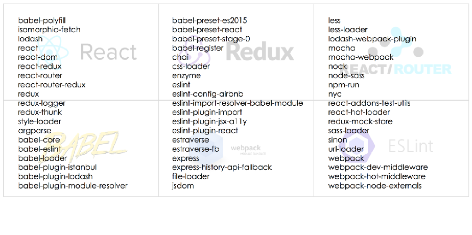

# 环境搭建及 React developer tools 的使用

使用脚手架工具创建 React 应用：Create React App, Codesandbox, Rekit 等

## 为什么需要脚手架工具

React、Router、Redux、Babel、webpack、ESlint ...



## Create React App

React.js 官网所推荐使用的工具 `create-react-app` 工具。它可以帮助我们一键生成所需要的工程目录，并帮我们做好各种配置和依赖，也帮我们隐藏了这些配置的细节。也就是所谓的"开箱即用"。

- [Create React App github 链接](https://github.com/facebook/create-react-app)
- [Create React App 官网](https://facebook.github.io/create-react-app/)

```bash
npm install -g create-react-app

create-react-app react-app

npm start   # 运行工程，启动编译当前的 React 项目，并自动打开 http://localhost:3000/
npm build   # 生成生产环境的构建版本
npm test    # 测试工程
npm eject   # 单向操作不可逆，npm eun eject 命令暴露项目的配置，可以自由配置项目所需的依赖
```

## 打包和部署

为什么需要打包？

1. 编译 ES6 语法特性，编译 JSX
2. 整合资源，例如图片，Less/Sass
3. 优化代码体积

使用 Webpack 进行打包.

打包注意事项：

1. 设置 nodejs 环境为 production
2. 禁用开发时专用代码，比如 logger
3. 设置应用根路径

## React developer tools 的使用

React 开发调试工具 React developer tools

安装地址：[React developer tools](https://chrome.google.com/webstore/detail/react-developer-tools/fmkadmapgofadopljbjfkapdkoienihi?hl=zh-CN)

- 本地：红色
- 线上：正常色
- 不是 React 项目：灰色

在 React 的菜单内查看 React 组件结构，state、props 等均可以查看

## 其他脚手架

- [create-react-app](https://github.com/facebook/create-react-app)
- [codesandbox-client](https://github.com/codesandbox/codesandbox-client)
- [create-react-app](https://facebook.github.io/create-react-app/)
- [react-starter-kit](https://github.com/bodyno/react-starter-kit)
- [react-boilerplate](https://github.com/react-boilerplate/react-boilerplate)
- [electron-react-boilerplate](https://github.com/electron-react-boilerplate/electron-react-boilerplate)
- [rekit.js](http://rekit.js.org/)
- [egg-react-ssr](https://github.com/ykfe/egg-react-ssr)
- [create-bfd-app](https://github.com/baifendian/create-bfd-app)
