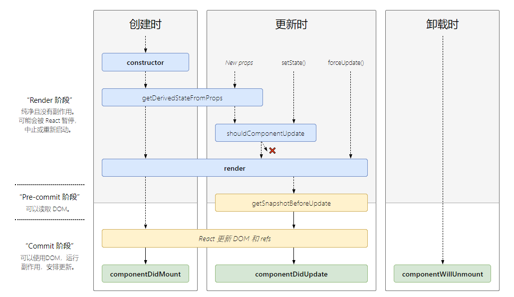
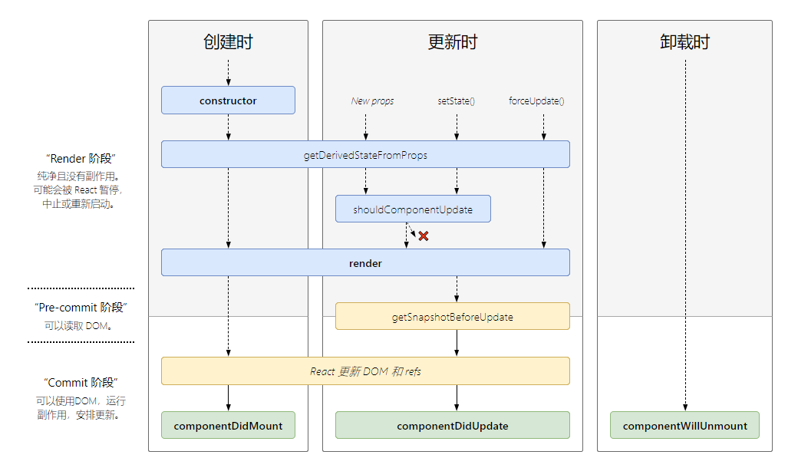
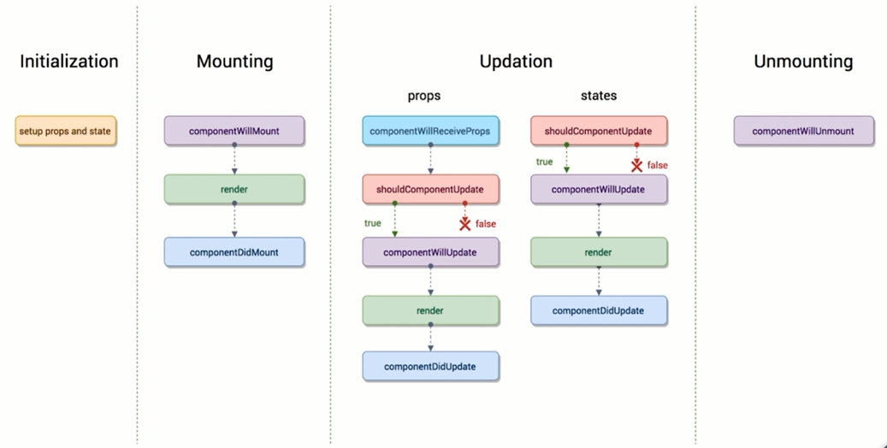
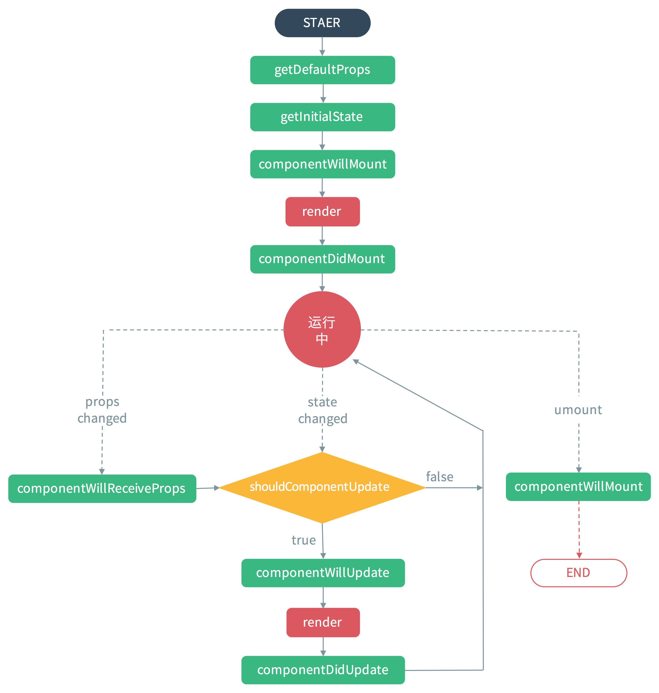

# 生命周期

生命周期函数指在某一个时刻组件自动调用执行的函数。

[链接：react-lifecycle-methods-diagram](http://projects.wojtekmaj.pl/react-lifecycle-methods-diagram/)

React version：16.3



React version：^16.4



<!-- 其他图式的生命周期


 -->

## life-cycle PAI

1. constructor(props)
2. getDerivedStateFromProps(nextProps, prevState)
3. componentWillMount() / UNSAFE_componentWillMount()
4. render()
5. componentWillReceiveProps()
6. shouldComponentUpdate(nextProps, nextState)
7. UNSAFE_componentWillUpdate(nextProps, nextState)
8. getSnapshotBeforeUpdate()
9. componentDidUpdate(prevProps, prevState, snapshot)

constructor

1. 用于初始化内部状态，很少使用
2. 唯一可以直接修改 state 的地方

getDerivedStateFromProps

1. 当 state 需要从 props 初始化时使用
2. 尽量不要使用：维护两者状态一致性会增加复杂度
3. 每次 render 都会调用
4. 典型场景：表单控件获取默认值

componentDidMount

1. UI 渲染完成后调用
2. 只执行一次
3. 典型场景：获取外部资源

componentWillUnmount

1. 组件移除时被调用
2. 典型场景：资源释放

getSnapshotBeforeUpdate

1. 在页面 render 之前调用，state 已更新
2. 典型场景：获取 render 之前的 DOM 状态

componentDidUpdate

1. 每次 UI 更新时被调用
2. 典型场景：页面需要根据 props 变化重新获取数据

shouldComponentUpdate

1. 决定 Virtual DOM 是否要重绘
2. 一般可以由 PureComponent 自动实现
3. 典型场景：性能优化

```js
class Life extends React.Component {
  // 1）初始化阶段
  constructor(props) {
    super(props);
    console.log('constructor(props)');
  }

  componentWillMount() {
    console.log('componentWillMount');
  }

  render() {
    console.log('render()');
    return (
      <div>
        <h2>测试组件的钩子函数！</h2>
      </div>
    );
  }

  componentDidMount() {
    console.log('componentDidMount');
  }

  // 2) 更新阶段
  componentWillUpdate() {
    console.log('componentWillUpdate()');
  }

  componentDidUpdate() {
    console.log('componentDidUpdate()');
  }

  // 3) 卸载阶段
  componentWillUnmount() {
    console.log('componentWillUnmount()');
  }

  // 4) 错误处理
  componentDidCatch() {
    console.log('componentDidCatch()');
  }
}
```

## ajax

ajax 一般放在 componentDidMount 生命周期内去执行。
