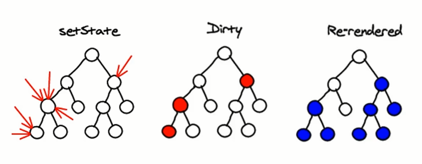

# React 中的 Virtual DOM、DIFF 算法

JSX 的运行基础：Virtual DOM

内部执行流程：

1. 用 JavaScript 对象结构表示 DOM 树的结构；然后用这个树构建一个真正的 DOM 树，插到文档当中;
2. 当状态变更的时候，重新构造一棵新的对象树。然后用新的树和旧的树进行比较，记录两棵树差异;
3. 把步骤 2 所记录的差异应用到步骤 1 所构建的真正的 DOM 树上，视图就更新了。

原理剖析：

Virtual DOM 本质上就是在 JS 和 DOM 之间做了一个缓存。可以类比 CPU 和硬盘，硬盘读取速度比较慢，我们会就在它们之间加缓存条;
反之, 既然 DOM 运行速度慢，那么我们就在 JS 和 DOM 之间加个缓存。JS 只操作 Virtual DOM，最后的时候再把变更的结果写入 DOM。

diff 算法

1. 如果两棵树的根元素类型不同，React 会销毁旧树，创建新树
2. 对于类型相同的 React DOM 元素，React 会对比两者的属性是否相同，只更新不同的属性; 当处理完这个 DOM 节点，React 就会递归处理子节点。
3. 遍历插入元素, 如果没有 key, React 将改变每一个子删除重新创建; 为了解决这个问题，React 提供了一个 key 属性。当子节点带有 key 属性，React 会通过 key 来匹配原始树和后来的树。

## React 的 Virtual DOM

1. 数据
2. JSX 模板
3. 数据 + 模板结合，生成真实的 DOM
4. state 变化
5. 数据 + 模板结合，生成真实的 DOM

缺陷：

- 第一次生成完整的 DOM 片段
- 第二次还生成完整的 DOM 片段
- 第二次的 DOM 片段替换第一次的 DOM 片段，非常耗性能

1. 数据
2. JSX 模板
3. 数据 + 模板结合，生成真实的 DOM，来显示
4. state 变化
5. 数据 + 模板结合，生成真实的 DOM
6. 新的 DOM (DoucomentFragment)，和原始的 DOM 做对比
7. 找出对比变化
8. 只更新变化的部分，替换原有的 DOM

缺陷：提升不明显

1. 数据
2. JSX 模板
3. 数据 + 模板结合
4. 生成虚拟 DOM，虚拟 DOM 就是一个 JS 对象，用它来描述真实的 DOM（损耗了性能）
5. state 发生变化
6. 数据 + 模板：生成新的虚拟 DOM（极大的提升了性能）
7. 比较原生虚拟 DOM 和新的虚拟 DOM 的区别，找出变化的内容（极大的提升了性能）
8. 直接操作 DOM，改变对应的内容

JSX -> `createElement` -> 虚拟 DOM（JS 对象）-> 真实 DOM

```js
React.createElement('div',{}, 'Hello, React !')

<div>
    Hello, React !
</div>
```

虚拟 DOM 的好处：

1. 性能提升
2. 跨端应用得以实现。React Native

## 虚拟 DOM 中的 DIFF 算法

DIFF diffrence

setState 使数据发生变化。

diff 算法作为 `Virtual DOM` 的加速器，其算法的改进优化是 React 整个界面渲染的基础和性能的保障，同时也是 React 源码中最神秘的，最不可思议的部分

采用的策略：广度优先深层比较，算法复杂度 O(n)

- 根节点开始比较
- 属性变化及顺序
- 节点类型发生变化
- 节点的跨层移动



虚拟 DOM 的两个假设

1. 组件的 DOM 结构是相对稳定的
2. 类型相同的兄弟节点可以被唯一标识

key 值，注意保持稳定，不建议用 index。

### diff 策略

react diff 算法的 3 个策略

- Web UI 中 DOM 节点跨层级的移动操作特别少，可以忽略不计。
- 拥有相同类的两个组件将会生成相似的树形结构，拥有不同类的两个组件将会生成不同的树形结构。
- 对于同一层级的一组子节点，它们可以通过唯一 id 进行区分。

对于以上三个策略，react 分别对 `tree diff`, `component diff`, `element diff` 进行算法优化。

## 扩展链接

https://segmentfault.com/a/1190000016539430#articleHeader0
