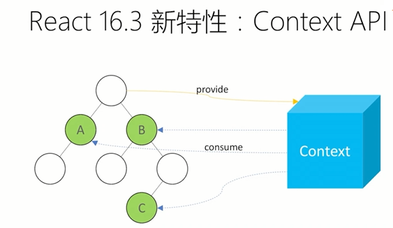

# React Context API

Context 提供了一个无需为每层组件手动添加 props，就能在组件树间进行数据传递的方法。

## API

- React.createContext
- Context.Provider
- Class.contextType
- Context.Consumer
- Context.displayName

Context API 包含两个组件，`<Provider>`和`<Consumer>`。若后者（Consumer）存在于前者(Provider)的子组件（children）中，那么无论后者处于前者子组件的哪个位置，前者可以向后者直接提供数据。

这里也用到了函数作为子组件。

`React.createContext` 方法用于创建一个 Context 对象。该对象包含 Provider 和 Consumer 两个属性，分别为两个 React 组件。

`Provider` 组件。用在组件树中更外层的位置。它接受一个名为 value 的 prop，其值可以是任何 JavaScript 中的数据类型。

`Consumer` 组件。可以在 Provider 组件内部的任何一层使用。它接收一个名为 children 值为一个函数的 prop。这个函数的参数是 Provider 组件接收的那个 value prop 的值，返回值是一个 React 元素（一段 JSX 代码）。

新版 Context API 的几个特点：

- Provider 和 Consumer 必须来自同一次 React.createContext 调用。也就是说 NameContext.Provider 和 AgeContext.Consumer 是无法搭配使用的。
- React.createContext 方法接收一个默认值作为参数。当 Consumer 外层没有对应的 Provider 时就会使用该默认值。
- Provider 组件的 value prop 值发生变更时，其内部组件树中对应的 Consumer 组件会接收到新值并重新执行 children 函数。此过程不受 shouldComponentUpdete 方法的影响。前面的示例代码中， Hello 组件继承自 React.PureComponent 但页面依然能正确显示足以说明这一点。
- Provider 组件利用 Object.is 检测 value prop 的值是否有更新。注意 Object.is 和 === 的行为不完全相同。具体细节请参考 Object.is 的 MDN 文档页。
- Consumer 组件接收一个函数作为 children prop 并利用该函数的返回值生成组件树的模式被称为 Render Props 模式。详细介绍请参考相关 React 文档。

是否该使用 Context API?

- 使用新的 Context API 可以为在多层嵌套的多个组件中使用共有数据带来极大的便利。React 官方文档中也推荐使用 Context API 储存全局变量，例如当前登入用户，主题样式或是首选语言。使用 Context API，可以减少多层 prop-drilling 的使用或是简化 redux state 结构。
- 是否使用 Context API 取决于程序的复杂程度，在大多数情况下，还是推荐使用 Redux。毕竟 Redux 是一个具有成熟生态圈的第三方库，其众多的中间件可以为我们解决许多开发中遇到的困难。在复杂度较小的程序中，Context API 可以带来极大的便利。
