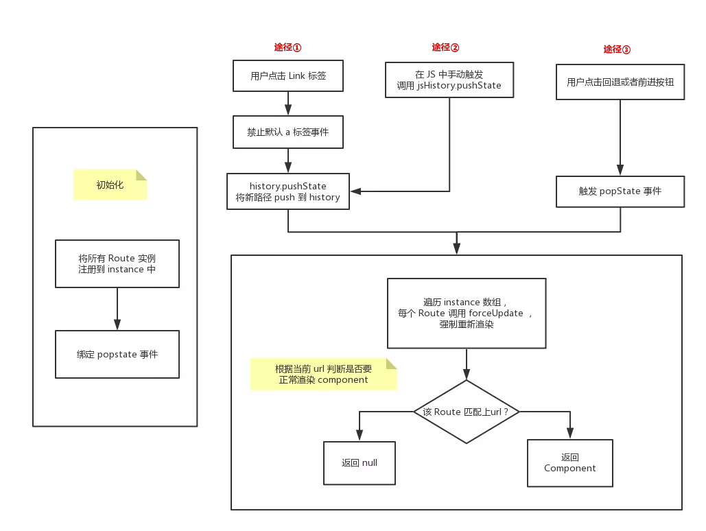

# 前端路由

现代前端开发中最流行的页面模型，莫过于 SPA 单页应用架构。单页面应用指的是应用只有一个主页面，通过动态替换 DOM 内容并同步修改 url 地址，来模拟多页应用的效果，切换页面的功能直接由前台脚本来完成，而不是由后端渲染完毕后前端只负责显示。前端三驾马车 Angular,Vue,React 均基于此模型来运行的。SPA 能够以模拟多页面应用的效果，归功于其前端路由机制。

前端路由，顾名思义就是一个前端不同页面的状态管理器,可以不向后台发送请求而直接通过前端技术实现多个页面的效果。angularjs 中的 ui-router, vue 中的 vue-router, 以及 react 的 react-router 均是对这种功能的具体实现。

路由功能

- 历史
- 跳转
- 事件

## 两种实现方式及其原理

```js
// 页面路由
window.location.href = 'https://www.google.com/';
history.back();

// hash 路由
window.location = '#hash';
window.onhashchange = function () {
  console.log('current hash:', window.location.hash);
};

// h5 路由
// 推进一个状态
history.pushState('name', 'title', '/path');
// 替换一个状态
history.replaceState('name', 'title', '/path');
// popstate
window.onpopstate = function () {
  console.log(window.location.href);
  console.log(window.location.pathname);
  console.log(window.location.hash);
  console.log(window.location.search);
};
```

### HashChange

原理

HTML 页面中通过锚点定位原理可进行无刷新跳转，触发后 url 地址中会多出# + 'XXX'的部分，同时在全局的 window 对象上触发 hashChange 事件，这样在页面锚点哈希改变为某个预设值的时候，通过代码触发对应的页面 DOM 改变，就可以实现基本的路由了,基于锚点哈希的路由比较直观，也是一般前端路由插件中最常用的方式。

## HTML5 HistoryAPI

HTML5 的 History API 为浏览器的全局 history 对象增加的扩展方法。一般用来解决 ajax 请求无法通过回退按钮回到请求前状态的问题。

在 HTML4 中，已经支持 window.history 对象来控制页面历史记录跳转，常用的方法包括：

- `history.forward()`; //在历史记录中前进一步
- `history.back()`; //在历史记录中后退一步
- `history.go(n)`: //在历史记录中跳转 n 步骤，n=0 为刷新本页,n=-1 为后退一页。

在 HTML5 中，`window.history`对象得到了扩展，新增的 API 包括：

- `history.pushState(data[,title][,url])`; //向历史记录中追加一条记录
- `history.replaceState(data[,title][,url])`; //替换当前页在历史记录中的信息。
- `history.state`; //是一个属性，可以得到当前页的`state`信息。
- `window.onpopstate`; //是一个事件，在点击浏览器后退按钮或 js 调用`forward()`、`back()`、`go()`时触发。监听函数中可传入一个`event`对象，`event.state`即为通过`pushState()`或`replaceState()`方法传入的 data 参数。

浏览器访问一个页面时，当前地址的状态信息会被压入历史栈,当调用 history.pushState() 方法向历史栈中压入一个新的 state 后，历史栈顶部的指针是指向新的 state 的。可以将其作用简单理解为 假装已经修改了 url 地址并进行了跳转 ,除非用户点击了浏览器的前进,回退,或是显式调用 HTML4 中的操作历史栈的方法，否则不会触发全局的 popstate 事件。

## 对比

| 对比         | hash 路由                              | History API 路由                                             |
| ------------ | -------------------------------------- | ------------------------------------------------------------ |
| url 字符串   | 丑                                     | 正常                                                         |
| 命名限制     | 通常只能在同一个 document 下进行改变   | url 地址可以自己来定义，只要是同一个域名下都可以，自由度更大 |
| url 地址变更 | 会改变                                 | 可以改变，也可以不改变                                       |
| 状态保存     | 无内置方法，需要另行保存页面的状态信息 | 将页面信息压入历史栈时可以附带自定义的信息                   |
| 参数传递能力 | 受到 url 总长度的限制，                | 将页面信息压入历史栈时可以附带自定义的信息                   |
| 实用性       | 可直接使用                             | 通常服务端需要修改代码以配合实现                             |
| 兼容性       | IE8 以上                               | IE10 以上                                                    |

## React-Router

先来看看一个简单的 React 中的 Router 代码：

```js
<Router>
  <Switch>
    <Route path="/about" component={About} />
    <Route path="/:user" component={User} />
  </Switch>
</Router>
```



其实现思路很简单：About 和 User 这两个 component 一直都存在。当路由发生改变时，与 URL 相匹配的 component 机会被成功渲染。而不匹配的 component 就设置为 null。
