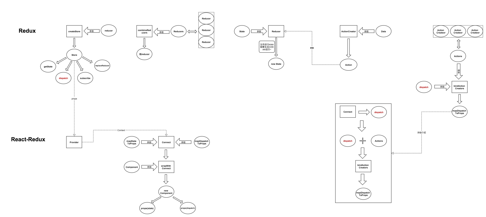
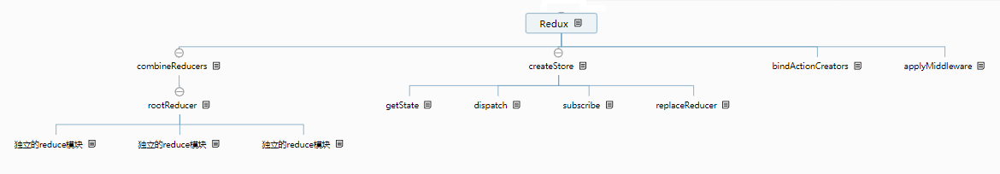
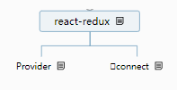

# Redux

单向数据流：从父组件流向子组件，兄弟组件无法共享数据

## 基础

- State：React 中的状态，是只读的对象，不可直接修改
- Reducer：基本函数，用于对 State 的业务处理
- Action：普通对象：用于描述事件行为，改变 State

Redux 核心的概念就三个：Action、Reducer、Store

## Redux 集成

- 创建 Action 模块
- 创建 Reducer 模块
- 创建 Store 模块
- 通过 connect 方法将 React 组件和 Redux 连接起来
- 添加 Provider 作为项目的根组件，用于数据的存储

## 调试工具安装

- Chrome 安装 Redux Devtools 扩展
- `redux-devtools-extension`

API 如下：

- 获取状态：store.getState( )
  - 获取当前时间点的数据集合 state
- 更新状态：store.dispatch( action )
  - 修改状态的唯一方式就是 dispatch 一个 action，store 接收到 action 后自动调用 reducer
- 绑定监听：store.subscribe( listener )
  - 一旦状态改变，就执行绑定的函数；方法返回一个函数，调用可以解除监听
- 改变 reducer：replaceReducer( new-reducer )
  - 替换创建 store 时的 reducer 页面，比如页面跳转时使用（新的 API，好像好少用）

## store

store 是一个对象，它有四个主要的方法：

**1、dispatch:**

> 用于 action 的分发——在 createStore 中可以用 middleware 中间件对 dispatch 进行改造，比如当 action 传入 dispatch 会立即触发 reducer，有些时候我们不希望它立即触发，而是等待异步操作完成之后再触发，这时候用 redux-thunk 对 dispatch 进行改造，以前只能传入一个对象，改造完成后可以传入一个函数，在这个函数里我们手动 dispatch 一个 action 对象，这个过程是可控的，就实现了异步。

**2、subscribe：**

> 监听 state 的变化——这个函数在 store 调用 dispatch 时会注册一个 listener 监听 state 变化，当我们需要知道 state 是否变化时可以调用，它返回一个函数，调用这个返回的函数可以注销监听。
> let unsubscribe = store.subscribe(() => {console.log('state 发生了变化')})

**3、getState：**

> 获取 store 中的 state——当我们用 action 触发 reducer 改变了 state 时，需要再拿到新的 state 里的数据，毕竟数据才是我们想要的。getState 主要在两个地方需要用到，一是在 dispatch 拿到 action 后 store 需要用它来获取 state 里的数据，并把这个数据传给 reducer，这个过程是自动执行的，二是在我们利用 subscribe 监听到 state 发生变化后调用它来获取新的 state 数据。

**4、replaceReducer:**

> 替换 reducer，改变 state 修改的逻辑。

store 可以通过 createStore()方法创建，接受三个参数，经过 combineReducers 合并的 reducer 和 state 的初始状态以及改变 dispatch 的中间件，后两个参数并不是必须的。store 的主要作用是将 action 和 reducer 联系起来并改变 state。

**action:**

> action 是一个对象，其中 type 属性是必须的，同时可以传入一些数据。action 可以用 actionCreactor 进行创造。dispatch 就是把 action 对象发送出去。

**reducer:**

> reducer 是一个函数，它接受一个 state 和一个 action，根据 action 的 type 返回一个新的 state。根据业务逻辑可以分为很多个 reducer，然后通过 combineReducers 将它们合并，state 树中有很多对象，每个 state 对象对应一个 reducer，state 对象的名字可以在合并时定义。

像这个样子：

```js
const reducer = combineReducers({
  a: doSomethingWithA,
  b: processB,
  c: c,
});
```

**combineReducers:**

> 其实它也是一个 reducer，它接受整个 state 和一个 action，然后将整个 state 拆分发送给对应的 reducer 进行处理，所有的 reducer 会收到相同的 action，不过它们会根据 action 的 type 进行判断，有这个 type 就进行处理然后返回新的 state，没有就返回默认值，然后这些分散的 state 又会整合在一起返回一个新的 state 树。

接下来分析一下整体的流程，首先调用 store.dispatch 将 action 作为参数传入，同时用 getState 获取当前的状态树 state 并注册 subscribe 的 listener 监听 state 变化，再调用 combineReducers 并将获取的 state 和 action 传入。combineReducers 会将传入的 state 和 action 传给所有 reducer，并根据 action 的 type 返回新的 state，触发 state 树的更新，我们调用 subscribe 监听到 state 发生变化后用 getState 获取新的 state 数据。

redux 的 state 和 react 的 state 两者完全没有关系，除了名字一样。

**上面分析了 redux 的主要功能，那么 react-redux 到底做了什么？**

## React-Redux

如果只使用 redux，那么流程是这样的：

> component --> dispatch(action) --> reducer --> subscribe --> getState --> component

用了 react-redux 之后流程是这样的：

> component --> actionCreator(data) --> reducer --> component

store 的三大功能：dispatch，subscribe，getState 都不需要手动来写了。react-redux 帮我们做了这些，同时它提供了两个好基友 Provider 和 connect。

**Provider**是一个组件，它接受 store 作为 props，然后通过 context 往下传，这样 react 中任何组件都可以通过 context 获取 store。也就意味着我们可以在任何一个组件里利用 dispatch(action) 来触发 reducer 改变 state，并用 subscribe 监听 state 的变化，然后用 getState 获取变化后的值。但是并不推荐这样做，它会让数据流变的混乱，过度的耦合也会影响组件的复用，维护起来也更麻烦。

**connect --connect(mapStateToProps, mapDispatchToProps, mergeProps, options)** 是一个函数，它接受四个参数并且再返回一个函数--wrapWithConnect，wrapWithConnect 接受一个组件作为参数 wrapWithConnect(component)，它内部定义一个新组件 Connect(容器组件)并将传入的组件(ui 组件)作为 Connect 的子组件然后 return 出去。

所以它的完整写法是这样的：connect(mapStateToProps, mapDispatchToProps, mergeProps, options)(component)

**mapStateToProps(state, [ownProps])：**

> mapStateToProps 接受两个参数，store 的 state 和自定义的 props，并返回一个新的对象，这个对象会作为 props 的一部分传入 ui 组件。我们可以根据组件所需要的数据自定义返回一个对象。ownProps 的变化也会触发 mapStateToProps

```javascript
function mapStateToProps(state) {
  return {todos: state.todos};
}
```

**mapDispatchToProps(dispatch, [ownProps])：**

> mapDispatchToProps 如果是对象，那么会和 store 绑定作为 props 的一部分传入 ui 组件。如果是个函数，它接受两个参数，bindActionCreators 会将 action 和 dispatch 绑定并返回一个对象，这个对象会和 ownProps 一起作为 props 的一部分传入 ui 组件。所以不论 mapDispatchToProps 是对象还是函数，它最终都会返回一个对象，如果是函数，这个对象的 key 值是可以自定义的

```javascript
function mapDispatchToProps(dispatch) {
  return {
    todoActions: bindActionCreators(todoActionCreators, dispatch),
    counterActions: bindActionCreators(counterActionCreators, dispatch),
  };
}
```

mapDispatchToProps 返回的对象其属性其实就是一个个 actionCreator，因为已经和 dispatch 绑定，所以当调用 actionCreator 时会立即发送 action，而不用手动 dispatch。ownProps 的变化也会触发 mapDispatchToProps。

**mergeProps(stateProps, dispatchProps, ownProps)：**

> 将 mapStateToProps() 与 mapDispatchToProps()返回的对象和组件自身的 props 合并成新的 props 并传入组件。默认返回 Object.assign({}, ownProps, stateProps, dispatchProps) 的结果。

**options：**

> pure = true 表示 Connect 容器组件将在 shouldComponentUpdate 中对 store 的 state 和 ownProps 进行浅对比，判断是否发生变化，优化性能。为 false 则不对比。

其实 connect 函数并没有做什么，大部分的逻辑都是在它返回的 wrapWithConnect 函数内实现的，确切的说是在 wrapWithConnect 内定义的 Connect 组件里实现的。

# Redux






