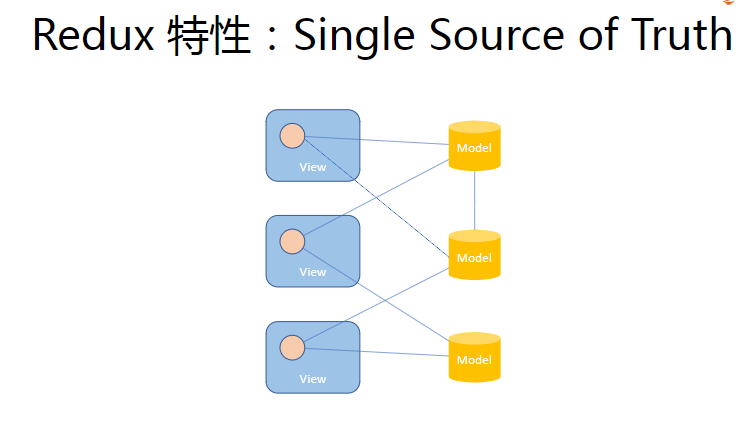
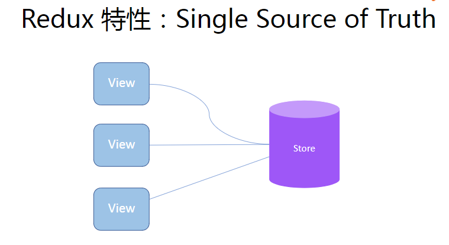
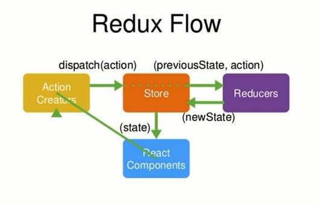
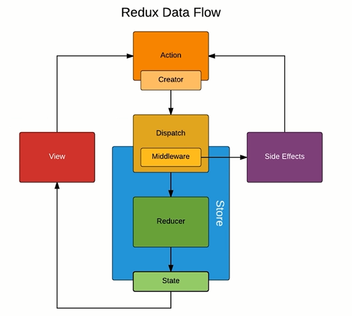

# Redux 简介

[Redux](https://github.com/reduxjs/redux)

Redux 让组件的通信更加容易


`注：图片来自 https://css-tricks.com/learning-react-redux/`





Redux 特性：

- Single Source of Truth
- 可预测性: state + action = new state
- 纯函数更新 Store

## Redux

Redux = Reducer + Flux



中间件



Redux 设计和使用的三项原则

- store 是唯一的
- 只有 store 能够改变自己的内容
- reducer 必须是纯函数

## 安装

安装 `Redux devTools`

[Redux devTools](https://github.com/zalmoxisus/redux-devtools-extension#usage)

```
npm install redux --save
```

reducer 一定是纯函数

一个函数的返回结果只依赖于它的参数，并且在执行过程里面没有副作用，我们就把这个函数叫做纯函数。

- 函数的返回结果只依赖于它的参数。
- 函数执行过程里面没有副作用。

## Redux 核心 API 描述

- createStore(reducer, [preloadedState], enhancer)

  - 创建一个 Redux store 来以存放应用中所有的 state。
  - 应用中应有且仅有一个 store。
  - reducer (Function): 接收两个参数，分别是当前的 state 树和要处理的 action，返回新的 state 树。
  - [preloadedState](any): 初始时的 state。 在同构应用中，你可以决定是否把服务端传来的 state 水合（hydrate）后传给它，或者从之前保存的用户会话中恢复一个传给它。如果你使用 combineReducers 创建 reducer，它必须是一个普通对象，与传入的 keys 保持同样的结构。否则，你可以自由传入任何 reducer 可理解的内容。
  - enhancer (Function): Store enhancer 是一个组合 store creator 的高阶函数，返回一个新的强化过的 store creator。这与 middleware 相似，它也允许你通过复合函数改变 store 接口

- Store 的方法

  - getState() 返回应用当前的 state 树
  - dispatch(action) 分发 action 这是触发 state 变化的唯一途径
  - subscribe(listener) 添加一个变化监听器 每当 dispatch(action)的时候 就会执行 state 树中的一部分可能已经变化。你可以在回调函数里调用 getState() 来拿到当前 state。

- applyMiddleware(...middlewares)：
  使用包含自定义功能的 middleware 来扩展 Redux 是一种推荐的方式。Middleware 可以让你包装 store 的 dispatch 方法来达到你想要的目的。同时， middleware 还拥有"可组合"这一关键特性。多个 middleware 可以被组合到一起使用，形成 middleware 链。其中，每个 middleware 都不需要关心链中它前后的 middleware 的任何信息。

## 小记

### Store

- Store 是应用状态 state 的管理者，包含下列四个函数：

  - Store.getState() // 获取整个 state 树
  - Store.dispatch(action) // 触发 state 改变的【唯一途径】
  - Store.subscribe(listener) // 可以理解为 DOM 中的 addEventListener
  - Store.replaceReducer(nextReducer) // 一般在 Webpack 按需加载时用到

- Store 与 state 的关系：
  - const store = createStore(reducer, initialState)
  - const state = store.getState()

### Action

1. Action 就是包含 type 属性的普通对象，type 是实现用户行为追踪的关键

```js
{
    type: 'ADD_TODO',
    payload: {
        id: 1,
        completed: false
    }
}
```

2. Action Creator 就是创造 action 的函数，返回值是一个 action 对象

```js
function addTodo(id) {
  return {
    type: 'ADD_TODO',
    payload: {
      id: id,
      completed: false,
    },
  };
}
```

通常，Action Creator 绑定到用户的操作（点击按钮等），根据参数不同，返回需要的 action。然后，通过 Store.dispatch(action) 改变 state

```js
<AddTodo onAddClick={(text) => dispatch(addTodo(text))} />
```

3. Reducer

- 用户的每次 dispatch(action) 操作都会触发 Reducer 执行
- Reducer 就是一个函数，根据 action.type 更新 state
- 最后，Reducer 返回最新的 state，完全替换原来的 state

Reducer 示例：

```js
function todos(state = [], action) {
  switch (action.type) {
    case ADD_TODO:
      return [
        ...state,
        {
          text: action.text,
          completed: false,
        },
      ];
    default:
      return state;
  }
}
```

## 总结

1. Store 由 Redux.createStore(reducer) 生成，state 通过 Store.getState() 获取，Store 就是一个存储着整个应用状态的对象

2. Action 本质上是一个包含 type 属性的普通对象，由 Action Creator (函数) 产生。要改变 state，必须（只能）通过 Store.dispatch(action) 触发

3. Reducer 根据 action.type 来更新 state，并返回最新的 nextState。reducer 必须有确定返回值，否则 nextState 即为 undefined。所以，state 可以看做 Reducer 返回值的汇总。

Redux 数据流演示：

```js
Action Creator(action)
    => Store.dispatch(action)
    => Reducer(state, action)
    => state = nextState
```
