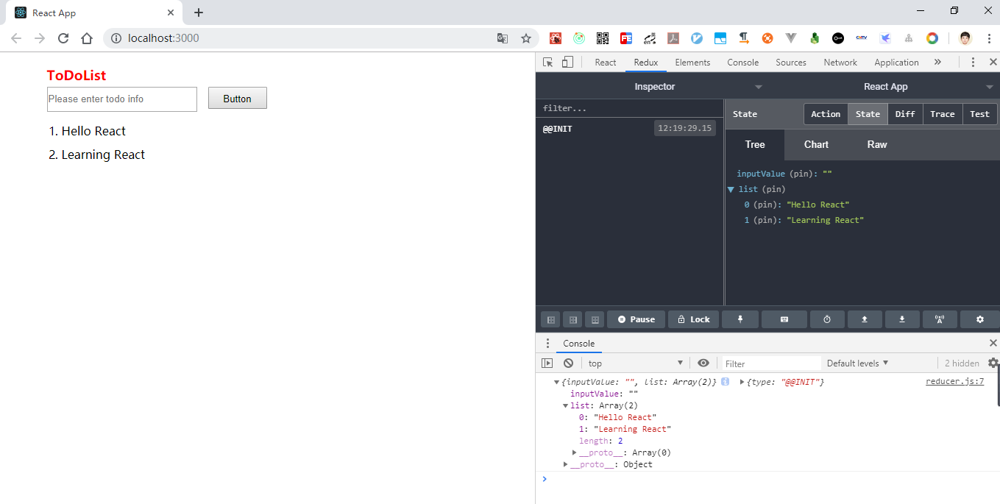

# Redux 入门：ToDoList 示例

示例截图


## ToDoList 示例

### store

store/index.js

```js
import {createStore} from 'redux';

import reducer from './reducer';

const store = createStore(
  reducer,
  window.__REDUX_DEVTOOLS_EXTENSION__ && window.__REDUX_DEVTOOLS_EXTENSION__()
);

export default store;
```

### reducer

store/reducer.js

```js
const defaultState = {
  inputValue: '',
  list: ['Hello React', 'Learning React'],
};

export default (state = defaultState, action) => {
  console.log(state, action);

  if (action.type === 'change_input_value') {
    const newState = JSON.parse(JSON.stringify(state));
    newState.inputValue = action.value;
    return newState;
  }

  if (action.type === 'add_todo_item') {
    const newState = JSON.parse(JSON.stringify(state));
    newState.list.push(state.inputValue);
    newState.inputValue = '';
    return newState;
  }

  if (action.type === 'delete_todo_item') {
    const newState = JSON.parse(JSON.stringify(state));
    newState.list.splice(action.index, 1);
    return newState;
  }

  return state;
};
```

### WithToDoList

WithToDoList.js

```js
import React, {Component} from 'react';

import ToDoListUI from './TodoListUI';

import store from './store/index';

class WithToDoList extends Component {
  constructor(props) {
    super(props);
    this.state = store.getState();

    this.storeOnChange = this.storeOnChange.bind(this);
    this.onBtnClickHandle = this.onBtnClickHandle.bind(this);
    this.onDeleteItemClick = this.onDeleteItemClick.bind(this);
    store.subscribe(this.storeOnChange);
  }

  storeOnChange() {
    this.setState(store.getState());
  }

  onChange(e) {
    const action = {
      type: 'change_input_value',
      value: e.target.value,
    };
    store.dispatch(action);
  }

  onBtnClickHandle() {
    if (!this.state.inputValue) {
      return;
    }
    const action = {
      type: 'add_todo_item',
    };
    store.dispatch(action);
  }

  onDeleteItemClick(index) {
    const action = {
      type: 'delete_todo_item',
      index,
    };
    store.dispatch(action);
  }

  render() {
    return (
      <ToDoListUI
        inputValue={this.state.inputValue}
        list={this.state.list}
        onChange={this.onChange}
        onBtnClickHandle={this.onBtnClickHandle}
        onDeleteItemClick={this.onDeleteItemClick}
      />
    );
  }
}

export default WithToDoList;
```

### ToDoListUI

```js
import React from 'react';
import './ToDoListUI.css';

function ToDoListUI(props) {
  const list = props.list.map((item, index) => (
    <li
      key={index}
      onClick={() => {
        props.onDeleteItemClick(index);
      }}
    >
      {item}
    </li>
  ));
  return (
    <div className="ToDoListUI">
      <h1 className="title">ToDoList</h1>
      <input
        className="input"
        placeholder="Please enter todo info"
        value={props.inputValue}
        onChange={props.onChange}
      />
      <button onClick={props.onBtnClickHandle}>Button</button>
      <ol className="list">{list}</ol>
    </div>
  );
}

export default ToDoListUI;
```

至此，基于 Redux 的 ToDoList 完毕，可以跑起来了~

## ActionTypes 的拆分

在上面的代码中，`store/reducer.js` 和 `WithToDoList.js` 中，`action.type` 都有使用且是一个常量，因此可以考虑将其单独定义。

store/actionTypes.js

```js
export const CHNAGE_INPUT_VALUE = 'change_input_value';
export const ADD_TODO_ITEM = 'add_todo_item';
export const DELETE_TODO_ITEM = 'delete_todo_item';
```

WithToDoList.js

```js
import {
  CHNAGE_INPUT_VALUE,
  ADD_TODO_ITEM,
  DELETE_TODO_ITEM,
} from './store/actionTypes';

const action = {
  type: ADD_TODO_ITEM,
};
store.dispatch(action);
```

## actionCreator 统一创建 action

在前面的代码中，action 是在组件内创建的，这样也不便于管理，因此也可以单独提出来。

store/actionCreator.js

```js
import {
  CHNAGE_INPUT_VALUE,
  ADD_TODO_ITEM,
  DELETE_TODO_ITEM,
} from './actionTypes';

export const getInputChangeAction = (value) => ({
  type: CHNAGE_INPUT_VALUE,
  value,
});

export const getAddToDoItemAction = () => ({
  type: ADD_TODO_ITEM,
});

export const getDeleteItemAction = (index) => ({
  type: DELETE_TODO_ITEM,
  index,
});
```

在组件内的使用如下：

WithToDoList.js

```js
const action = getDeleteItemAction(index);
store.dispatch(action);
```

Redux 设计和使用的三项原则

- store 是唯一的
- 只有 store 能够改变自己的内容
- reducer 必须是纯函数
