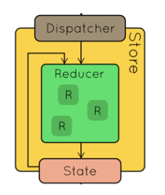
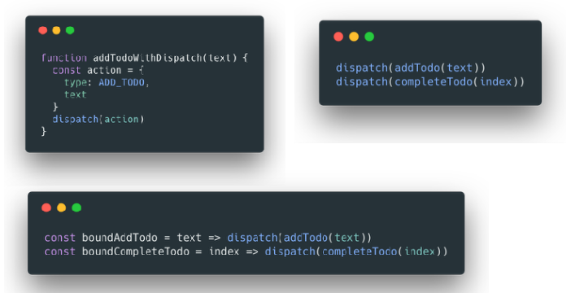
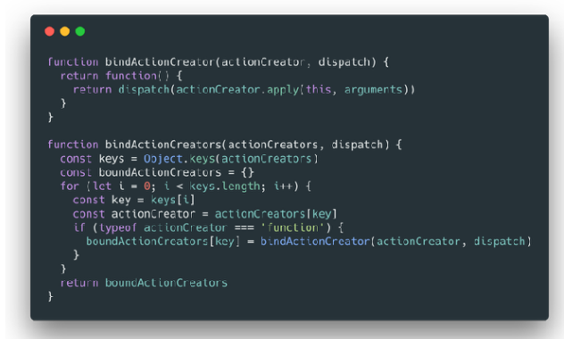

# Redux 简单总结

## 理解 store



```js
const const = createStore(reducer, [preloadedState], enhancer);
```

1. getState()
2. dispatch(action)
3. subscribe(listener)

## 理解 action

```js
{
    type: "ADD_TODO_ITEM",
    text: "Redux"
}
```

## 理解 reducer

```js
const initialState = fromJS({
  title: 'react',
});

export default (state = initialState, action) => {
  switch (action.type) {
    case constants.CHANGE_TITLE:
      return {
        ...state,
        title: 'redux',
      };
    default:
      return state;
  }
};
```

## 理解 combineReducers 完成对数据的拆分管理

/pages/TodoList/store

```js
export default (state = initialState, action) => {
  switch (action.type) {
    case constants.CHANGE_TITLE:
      return {
        ...state,
        title: 'redux',
      };
    default:
      return state;
  }
};
```

/pages/Test/store

```js
export default (state = initialState, action) => {
  switch (action.type) {
    case constants.CHANGE_TITLE:
      return {
        ...state,
        title: 'test',
      };
    default:
      return state;
  }
};
```

reducer.js

```js
import {combineReducers} from 'redux';

import {reducer as TodoListReducer} from '../pages/TodoList/store';
import {reducer as TestReducer} from '../pages/Test/store';

const reducer = combineReducers({
  todoList: TodoListReducer,
  test: TestReducer,
});

export default reducer;
```

## 理解 bindActionCreators




