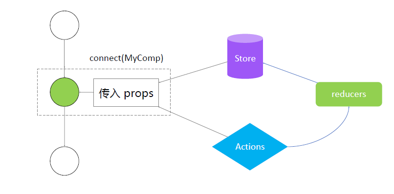

# React-Redux

git 地址：https://github.com/reduxjs/react-redux

核心 API

- Provider
- connect

## 使用 Provider store

index.js

```js
import React from 'react';
import ReactDOM from 'react-dom';
import {Provider} from 'react-redux';

import './index.css';
import WithToDoList from './WithToDoList';

import store from './store/index';

const App = () => {
  return (
    <Provider store={store}>
      <WithToDoList />
    </Provider>
  );
};

ReactDOM.render(<App />, document.getElementById('root'));
```

## 使用 connect、mapStateToProps、 mapDispatchToProps

WithToDoList.js

```js
import React, {Component} from 'react';

import {connect} from 'react-redux';

import ToDoListUI from './TodoListUI';

import {
  getInputChangeAction,
  getAddToDoItemAction,
  getDeleteItemAction,
} from './store/actionCreator';

class WithToDoList extends Component {
  constructor(props) {
    super(props);
    this.onBtnClickHandle = this.onBtnClickHandle.bind(this);
  }
  onBtnClickHandle() {
    if (!this.props.inputValue) {
      return;
    }
    this.props.onBtnClickHandle();
  }
  render() {
    const {inputValue, list, onChangeInput, onDeleteItemClick} = this.props;
    return (
      <ToDoListUI
        inputValue={inputValue}
        list={list}
        onChange={onChangeInput}
        onBtnClickHandle={this.onBtnClickHandle}
        onDeleteItemClick={onDeleteItemClick}
      />
    );
  }
}

const mapStateToProps = (state) => {
  return {
    inputValue: state.inputValue,
    list: state.list,
  };
};

const mapDispatchToProps = (dispatch) => {
  return {
    onChangeInput(e) {
      const action = getInputChangeAction(e.target.value);
      dispatch(action);
    },
    onBtnClickHandle() {
      const action = getAddToDoItemAction();
      dispatch(action);
    },
    onDeleteItemClick(index) {
      const action = getDeleteItemAction(index);
      dispatch(action);
    },
  };
};

export default connect(mapStateToProps, mapDispatchToProps)(WithToDoList);
```

## connect 的工作原理：高阶组件


