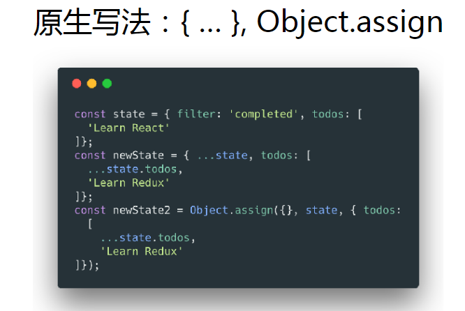

# Redux 的不可变数据（Immutability）

Redux 的运行基础，不可变数据（Immutability）

为何需要不可变数据

1. 性能优化
2. 易于调试和跟踪
3. 易于推测

如何操作不可变数据

1. 原生写法：`{ … }`， `Object.assign`
2. [immutability-helper](https://github.com/kolodny/immutability-helper)
3. [immer](https://github.com/immerjs/immer)

示例：

