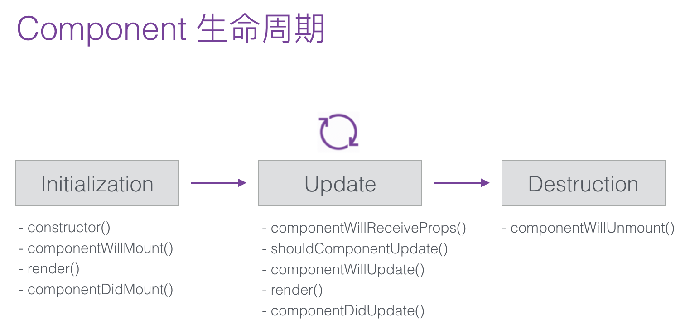

# dva 入门

## React 基础知识

**什么是 React?**

React 的核心目的是创建 UI 组件，也就是说它是 MVC 架构中的 V 层，所以 React 和你的技术架构并没有关系。

打个比方来说在 AngularJS 1.x 中它通过扩展 html 标签，注入一些结构性的东西（比如 Controllers, Services），所以 AngularJS 1.x 是会侵入到你整个技术的架构，从某些方面来说这些抽象确实能解决一些业务问题，但由此而来的是塔缺乏了灵活性。

React 这种仅仅关注在 Components 的库，给了开发者非常强的灵活度，因为我不并不会被束缚在某一个技术架构。

**Components 在各个生命周期内发生了什么 ?**

从最上层来说 React Component 生命周期可以落入到以下三个环节：

- 初始化，Initialization
- state/props 更新，State/Property Updates
- 销毁， Destruction



在这三个类别下分别对应着一些 React 的抽象方法，这些方法都是在组件特定生命周期中的钩子，这些钩子会在组件整个生命周期中执行一次或者多次。明白了这些钩子的调用时机，可以有助于更好的书写组件。

比如：

- componentWillMount: 在组件 render 之前执行且永远只执行一次。
- componentDidMount: 组件加载完毕之后立即执行，并且此时才在 DOM 树中生成了对应的节点，因此我们通过 this.getDOMNode() 来获取到对应的节点。
- ...

## Dva

- [dva.js 知识导图](https://github.com/dvajs/dva-knowledgemap)

## dva 中的数据流


如何来理解呢?

在 web 应用中，数据的改变通常发生在用户交互行为或者浏览器行为（如路由跳转等），当此类行为改变数据的时候可以通过 dispatch 发起一个 action，如果是同步行为会直接通过 Reducers 改变 State ，如果是异步行为会先触发 Effects 然后流向 Reducers 最终改变 State，所以在 dva 中，数据流向非常清晰简明，并且思路基本跟开源社区保持一致。

## dva 的基本概念

简而言之 dva 是基于现有应用架构 (redux + react-router + redux-saga 等)的一层轻量封装

## dva - Model

- State

State 表示 Model 的状态数据，通常表现为一个 javascript 对象（immutable data）。

- Action

Action 是一个普通 javascript 对象，它是改变 State 的唯一途径。无论是从 UI 事件、网络回调，还是 WebSocket 等数据源所获得的数据，最终都会通过 dispatch 函数调用一个 action，从而改变对应的数据。** 需要注意的是 dispatch 是在组件 connect Models以后，通过 props 传入的。

```js
dispatch({
  type: 'user/add', // 如果在 model 外调用，需要添加 namespace
  payload: {}, // 需要传递的信息
});
```

以上调用函数内的对象就是一个 action。

- dispatch 函数

用于触发 action 的函数，action 是改变 State 的唯一途径，但是它只描述了一个行为，而 dipatch 可以看作是触发这个行为的方式，而 Reducer 则是描述如何改变数据的。

## dva - Reducer

在 dva 中，reducers 聚合积累的结果是当前 model 的 state 对象。通过 actions 中传入的值，与当前 reducers 中的值进行运算获得新的值（也就是新的 state）。需要注意的是 Reducer 必须是纯函数。

```js
app.model({
  namespace: 'todos', //model 的 namespace
  state: [], // model 的初始化数据
  reducers: {
    // add 方法就是 reducer，可以看到它其实非常简单就是把老的 state 和接收到的数据处理下，返回新的 state
    add(state, { payload: todo }) {
      return state.concat(todo);
    },
  },
};
```

## dva - Effect

Effect 被称为副作用，在我们的应用中，最常见的就是异步操作，Effects 的最终流向是通过 Reducers 改变 State。

核心需要关注下 put, call, select。

```js
app.model({
  namespace: 'todos',
  effects: {
    *addRemote({ payload: todo }, { put, call, select }) {
      const todos = yield select(state => state.todos); // 这边的 state 来源于全局的 state，select 方法提供获取全局 state 的能力，也就是说，在这边如果你有需要其他 model 的数据，则完全可以通过 state.modelName 来获取
      yield call(addTodo, todo); // 用于调用异步逻辑，支持 promise 。
      yield put({ type: 'add', payload: todo }); // 用于触发 action 。这边需要注意的是，action 所调用的 reducer 或 effects 来源于本 model 那么在 type 中不需要声明命名空间，如果需要触发其他非本 model 的方法，则需要在 type 中声明命名空间，如 yield put({ type: 'namespace/fuc', payload: xxx });
    },
  },
});
```

## dva - Subscription

Subscriptions 是一种从 源 获取数据的方法，它来自于 elm。

Subscription 语义是订阅，用于订阅一个数据源，然后根据条件 dispatch 需要的 action。数据源可以是当前的时间、服务器的 websocket 连接、keyboard 输入、geolocation 变化、history 路由变化等等。

```js
import key from 'keymaster';
...
app.model({
  namespace: 'count',
  subscriptions: {
    keyEvent(dispatch) {
      key('⌘+up, ctrl+up', () => { dispatch({type:'add'}) });
    },
  }
});
```

## dva - Router

这里的路由通常指的是前端路由，由于我们的应用现在通常是单页应用，所以需要前端代码来控制路由逻辑，通过浏览器提供的 History API 可以监听浏览器url的变化，从而控制路由相关操作。

dva 实例提供了 router 方法来控制路由，使用的是react-router。

```js
import { Router, Route } from 'dva/router';
app.router(({history}) =>
    // 
);
```

## dva - Route Components

在 dva 中我们通常以页面维度来设计 Container Components。

所以在 dva 中，通常需要 connect Model的组件都是 Route Components，组织在/routes/目录下，而/components/目录下则是纯组件（Presentational Components）。

**通过 connect 绑定数据**

```js
import { connect } from 'dva';
function App() {}

function mapStateToProps(state, ownProps) { // 该方法名已经非常形象的说明了 connect 的作用在于 State -> Props 的转换，同时自动注册一个 dispatch 的方法，用以触发 action
  return {
    users: state.users,
  };
}
export default connect(mapStateToProps)(App);
```

然后在 App 里就有了 dispatch 和 users 两个属性。

好了，如上就是 dva 中的一些核心概念，起初看的时候可能一下子接收到的信息量颇大，但是不要着急，后续业务中的使用会让你对于如上概念越来越清晰。

那么如何来启动一个 dva 应用呢

```bash
// Install dva-cli
$ npm install dva-cli -g

// Create app and start
$ dva new myapp
$ cd myapp
$ npm install
$ npm start
```

来一窥 dva 项目 src 目录结构，尝试来明白整体的代码的组织方式

```txt
.
├── assets
│   └── yay.jpg
├── components
│   └── Example.js
├── index.css
├── index.html
├── index.js
├── models
│   └── example.js
├── router.js
├── routes
│   ├── IndexPage.css
│   └── IndexPage.js
├── services
│   └── example.js
├── tests
│   └── models
│       └── example-test.js
└── utils
    └── request.js
```

- assets: 我们可以把项目 assets 资源丢在这边
- components: 纯组件，在 dva 应用中 components 目录中应该是一些 logicless 的 component, logic 部分均由对应的 route-component 来承载。在安装完 dva-cli 工具后，我们可以通过 dva g component componentName 的方式来创建一个 component。
- index.css: 首页样式
- index.html: 首页
- index.js:  dva 应用启动 五部曲，这点稍后再展开
- models: 该目录结构用以存放 model，在通常情况下，一个 model 对应着一个 route-component，而 route-component 则对应着多个 component，当然这取决于你如何拆分，个人偏向于尽可能细粒度的拆分。在安装完 dva-cli 工具后，我们可以通过 dva g model modelName 的方式来创建一个 model。该 model 会在 index.js 中自动注册。
- router.js: 页面相关的路由配置，相应的 route-component 的引入
- routes: route-component 存在的地方，在安装完 dva-cli 工具后，我们可以通过 dva g route route-name 的方式去创建一个 route-component，该路由配置会被自动更新到 route.js 中。route-component 是一个重逻辑区，一般业务逻辑全部都在此处理，通过 connect 方法，实现 model 与 component 的联动。
- services: 全局服务，如发送异步请求
- tests: 测试相关
- utils: 全局类公共函数

## dva 的五部曲

```js
import './index.html';
import './index.css';
import dva from 'dva';

// 1. Initialize
const app = dva();

// 2. Plugins - 该项为选择项
//app.use({});

// 3. Model 的注册
//app.model(require('./models/example'));

// 4. 配置 Router
app.router(require('./router'));

// 5. Start
app.start('#root');
```

好了，以上便是五部曲，看了 dva 官方文档的可能说还少一步

```js
// 4. Connect components and models
const App = connect(mapStateToProps)(Component);
```

原因是在实际业务中，我们的 connect 行为通常在 route-component 中进行设置。

