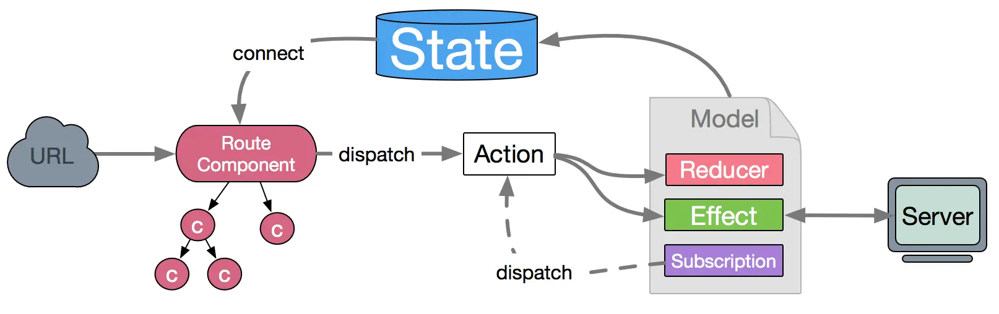
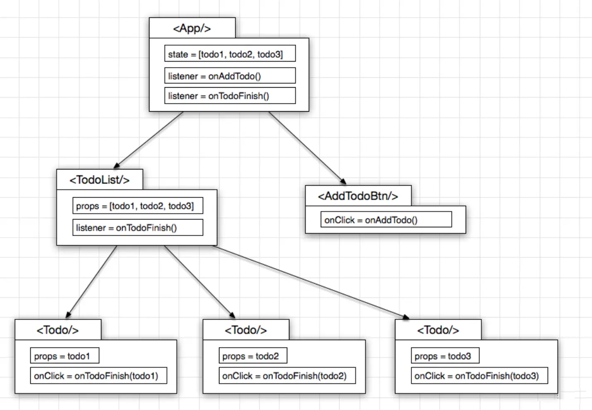
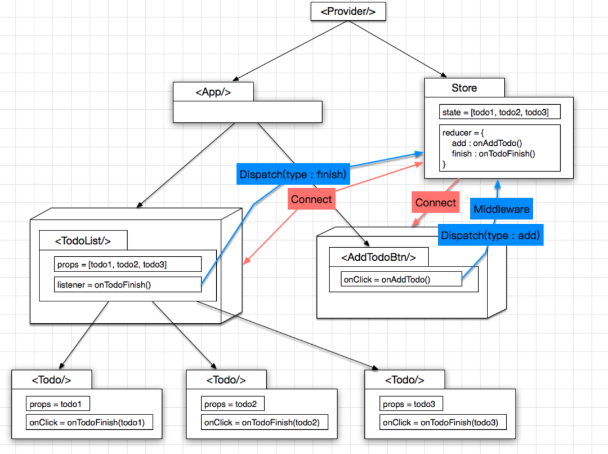
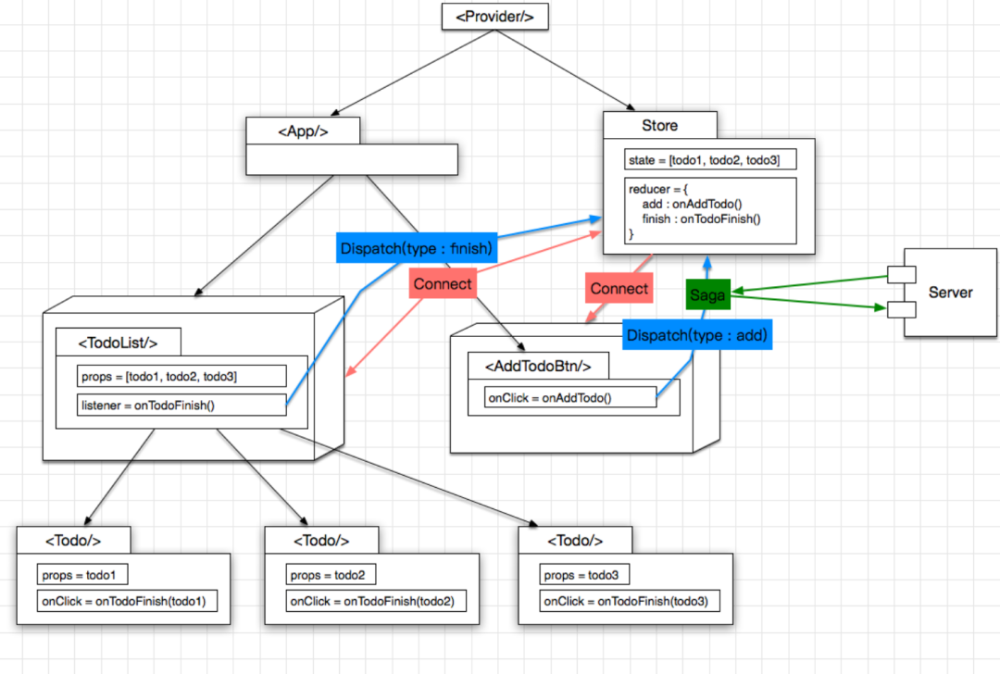

# DvaJS 原理

## Dva 是什么

dva 首先是一个基于 redux 和 redux-saga 的数据流方案，然后为了简化开发体验，dva 还额外内置了 react-router 和 fetch，所以也可以理解为一个轻量级的应用框架。

## Dva 解决的问题

- 文件切换问题。redux 的项目通常要分 reducer, action, saga, component 等等，他们的分目录存放造成的文件切换成本较大。
- 不便于组织业务模型 (或者叫 domain model) 。比如我们写了一个 userlist 之后，要写一个 productlist，需要复制很多文件。
- saga 创建麻烦，每监听一个 action 都需要走 fork -> watcher -> worker 的流程
- entry 创建麻烦。可以看下这个redux entry的例子，除了 redux store 的创建，中间件的配置，路由的初始化，Provider 的 store 的绑定，saga 的初始化，还要处理 reducer, component, saga 的 HMR 。这就是真实的项目应用 redux 的例子，看起来比较复杂。

## Dva 的优势

- **易学易用**，仅有 6 个 api，对 redux 用户尤其友好，配合 umi 使用后更是降低为 0 API
- **elm 概念**，通过 reducers, effects 和 subscriptions 组织 model
- **插件机制**，比如dva-loading可以自动处理 loading 状态，不用一遍遍地写 showLoading 和 hideLoading
- **支持 HMR**，基于babel-plugin-dva-hmr实现 components、routes 和 models 的 HMR

## Dva 的劣势

- 未来不确定性高。[dva@3 前年提出计划后，官方几乎不再维护](https://github.com/dvajs/dva/issues/2208)。
- 对于绝大多数不是特别复杂的场景来说，**目前可以被 Hooks 取代**

## Dva 的适用场景

- 业务场景：组件间通信多，业务复杂，需要引入状态管理的项目
- 技术场景：使用 React Class Component 写的项目

## Dva 核心概念

- **基于 Redux 理念的数据流向。** 用户的交互或浏览器行为通过 dispatch 发起一个 action，如果是同步行为会直接通过 Reducers 改变 State，如果是异步行为（可以称为副作用）会先触发 Effects 然后流向 Reducers 最终改变 State。

    

- 基于 Redux 的基本概念。包括：

    - State 数据，通常为一个 JavaScript 对象，操作的时候每次都要当作不可变数据（immutable data）来对待，保证每次都是全新对象，没有引用关系，这样才能保证 State 的独立性，便于测试和追踪变化。
    - Action 行为，一个普通 JavaScript 对象，它是改变 State 的唯一途径。
    - dispatch，一个用于触发 action 改变 State 的函数。
    - Reducer 描述如何改变数据的纯函数，接受两个参数：已有结果和 action 传入的数据，通过运算得到新的 state。
    - Effects（Side Effects） 副作用，常见的表现为异步操作。dva 为了控制副作用的操作，底层引入了redux-sagas做异步流程控制，由于采用了generator 的相关概念，所以将异步转成同步写法，从而将 effects 转为纯函数。
    - Connect 一个函数，绑定 State 到 View

- 其他概念

    - Subscription，订阅，从源头获取数据，然后根据条件 dispatch 需要的 action，概念来源于elm。数据源可以是当前的时间、服务器的 websocket 连接、keyboard 输入、geolocation 变化、history 路由变化等等。
    - Router，前端路由，dva 实例提供了 router 方法来控制路由，使用的是react-router。
    - Route Components，跟数据逻辑无关的组件。通常需要 connect Model 的组件都是 Route Components，组织在/routes/目录下，而/components/目录下则是纯组件（Presentational Components）

## Dva 应用最简结构

### 不带 Model

```js
import dva from 'dva';
const App = () => <div>Hello dva</div>;
// 创建应用
const app = dva();
// 注册视图
app.router(() => <App />);
// 启动应用
app.start('#root');
```

带 Model

```js
// 创建应用
const app = dva();
app.use(createLoading()) // 使用插件
// 注册 Model
app.model({
  namespace: 'count',
  state: 0,
  reducers: {
    add(state) { return state + 1 },
  },
  effects: {
    *addAfter1Second(action, { call, put }) {
      yield call(delay, 1000);
      yield put({ type: 'add' });
    },
  },
});
// 注册视图
app.router(() => <ConnectedApp />);
// 启动应用
app.start('#root');
```

## Dva底层原理和部分关键实现

### 背景介绍

- 整个 dva 项目使用 lerna 管理的，在每个 package 的 package.json 中找到模块对应的入口文件，然后查看对应源码。
- dva 是个函数，返回一了个 app 的对象。
- 目前 dva 的源码核心部分包含两部分，dva 和 dva-core。前者用高阶组件 React-redux 实现了 view 层，后者是用 redux-saga 解决了 model 层。

### [dva](https://github.com/dvajs/dva/blob/master/packages/dva/src/index.js)

dva 做了三件比较重要的事情：

1. 代理 router 和 start 方法，实例化 app 对象
2. 调用 dva-core 的 start 方法，同时渲染视图
3. 使用 react-redux 完成了 react 到 redux 的连接。

```js
// dva/src/index.js
export default function (opts = {}) {
  // 1. 使用 connect-react-router 和 history 初始化 router 和 history
  // 通过添加 redux 的中间件 react-redux-router，强化了 history 对象的功能
 const history = opts.history || createHashHistory();
  const createOpts = {
    initialReducer: {
      router: connectRouter(history),
    },
    setupMiddlewares(middlewares) {
      return [routerMiddleware(history), ...middlewares];
    },
    setupApp(app) {
      app._history = patchHistory(history);
    },
  };
  // 2. 调用 dva-core 里的 create 方法 ，函数内实例化一个 app 对象。
 const app = create(opts, createOpts);
  const oldAppStart = app.start;
  // 3. 用自定义的 router 和 start 方法代理
 app.router = router;
  app.start = start;
  return app;
  // 3.1 绑定用户传递的 router 到 app._router
 function router(router) {
    invariant(
      isFunction(router),
      `[app.router] router should be function, but got ${typeof router}`,
    );
    app._router = router;
  }
  // 3.2 调用 dva-core 的 start 方法，并渲染视图
 function start(container) {
    // 对 container 做一系列检查，并根据 container 找到对应的DOM节点
    if (!app._store) {
      oldAppStart.call(app);
    }
    const store = app._store;
    // 为HMR暴露_getProvider接口
 // ref: https://github.com/dvajs/dva/issues/469
 app._getProvider = getProvider.bind(null, store, app);
    // 渲染视图
 if (container) {
      render(container, store, app, app._router);
      app._plugin.apply('onHmr')(render.bind(null, container, store, app));
    } else {
      return getProvider(store, this, this._router);
    }
  }
}
function getProvider(store, app, router) {
  const DvaRoot = extraProps => (
    <Provider store={store}>{router({ app, history: app._history, ...extraProps })}</Provider>
  );
  return DvaRoot;
}
function render(container, store, app, router) {
  const ReactDOM = require('react-dom'); // eslint-disable-line
 ReactDOM.render(React.createElement(getProvider(store, app, router)), container);

}
```

我们同时可以发现 app 是通过 create(opts, createOpts)进行初始化的，其中 opts 是暴露给使用者的配置，createOpts 是暴露给开发者的配置，真实的 create 方法在 dva-core 中实现

### [dva-core](https://github.com/dvajs/dva/blob/master/packages/dva-core/src/index.js)


dva-core 则完成了核心功能：

1. 通过 create 方法完成 app 实例的构造，并暴露 use、model 和 start 三个接口
2. 通过 start 方法完成

```bash
store 的初始化
models 和 effects 的封装，收集并运行 sagas
运行所有的 model.subscriptions
暴露 app.model、app.unmodel、app.replaceModel 三个接口
```

dva-core create

**作用**： 完成 app 实例的构造，并暴露 use、model 和 start 三个接口

```js
// dva-core/src/index.js
const dvaModel = {
  namespace: '@@dva',
  state: 0,
  reducers: {
    UPDATE(state) {
      return state + 1;
    },
  },
};
export function create(hooksAndOpts = {}, createOpts = {}) {
  const { initialReducer, setupApp = noop } = createOpts; // 在dva/index.js中构造了createOpts对象
  const plugin = new Plugin(); // dva-core中的插件机制，每个实例化的dva对象都包含一个plugin对象
  plugin.use(filterHooks(hooksAndOpts)); // 将dva(opts)构造参数opts上与hooks相关的属性转换成一个插件
  const app = {
    _models: [prefixNamespace({ ...dvaModel })],
    _store: null,
    _plugin: plugin,
    use: plugin.use.bind(plugin), // 暴露的use方法，方便编写自定义插件
    model, // 暴露的model方法，用于注册model
    start, // 原本的start方法，在应用渲染到DOM节点时通过oldStart调用
  };
  return app;
}
```

dva-core start

**作用：**

1. 封装models 和 effects ，收集并运行 sagas
2. 完成store 的初始化
3. 运行所有的model.subscriptions
4. 暴露app.model、app.unmodel、app.replaceModel三个接口

```js
function start() {
  const sagaMiddleware = createSagaMiddleware();
  const promiseMiddleware = createPromiseMiddleware(app);
  app._getSaga = getSaga.bind(null);
  const sagas = [];
  const reducers = { ...initialReducer };
  for (const m of app._models) {
    // 把每个 model 合并为一个reducer，key 是 namespace 的值，value 是 reducer 函数
    reducers[m.namespace] = getReducer(m.reducers, m.state, plugin._handleActions);
    if (m.effects) {
      // 收集每个 effects 到 sagas 数组
      sagas.push(app._getSaga(m.effects, m, onError, plugin.get('onEffect'), hooksAndOpts));
    }
  }
  // 初始化 Store
  app._store = createStore({
    reducers: createReducer(),
    initialState: hooksAndOpts.initialState || {},
    plugin,
    createOpts,
    sagaMiddleware,
    promiseMiddleware,
  });
  const store = app._store;
  // Extend store
  store.runSaga = sagaMiddleware.run;
  store.asyncReducers = {};
  // Execute listeners when state is changed
  const listeners = plugin.get('onStateChange');
  for (const listener of listeners) {
    store.subscribe(() => {
      listener(store.getState());
    });
  }
  // Run sagas, 调用 Redux-Saga 的 createSagaMiddleware 创建 saga中间件，调用中间件的 run 方法所有收集起来的异步方法
  // run方法监听每一个副作用action，当action发生的时候，执行对应的 saga
  sagas.forEach(sagaMiddleware.run);
  // Setup app
  setupApp(app);
  // 运行 subscriptions
  const unlisteners = {};
  for (const model of this._models) {
    if (model.subscriptions) {
      unlisteners[model.namespace] = runSubscription(model.subscriptions, model, app, onError);
    }
  }
  // 暴露三个 Model 相关的接口，Setup app.model and app.unmodel
  app.model = injectModel.bind(app, createReducer, onError, unlisteners);
  app.unmodel = unmodel.bind(app, createReducer, reducers, unlisteners);
  app.replaceModel = replaceModel.bind(app, createReducer, reducers, unlisteners, onError);
  /**
   * Create global reducer for redux.
   *
   * @returns {Object}
   */
  function createReducer() {
    return reducerEnhancer(
      combineReducers({
        ...reducers,
        ...extraReducers,
        ...(app._store ? app._store.asyncReducers : {}),
      }),
    );
  }
}
}
```

### 路由

在前面的 dva.start 方法中我们看到了 createOpts，并了解到在 dva-core 的 start 中的不同时机调用了对应方法。

```js
import * as routerRedux from 'connected-react-router';
const { connectRouter, routerMiddleware } = routerRedux;
const createOpts = {
  initialReducer: {
    router: connectRouter(history),
  },
  setupMiddlewares(middlewares) {
    return [routerMiddleware(history), ...middlewares];
  },
  setupApp(app) {
    app._history = patchHistory(history);
  },
};
```

其中 initialReducer 和 setupMiddlewares 在初始化 store 时调用，然后才调用 setupApp

可以看见针对 router 相关的 reducer 和中间件配置，其中 connectRouter 和 routerMiddleware 均使用了 connected-react-router 这个库，其主要思路是：把路由跳转也当做了一种特殊的 action。


## Dva 与 React、React-Redux、Redux-Saga 之间的差异


### 原生 React



按照 React 官方指导意见, 如果多个 Component 之间要发生交互, 那么状态(即: 数据)就维护在这些 Component 的最小公约父节点上,
也即是
以及 本身不维持任何 state, 完全由父节点 传入 props 以决定其展现, 是一个纯函数的存在形式, 即: Pure Component


### React-Redux



与上图相比, 几个明显的改进点:

1. 状态及页面逻辑从 里面抽取出来, 成为独立的 store, 页面逻辑就是 reducer
2. 及都是 Pure Component, 通过 connect 方法可以很方便地给它俩加一层 wrapper 从而建立起与 store 的联系: 可以通过 dispatch 向 store 注入 action, 促使 store 的状态进行变化, 同时又订阅了 store 的状态变化, 一旦状态变化, 被 connect 的组件也随之刷新
3. 使用 dispatch 往 store 发送 action 的这个过程是可以被拦截的, 自然而然地就可以在这里增加各种 Middleware, 实现各种自定义功能, eg: logging

这样一来, 各个部分各司其职, 耦合度更低, 复用度更高, 扩展性更好。


### Redux-Saga



因为我们可以使用 Middleware 拦截 action, 这样一来异步的网络操作也就很方便了, 做成一个 Middleware 就行了, 这里使用 redux-saga 这个类库, 举个栗子:

1. 点击创建 Todo 的按钮, 发起一个 type == addTodo 的 action
2. saga 拦截这个 action, 发起 http 请求, 如果请求成功, 则继续向 reducer 发一个 type == addTodoSucc 的 action, 提示创建成功, 反之则发送 type == addTodoFail 的 action 即可

### Dva


有了前面三步的铺垫, Dva 的出现也就水到渠成了, 正如 Dva 官网所言, Dva 是基于 React + Redux + Saga 的最佳实践, 对于提升编码体验有三点贡献：

1. 把 store 及 saga 统一为一个 model 的概念, 写在一个 js 文件里面
2. 增加了一个 Subscriptions, 用于收集其他来源的 action, 比如键盘操作等
3. model 写法很简约, 类似于 DSL（领域特定语言），可以提升编程的沉浸感，进而提升效率

**约定大于配置**

```js
app.model({
  namespace: 'count',
  state: {
    record: 0,
    current: 0,
  },
  reducers: {
    add(state) {
      const newCurrent = state.current + 1;
      return { ...state,
        record: newCurrent > state.record ? newCurrent : state.record,
        current: newCurrent,
      };
    },
    minus(state) {
      return { ...state, current: state.current - 1};
    },
  },
  effects: {
    *add(action, { call, put }) {
      yield call(delay, 1000);
      yield put({ type: 'minus' });
    },
  },
  subscriptions: {
    keyboardWatcher({ dispatch }) {
      key('⌘+up, ctrl+up', () => { dispatch({type:'add'}) });
    },
  },
});
```

## Dva 背后值得学习的思想

Dva 的 api 参考了choo，概念来自于 elm。

1. Choo 的理念：编程应该是有趣且轻松的，API 要看上去简单易用。

    We believe programming should be fun and light, not stern and stressful. It's cool to be cute; using serious words without explaining them doesn't make for better results - if anything it scares people off. We don't want to be scary, we want to be nice and fun, and thencasually_be the best choice around._Real casually.

    We believe frameworks should be disposable, and components recyclable. We don't want a web where walled gardens jealously compete with one another. By making the DOM the lowest common denominator, switching from one framework to another becomes frictionless. Choo is modest in its design; we don't believe it will be top of the class forever, so we've made it as easy to toss out as it is to pick up.

    We don't believe that bigger is better. Big APIs, large complexities, long files - we see them as omens of impending userland complexity. We want everyone on a team, no matter the size, to fully understand how an application is laid out. And once an application is built, we want it to be small, performant and easy to reason about. All of which makes for easy to debug code, better results and super smiley faces.

2. 来自 Elm 的概念：

- Subscription，订阅，从源头获取数据，数据源可以是当前的时间、服务器的 websocket 连接、keyboard 输入、geolocation 变化、history 路由变化等等。


