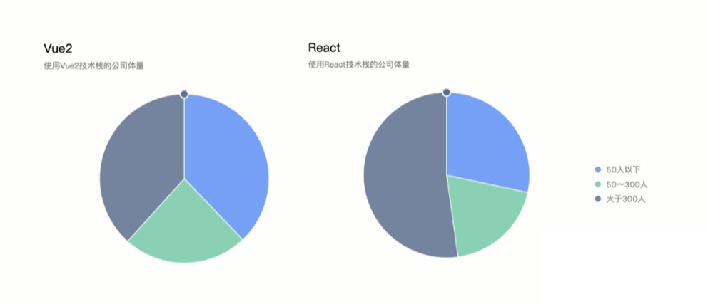
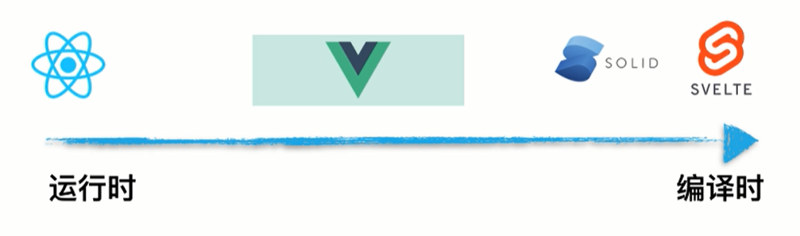
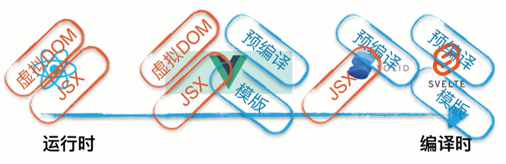
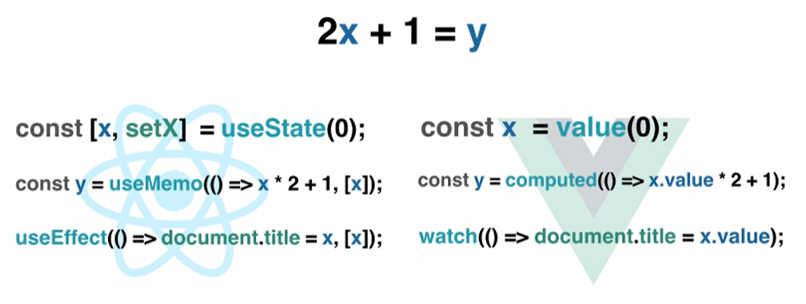
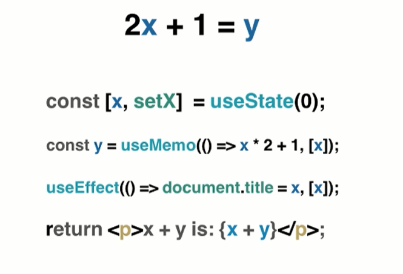
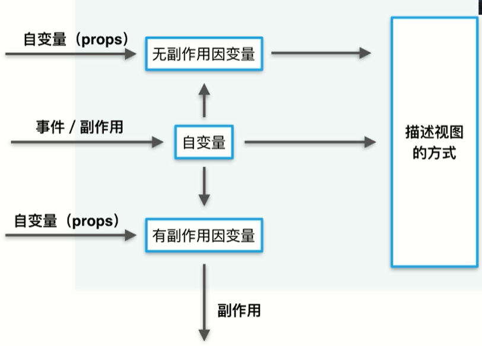

# React 对全球前端框架发展影响

## 技术栈与公司规模的关系



## React 定位

- 领域状态 + 视图状态

路由、请求库、工程化 ...

- 小项目：Vue、React 内置状态
- 状态管理：Vuex、Redux（Svelte、Solid）
- 需要前端框架：Angular
- 需要后端框架：Next.js、Nuex.js

- 框架
  - 前端框架
    - 路由、请求库、工程化
    - 状态
      - 领域状态
      - 视图状态
  - 后端、跨端框架

## 架构层面

`架构`层面：极致的`运行`时



UI=fn(state)

视图=fn(视图状态)

**更新粒度**：树级、组件级、节点级

- 节点级：`预编译`、关系`触发更新`的节点、`无虚拟 DOM`
- 树级：`基本无编译`、不关心`触发更新`的节点、`虚拟DOM`
- 组件级：有`预编译`能力、关系`触发更新`的节点、`虚拟DOM`

描述视图的方式 -> 虚拟 DOM -> 真实 DOM

描述视图的方式

- JSX
- 模板语法



## 特性层面

- Hooks
- 设计理念：代数效应
- 工程角度：逻辑收敛、功能复用
- 认知层面？？？

一个**初一**数学知识

```jsx
// 2x+1=y

const [x, setX] = useState(0);
const y = useMemo(() => x * 2 + 1, [x]);

useEffect(() => (document.title = x), [x]);
```







## CM 对 React 来说意味着什么

性能瓶颈

- CPU 瓶颈
  - 减少运行时流程
    - 性能优化 API
  - 减少用户感知
    - 时间切片
- IO 瓶颈
  - 网络延迟
  - Suspense
    - 全新SSR 架构


## 其他

- 自定义hooks替代高阶组件
- 派生状态
- 时间切片
- 命令式、声明式、响应式、函数式
- mvc mvvm mvp
- usePersistFn？
- server side render

状态管理：
- mobx
- rematch
- react-query
- dva
- redux
- rtk
- recoil
- unstated？
- swr
