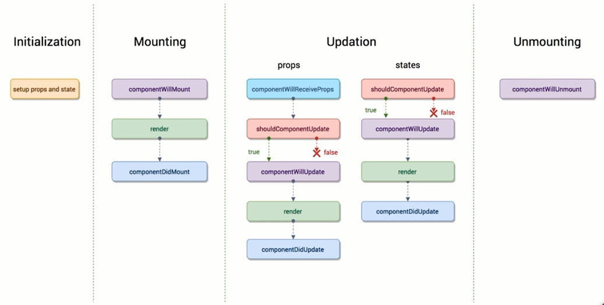

# 生命周期函数

life-cycle

声明周期函数指在某一个时刻组件自动调用执行的函数





```js
componentWillMount() {
    console.log('componentWillMount');
}

componentDidMount() {
    console.log('componentDidMount');
}

shouldComponentUpdate(nextProps, nextState) {
    console.log('shouldComponentUpdate');
    return true;
}

// 组件被更新之前  shouldComponentUpdate 返回true时才去执行
componentWillUpdate() {
    console.log('componentWillUpdate');
}

componentDidUpdate() {
    console.log('componentDidUpdate');
}

componentWillUnmount() {
    console.log('TestComponent componentWillUnmount')
}

// 只有父组件的reder被执行时
// props更新时才出发
componentWillReceiveProps() {
    console.log('componentWillReceiveProps');
}
```


## 使用场景


父组件的变化与子组件没有关系时

在子组件的
```js
shouldComponentUpdate(nextProps, nextState) {
    console.log('shouldComponentUpdate');
    if(nextProps.test ！== this.props.test ) {
        return true;
    } else {
        return false;
    }
}
```


Ajax
```js
componentDidMount() {
    
}
```

使用axios来做ajax

git地址：https://github.com/axios/axios
文档： https://www.kancloud.cn/yunye/axios/234845


