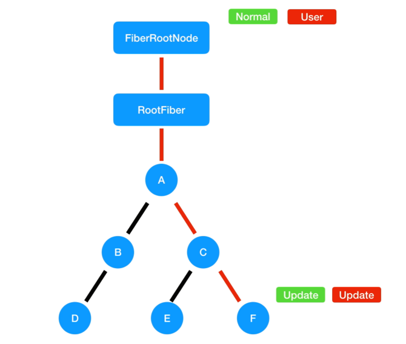

经过前几章的学习，我们终于有足够的前置知识理解**状态更新**的整个流程。

这一章我们看看几种常见的触发**状态更新**的方法是如何完成工作的。

## 几个关键节点

在开始学习前，我们先了解源码中几个关键节点（即几个关键函数的调用）。通过这章的学习，我们会将这些关键节点的调用路径串起来。

先从我们所熟知的概念开始。

### render阶段的开始

我们在[render阶段流程概览一节](../process/reconciler.html)讲到，

`render阶段`开始于`performSyncWorkOnRoot`或`performConcurrentWorkOnRoot`方法的调用。这取决于本次更新是同步更新还是异步更新。

### commit阶段的开始

我们在[commit阶段流程概览一节](../renderer/prepare.html)讲到，

`commit阶段`开始于`commitRoot`方法的调用。其中`rootFiber`会作为传参。

我们已经知道，`render阶段`完成后会进入`commit阶段`。让我们继续补全从`触发状态更新`到`render阶段`的路径。

```sh
触发状态更新（根据场景调用不同方法）

    |
    |
    v

    ？

    |
    |
    v

render阶段（`performSyncWorkOnRoot` 或 `performConcurrentWorkOnRoot`）

    |
    |
    v

commit阶段（`commitRoot`）
```

### 创建Update对象

在`React`中，有如下方法可以触发状态更新（排除`SSR`相关）：

- ReactDOM.render

- this.setState

- this.forceUpdate

- useState

- useReducer

这些方法调用的场景各不相同，他们是如何接入同一套**状态更新机制**呢？

答案是：每次`状态更新`都会创建一个保存**更新状态相关内容**的对象，我们叫他`Update`。在`render阶段`的`beginWork`中会根据`Update`计算新的`state`。

我们会在下一节详细讲解`Update`。

### 从fiber到root

现在`触发状态更新的fiber`上已经包含`Update`对象。

我们知道，`render阶段`是从`rootFiber`开始向下遍历。那么如何从`触发状态更新的fiber`得到`rootFiber`呢？

答案是：调用`markUpdateLaneFromFiberToRoot`方法。

> 你可以从[这里](https://github.com/facebook/react/blob/1fb18e22ae66fdb1dc127347e169e73948778e5a/packages/react-reconciler/src/ReactFiberWorkLoop.new.js#L636)看到`markUpdateLaneFromFiberToRoot`的源码

该方法做的工作可以概括为：从`触发状态更新的fiber`一直向上遍历到`rootFiber`，并返回`rootFiber`。

由于不同更新优先级不尽相同，所以过程中还会更新遍历到的`fiber`的优先级。这对于我们当前属于超纲内容。

### 调度更新

现在我们拥有一个`rootFiber`，该`rootFiber`对应的`Fiber树`中某个`Fiber节点`包含一个`Update`。

接下来通知`Scheduler`根据**更新**的优先级，决定以**同步**还是**异步**的方式调度本次更新。

这里调用的方法是`ensureRootIsScheduled`。

以下是`ensureRootIsScheduled`最核心的一段代码：

```js
if (newCallbackPriority === SyncLanePriority) {
  // 任务已经过期，需要同步执行render阶段
  newCallbackNode = scheduleSyncCallback(
    performSyncWorkOnRoot.bind(null, root)
  );
} else {
  // 根据任务优先级异步执行render阶段
  var schedulerPriorityLevel = lanePriorityToSchedulerPriority(
    newCallbackPriority
  );
  newCallbackNode = scheduleCallback(
    schedulerPriorityLevel,
    performConcurrentWorkOnRoot.bind(null, root)
  );
}
```

> 你可以从[这里](https://github.com/facebook/react/blob/b6df4417c79c11cfb44f965fab55b573882b1d54/packages/react-reconciler/src/ReactFiberWorkLoop.new.js#L602)看到`ensureRootIsScheduled`的源码

其中，`scheduleCallback`和`scheduleSyncCallback`会调用`Scheduler`提供的调度方法根据`优先级`调度回调函数执行。

可以看到，这里调度的回调函数为：

```js
performSyncWorkOnRoot.bind(null, root);
performConcurrentWorkOnRoot.bind(null, root);
```

即`render阶段`的入口函数。

至此，`状态更新`就和我们所熟知的`render阶段`连接上了。

## 总结

让我们梳理下`状态更新`的整个调用路径的关键节点：

```sh
触发状态更新（根据场景调用不同方法）

    |
    |
    v

创建Update对象（接下来三节详解）

    |
    |
    v

从fiber到root（`markUpdateLaneFromFiberToRoot`）

    |
    |
    v

调度更新（`ensureRootIsScheduled`）

    |
    |
    v

render阶段（`performSyncWorkOnRoot` 或 `performConcurrentWorkOnRoot`）

    |
    |
    v

commit阶段（`commitRoot`）
```

## 总结

本节我们了解了**状态更新**的整个流程。

在接下来三节中，我们会花大量篇幅讲解`Update`的工作机制，因为他是构成`React concurrent mode`的核心机制之一。




