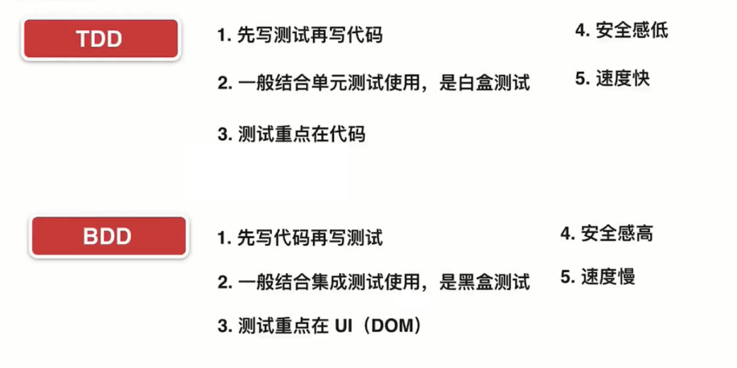

# React 中的 TDD 与 BDD



## React 环境中配置 Jest

安装 cra

```bash
npm install -g create-react-app

create-react-app jest-react

npm run eject
```

```bash
npm install -g cnpm --registry=https://registry.npm.taobao.org
```

第一种： 在 package.json 中有 jest 配置信息。

第二种： 新建 jest.config.js , 将 package.json 中的 jest 配置信息移出来。

## enzyme 的配置及使用

- [enzyme](https://github.com/airbnb/enzyme)
- [jest-enzyme](https://github.com/FormidableLabs/enzyme-matchers/tree/master/packages/jest-enzyme)

```bash
npm i --save-dev enzyme enzyme-adapter-react-16

npm i --save-dev jest-enzyme
```

jest 配置项

```js
"setupFilesAfterEnv": ['./node_modules/jest-enzyme/lib/index.js'],
```

```js
import React from 'react';
import Enzyme, {shallow} from 'enzyme';
import Adapter from 'enzyme-adapter-react-16';
import App from './App';

Enzyme.configure({adapter: new Adapter()});

it('renders without crashing', () => {
  const wrapper = shallow(<App />);
  const container = wrapper.find('[data-test="app-container"]');
  // wrapper.debug();
  // expect(container.length).toBe(1);
  // expect(container.prop('title')).toBe('React App');

  expect(container).toExist();
  expect(container).toHaveProp('title', 'React App');

  // 生成快照
  expect(container).toMatchSnapshot();
});
```

优化：

1. wrapper.find

testUtils.js

```js
export const findTestWrapper = (wrapper, tag) => {
  return wrapper.find(`[data-test="${tag}"]`);
};
```

2. Enzyme import 抽取

testSetup.js

```js
import Enzyme from 'enzyme';
import Adapter from 'enzyme-adapter-react-16';

Enzyme.configure({adapter: new Adapter()});
```

配置 jest.config.js

```js
"setupFilesAfterEnv": [
    './node_modules/jest-enzyme/lib/index.js',
    "<rootDir>/src/utils/testSetup.js", // 重要
],
```

生成测试覆盖率

```js
  "scripts": {
    "start": "node scripts/start.js",
    "build": "node scripts/build.js",
    "test": "node scripts/test.js",
    "coverage": "node scripts/test.js --coverage --watchAll=false"
  },
```

TDD 与 单元测试

- TDD：代码质量提高
- 单元测试：测试覆盖率高，业务耦合度，代码量大，过于独立

## BDD

BDD 与 集成测试

## 前端自动化测试的优势

1. 更好的代码组织，项目的可维护性增强
1. 更小的 Bug 出现概率，尤其是回归测试中的 Bug
1. 修改工程质量差的项目，更加安全
1. 项目具备潜在的文档特性
1. 扩展知识面

总结：

- TDD、BDD
  - TDD：先写测试再写代码，一般用于工具类库测试。
  - BDD: 先写代码再写测试，一般用于业务代码测试。
- 集成测试，单元测试
- 测试与业务的解耦
- 代码测试覆盖率并不代表一定靠谱
- 功能测试及 UI 测试
- 测试越独立，隐藏的问题越多
