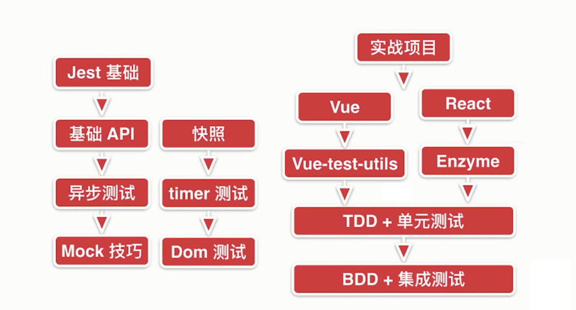

# 前端自动化测试及 Jest

前端自动化测试库有很多：Jasmine，MOCHA,Jest。Jest，因为在性能、功能和易用性表现的比较好，实际上其他测试库也不差，底层原理都差不多，学会一门通所有，下面说说 Jest 的优点：

- 速度快：没有修改的代码是不会重新运行测试代码的
- API 简单：数量少，容易学
- 易配置：通过配置文件简单配置
- 隔离性好：测试文件之间相互隔离
- 监控模式：更灵活的运行测试用例
- IDE 整合：容易合 IDE 做整合
- Snaphot：快速解决不重要的测试
- 多项目并行：同时测试 node 和 vue 的测试用例
- 覆盖率：通过简单的命令即可生成报告
- MOCK 丰富：提供很多 Mock 机制
- 支持新型技术：比如 Babel,typescript,node 等等
- 插件丰富：在 vue 中结合 Vue-test-utils 对组件进行测试，在 react 中结合 Enzyme 对组件测试

## 持续集成 & 持续交付 & 持续部署

在互联网时代软件从开发到上线，后续迭代更新，已经形成了一套近乎标准的流程，其中最重要的流程就是持续集成(Continuous integration，简称 CI)。"持续"的核心思想在于：在事先难以完全了解完整正确的需求时，干脆把大项目分割成小块完成，并加快交付的速度和频率，使其尽早在下个环节得到验证，若发现问题能够尽早返工。

对于持续集成、持续交付和持续部署三个从敏捷思想中提出的概念，此处举个在知乎上看到的很形象例子：装修厨房，铺地砖时边角地砖要切割大小，如果一次全切割完再铺上去，发现尺寸有误时的浪费和返工成本就大了，不如切一块铺一块，这就是持续集成；装修厨房有很多部分，每个部分都有检测手段，如地砖铺完了要测试漏水与否，线路铺完了要通电测试电路通顺，水管装好了也要测试冷水热水，如果等全部装完了再测，出现问题可能会互相影响，比如电路不行可能要把地砖给挖开，如果每完成一部分就测试，这是持续部署；全部装修完了等待验收，客户发现地砖颜色不合意，水池太小，灶台位置不对，返工吗？所以不如每完成一部分就试用验收，这就是持续交付。这三个概念强调在软件开发过程中，通过技术手段自动化这三个工作，加快交付速度。

具体来说，持续集成是一种软件开发实践，强调开发人员在提交新代码后立刻进行构建、自动化测试等，频繁自动将代码集成到主干和生产环境，降低一次性集成过多代码带来的风险。

持续交付在持续集成的基础上，将集成后的代码部署到更贴近真实运行环境的"类生产环境"中。比如把完成单元测试的代码部署包含完整功能的预发布环境中运行更多更完整的集成测试，甚至是人工测试，通过后继续手动部署到生产环境中。

持续部署则是在持续交付的基础上，把部署到生产环境的过程自动化。

## 持续集成 & 前端自动化测试

持续集成是互联网软件开发上线流程中的核心一环，在 1.1 节介绍中也不难看出，自动化测试是持续集成得以实现的核心步骤，缺乏了自动化测试，持续集成自然无从谈起。

在日常的开发中，前端错综复杂的变化引发的 bug 往往令开发者头疼，或多或少经历过 修完东墙西墙倒 的经历，此时前端自动化测试就显得非常重要。前端的自动化测试无非也是编写测试用例，在持续集成时执行跑通全部测试用例。如果是一个短平快的小项目，引入前端自动化测试，编写测试用例，无疑只会增加开发成本，然而当项目扩大、迭代频繁、逻辑复杂、需求反复变更的情况下，回归测试的成本是巨额的，自动化测试的优势就能体现出来。

`自动化测试的收益 = 迭代次数 * 全手动执行成本 - 首次自动化成本 - 维护次数 * 维护成本`

尽早引入前端自动化测试不仅能够减少项目 bug 出现概率(尤其是回归测试中的 bug)，还能更好地进行代码组织，增强项目的可维护性，尤其对于工程质量较差的项目，收益是巨大的；如果将其应用于持续集成中，commit 触发自动执行测试脚本，还能大幅提升团队的开发效率。

## 分类

前端自动化测试可以按照开发模式分两类：TDD (Test-Driven Development) 测试驱动开发、BDD (Behavior Driven Development) 行为驱动开发。TDD 顾名思义，开发者根据需求先编写测试用例，再逐步开发，最终满足全部测试用例的需求。刚开始的时候，只有测试用例，未进行功能开发，执行测试用例，满屏是红色的测试用例不通过提示，随着测试用例被满足变绿，最终全部变绿，功能开发完成，因此前端自动化测试也被叫做 Red-Green Development。测试还可以按照用例粒度分为 单元测试 (Unit Test)、集成测试 (Integration Test)、端到端测试 (End to End Test)。

### TDD

TDD (Test-Driven Development) 测试驱动开发

- TDD 先写测试再写代码，单位是模块，多用于 单元测试
- 重点在测试代码，属于 白盒测试
- 测试内容是模块，速度快，但是忽略模块间依赖，安全感低

TDD 的开发流程

1. 编写测试用例
2. 运行测试，测试用例无法通过测试
3. 编写代码，测试用例通过测试
4. 代码优化，完成开发
5. 重复上述步骤

TDD 有以下优势：

- 长期减少回归 BUG
- 代码质量会更好（组织、可维护性）
- 测试覆盖率高
- 错误测试代码不容易出现

### BDD

BDD (Behavior Driven Development) 行为驱动开发

- BDD 先写代码再写测试，测试单位是功能，多用于 集成测试
- 重点在测试 UI（DOM）功能，属于 黑盒测试
- 测试内容是整套操作流程，速度慢，往往需要多个模块配合，安全感高

### 工具选择

前端近几年涌现出很多优秀的测试工具：

- karma – Google Angular 团队开发的测试运行平台，配置简单灵活，能够很方便在多个真实浏览器中运行测试
- mocha – 很优秀的测试框架，有完善的生态系统，简单的测试组织方式，不对断言库和工具做任何限制，非常灵活
- jest – facebook 出品的大而全的测试框架，React 官方推荐的单元测试框架，配置简单运行速度快

还有很多其他的前端测试框架，但大同小异，无非是对断言和测试桩等工具的集成度不同，论成熟度首推 mocha，论效率首推 jest。

jest 是 Facebook 开源的 JavaScript 测试框架，它自动集成了断言、JsDom、覆盖率报告等开发者所需要的所有测试工具，是一款几乎零配置的测试框架，而且速度很快，此处选择 jest 作为测试工具。

## 前端工程化

- 高质量的代码设计
- 高质量的代码实现
- 前端自动化测试

对比

- 代码重构 Code Refactoring
  - 修复时间长
  - 修复成本高
- 前端自动化测试 Automatic FrontEnd Testing
  - 修复时间短
  - 修复成本低



## 自动化测试产生的背景及原理

TypeScript、Flow、Eslint、StyleLint

```js
function add(a, b) {
  return a + b;
}

function minus(a, b) {
  return a - b;
}

var result = add(3, 7);
var expected = 10;

if (result !== 10) {
  throw Error(`3 + 7 应该等于 ${result}, 但结果是 ${expected}`);
}

var result = minus(9, 9);
var expected = 0;

if (result !== 0) {
  throw Error(`9 - 9 应该等于 ${result}, 但结果是 ${expected}`);
}
```

```js
function expect(result) {
  return {
    toBe: function (actual) {
      if (result !== actual) {
        throw Error(`预期值与实际值不符`);
      }
    },
  };
}

expect(add(3, 3)).toBe(6);
expect(minus(3, 3)).toBe(0);
expect(minus(6, 3)).toBe(3);
```

```js
function expect(result) {
  return {
    toBe: function (actual) {
      if (result !== actual) {
        throw Error(`预期值与实际值不符，预期值是${actual}, 结果值是${result}`);
      }
    },
  };
}

function test(desc, fn) {
  try {
    fn();
    console.log(`${desc}, 通过测试`);
  } catch (error) {
    console.log(`${desc}, 没有通过测试; ${error}`);
  }
}

test('测试 3 + 3', () => {
  expect(add(3, 3)).toBe(6);
});
test('测试 3 - 3', () => {
  expect(minus(3, 3)).toBe(0);
});
```

## 前端自动化测试框架：Jest

Jasmine、mocha、chai、jest

性能、功能、易用性

Jest 特点：

- 速度快
- API 简单
- 易配置
- 隔离性
- 监控模式
- IDE 整合
- Snapshot
- 多项目并行
- 覆盖率
- Mock 丰富

## 使用 Jest 测试上面的代码

```bash
npm i jest@24.8.0 -D
```

- 单元测试
- 集成测试
- 模块测试

```js
function add(a, b) {
  return a + b;
}

function minus(a, b) {
  return a - b;
}

module.exports = {
  add,
  minus,
};
```

```js
var math = require('./math');

var {add, minus} = math;

test('测试 3 + 3', () => {
  expect(add(3, 3)).toBe(6);
});
test('测试 3 - 3', () => {
  expect(minus(3, 3)).toBe(0);
});
```

## Jest 简单配置

- npx jest --init
- npx jest --coverage

```js
  "scripts": {
    "test": "jest --watchAll",
    "coverage": "jest --coverage"
  }
```

cnpm i @babel/core@7.4.5 @babel/preset-env@7.4.5 -D

.babelrc

```js
{
    "presets": [
        ["@babel/preset-env", {
            "targets": {
                "node": "current"
            }
        }]
    ]
}
```

npm run jest

- jest: babel-jest
- babel-core
- 获取 babelrc 配置
- 在运行测试前，结合 babel，先把代码转换一次
- 运行转换后的测试用例

再次跑之前的用例

```js
export function add(a, b) {
  return a + b;
}

export function minus(a, b) {
  return a - b;
}
```

```js
import {add, minus} from './math';

test('测试 3 + 3', () => {
  expect(add(3, 3)).toBe(6);
});
test('测试 3 - 3', () => {
  expect(minus(3, 3)).toBe(0);
});
```

```bash
npx jest --init  # 初始化 jest.config.js
npx jest # 普通执行测试
npx jest --coverage # 生成覆盖率报告
```

```js
{
    "test": "jest",               // 普通执行测试
    "coverage": "jest --coverage" // 生成覆盖率报告
    "test:watch": "jest --watch", // 持续监听变化，默认 o 模式
    "test:all": "jest --watchAll" // 持续监听所有文件变化
}
```

## Jest 中的匹配器

- toBe: 匹配器 matchers（与 js 中的 object.is\ === 类似）
- toEqual: 测试对象内容相等
- toBeNull
- toBeUndefined
- toBeDefined
- ...

```js
test('测试 10 与 10 相等', () => {
  expect(10).toBe(10);
});

test('测试对象内容相等', () => {
  var obj = {
    a: 'test',
  };
  expect(obj).toEqual({a: 'test'});
});

test('toBeNull', () => {
  var a = null;
  expect(a).toBeNull();
});

test('toBeUndefined', () => {
  var a = undefined;
  expect(a).toBeUndefined();
});

test('toBeDefined', () => {
  var a = 88;
  expect(a).toBeDefined();
});

test('toBeTruthy', () => {
  var a = true;
  expect(a).toBeTruthy();
});

test('toBeFalsy', () => {
  var a = false;
  expect(a).toBeFalsy();
});

test('not toBeFalsy', () => {
  var a = true;
  expect(a).not.toBeFalsy();
});

// 比这个数字大
test('toBeGreaterThan', () => {
  var a = 10;
  expect(a).toBeGreaterThan(9);
});

// 比这个数字小
test('toBeLessThan', () => {
  var a = 10;
  expect(a).toBeLessThan(99);
});

// 大于等于
test('toBeGreaterThanOrEqual', () => {
  var a = 10;
  expect(a).toBeGreaterThanOrEqual(5);
});

// 小于等于
test('toBeLessThanOrEqual', () => {
  var a = 10;
  expect(a).toBeLessThanOrEqual(88);
});

test('toBeCloseTo', () => {
  var a = 0.1 + 0.2;
  expect(a).toBeCloseTo(0.3);
});

// String
test('toMatch', () => {
  var a = 'jest test case';
  expect(a).toMatch('test');
});

// Array, Set
test('toContain', () => {
  var arr = ['jest', 'test', 'case'];
  expect(arr).toContain('test');
});

test('toContain Set', () => {
  var arr = ['jest', 'test', 'case'];
  var data = new Set(arr);
  expect(data).toContain('test');
});

// 异常
function throwErrorFunc() {
  throw new Error('this is new error');
}
test('toThrow', () => {
  expect(throwErrorFunc).toThrow();
});

test('toThrow message', () => {
  expect(throwErrorFunc).toThrow('this is new error');
});

function notThrowErrorFunc() {}
test('toThrow not', () => {
  expect(notThrowErrorFunc).not.toThrow();
});
```

## Jest 命令行工具的使用

```bash
code # 自动打开 vsc
```

```bash
npm run test
```

Jest 的命令行参数

- --watchAll，相当于 a 模式，当任何一个测试文件修改，则重新运行所有的测试
- --watch，相当于 o 模式，当某个测试文件修改，则只重新运行修改的那个文件里的所有测试。需要配合使用 git
- f，只重新运行上次测试失败的测试用例。
- p，只重新运行测试文件名字跟输入的匹配的测试文件。
- t，只重新运行测试用例名字跟输入的匹配的测试用例。

但我们运行的 jest 命令行带了--watchAll 或 --watch，执行命令后，终端中该命令并不会退出，而是在等待状态，这时候你可以输入上述中的各种模式的代号，进行重新运行测试

```js
"scripts": {
    "test:watch": "jest --watch", // 默认 o 模式
    "test:all": "jest --watchAll",
    "coverage": "jest --coverage"
}
```

## Jest 中的核心钩子函数

- beforeAll
- beforeEach
- afterAll
- afterEach

```js
beforeAll(() => {
  console.log('beforeAll');
});
afterAll(() => {
  console.log('afterAll');
});
// 每个用例执行前执行，一般用于针对不同用例初始化不同的实例对象
beforeEach(() => {
  console.log('beforeEach');
  // 实例化
  counter = new Counter();
});
afterEach(() => {
  console.log('afterEach');
});
```

## describe 分组

可以用于限定作用域，可以与钩子函数配合使用，写在不同层级的钩子函数，作用域不同

```js
describe('测试分组和钩子函数', () => {
  let counter = null;
  // 外层 beforeEach
  beforeEach(() => {
    counter = new Counter();
  });
  // 分组1
  describe('测试分组1代码', () => {
    // 【 使用 describe 限定作用域 】
    // 内层 beforeEach 不会对后面的同级 describe 产生影响
    beforeEach(() => {
      console.log('beforeEach test group1');
    });
    test('xxx', () => {
      /* ... */
    });
    // ...
  });
  // 分组2
  describe('测试分组2代码', () => {
    test('xxx', {
      /* ... */
    });
    // ...
  });
});
```

## only 跳过 case

```js
test('该 case 被跳过', () => {
  /* ... */
});
test.only('只测试这个用例，跳过其他 case', () => {
  /* ... */
});
test('该 case 被跳过', () => {
  /* ... */
});
```

## snapshot 快照测试

快照测试适用于配置文件、UI 等内容的测试，快照保存上次运行的结果存储在 **snapshots** 下，如果两次执行结果不一致则不通过，需要检查后更新快照，按 u 更新全部快照，按 i 进入交互式单独更新。例如测试下面的配置文件 snapshot.js

```js
// 固定值
export const generateConfig1 = () => {
  return {
    server: 'http://localhost',
    port: 8080,
  };
};
// 存在变化的时间值
export const generateConfig2 = () => {
  return {
    server: 'http://localhost',
    port: 8080,
    time: new Date(),
  };
};
```

编写测试用例，注意匹配时间类变化值

```js
import {generateConfig1, generateConfig2} from './11-snapshot';
test('测试 generateConfig1 函数', () => {
  expect(generateConfig1()).toMatchSnapshot();
});
test('测试 generateConfig2 函数', () => {
  expect(generateConfig2()).toMatchSnapshot({
    // 用于匹配时间类变化的值
    time: expect.any(Date),
  });
});
```

### inline snapshot

inline snapshot，可以将快照保存在用例中，需要安装 prettier 模块

```bash
npm install prettier --save
```

编写测试用例

```js
test('测试 generateConfig2 函数 inline', () => {
  expect(generateConfig2()).toMatchInlineSnapshot({
    time: expect.any(Date),
  });
});
```

执行后快照保存在用例文件中

```js
test('测试 generateConfig2 函数 inline', () => {
  expect(generateConfig2()).toMatchInlineSnapshot(
    {
      time: expect.any(Date),
    },
    `
        Object {
            "port": 8080,
            "server": "http://localhost",
            "time": Any<Date>,
        }
        `
  );
});
```

## DOM 测试

dom 测试一般用于测试 UI，例如需要测试下面 jquery 操作 dom 的代码 dom.js

```js
import $ from 'jquery';
const addDivToBody = () => {
  $('body').append('<div/>');
};
export default addDivToBody;
```

编写测试用例，node 不具备 dom，因此 jest 在 node 环境下模拟了 dom api — jsDom

```js
import addDivToBody from './dom';
import $ from 'jquery';
test('测试 addDivToBody', () => {
  addDivToBody();
  addDivToBody();
  expect($('body').find('div').length).toBe(2);
});
```
