# React Notes（1）

- Ant Design
- DvaJS
- Recharts

学习 React 的误区

- 基础知识掌握不够牢固
- 没有弄懂 React 独特的数据流和状态管理
- 盲目的学习 React 全家桶，没有弄懂它究竟解决了什么问题
- 堆积大量逻辑重复的代码
- 不懂测试，完全没有测试的概念

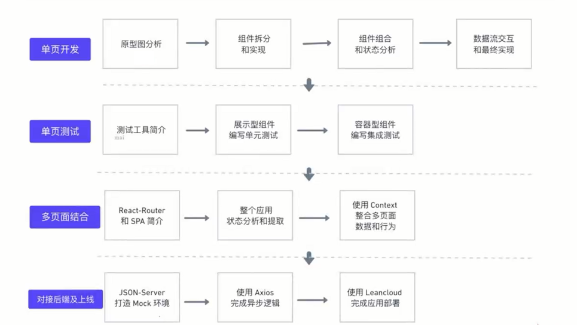

## 掌握的知识点

基础知识

- React 16
- React 理念
- Context
- 高阶组件

React 工具

- Ionicon
- ReactRouter
- Recharts
- Bootstrap

测试及后端

- Jest
- Enzyme
- JSONServer
- Axios

## 代码文件结构，代码和文件命名规则

- 代码结构 和 文件命名 的重要性
- 用 cra 创建工程模板
- 展示型组件 和 容器型组件

展示型组件

- 关系数据的展示方式
- 不依赖 App 中的其他文件
- 不关心数据是如何加装和变化的
- 仅通过 props 接收数据和回调函数
- 除非需要用到 state ，声明周期函数或性能优化，通常写成函数式组件

容器型组件

- 关系数据的运作方式
- 为展示型组件提供数据和操作数据的方法
- 为展示型组件提供函数
- 通常是有状态的，并且作为数据源存在

规范

- components 文件夹存放所有的展示型组件
- containers 文件夹存放所有的容器型组件
- 这两个文件夹下的 **test** 文件夹存放所有组件的测试文件
- 文件使用 Pascal Case 命名法
- src 根目录下放统一使用的一些文件

## React 理念

React 官方推荐的开发 React 应用的思考方式

[thinking-in-react](https://react.docschina.org/docs/thinking-in-react.html)

1. 把 UI 划分出组件层级
2. 创建应用的静态版本
3. 确定 UI state 的最小（且完整）表示
4. 确定 state 放置的位置
5. 添加反向数据流

## 选择图标库

- 使用 svg 图标库，而不是 font icon
- 很多 free icon set - icomoon、Ionicon ...

[Ionicon](https://ionicons.com/)

[react-ionicons](https://www.npmjs.com/package/react-ionicons)

[react-ionicons gitpage](https://zamarrowski.github.io/react-ionicons/)

## 使用 PropType 检查属性检查

- 类型检查可以帮助我们更好的发现 Bug
- React 中使用 PropTypes 做类型检查
- Props 默认值：defaultProps

```js
Comxxx.propTypes = {
  income: PropTypes.number.isRequired,
  outcome: PropTypes.number.isRequired,
};
```

## State 设计原则

- 最小化 State 原则
- DRY：Don't Repeat Yourself
- 有些数据可以根据 State 计算得出

## 组件测试

国内互联网测试现状

- 重视程度严重不足
- 没有时间
- 不会写测试

测试是什么和重要性

- 高质量的代码
- 更早的发现 Bug，减少成本
- 让重构和升级更加容易可靠
- 让开发流程更加的敏捷

测试金字塔

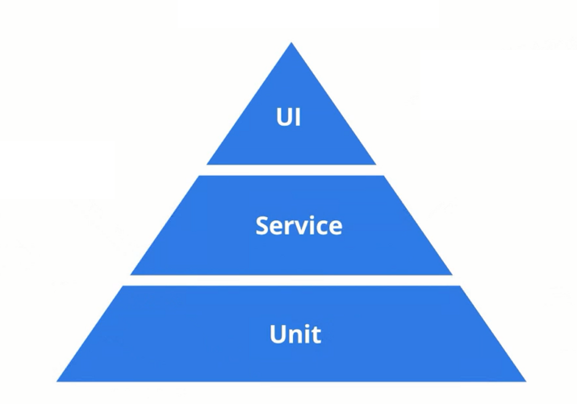

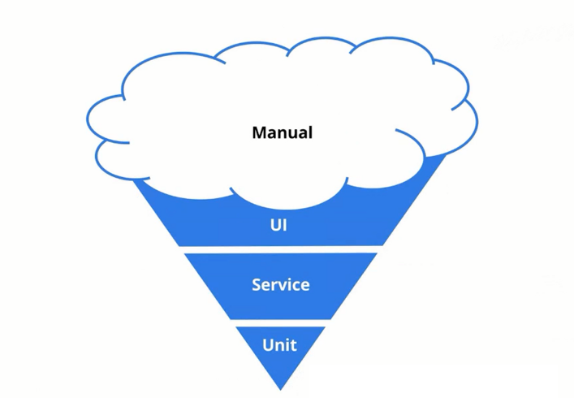

React 特别适合单元测试

- 组件化
- Functional Component
- 单向数据流

### 通用测试框架 - Jest

[Jest](https://jestjs.io/)

- 通用测试框架
- 支持多平台，运行速度极快
- 内置代码覆盖率测试
- 为 React 提供了一下特殊的测试方法

### 断言库

- 判断一个值是否对应相应的结果
- https://jestjs.io/docs/en/using-matchers
- 其他断言库：chai 等

### React 测试工具

- React 官方测试工具 - ReactTestUtils
- Airbnb 基于官方的封装 - Enzyme

[Enzyme 官网](https://airbnb.io/enzyme/)

Enzyme 优点：

- 简单 易懂
- 类似 JQ 链式写法

两种测试方法

- Shallow Rendering
- DOM Rendering

### TDD

测试驱动开发，Test-Driven Development

### 单元测试用例分析

- 测试默认状态 - 是否正确渲染特定组件和数据等
- 测试交互 - 点击交互该组件的 state 是否有相应的修改
- 测试交互 - 对应操作触发以后展示型组件的属性是否修改

## 使用 React-Router 开发 SPA 应用

什么是 SPA

- 一种 Web 应用程序或者网站
- 在和用户交互的时候在页面页面内完成展示
- 由 JS 实现 URL 变换 和 动态变换 HTML 的内容

SPA 应用的有点

- 速度快，一次下载完成静态资源，跳转不需要再次下载
- 体验好，整个交互趋于无缝，更倾向于原生应用
- 为前后端分离提供了实践场所

SPA 框架

- angular
- ember

React Router 特点

- Components Based
- 声明式和可组合
- 支持多种应用 - web、React Native

尝试 TDD 的开发流程

- 分析需求
- 编写测试用例
- 实现组件的具体实现

## Redux

- 一种特殊的数据结构
- 使用一些特殊的方法来实现数据的更改
- 不是 React 的特有的，其他框架也可以用

## 使用 Context 来管理数据

- Context.Provider
- Context.Consumer

withContext 高阶组件的封装

```js
import React from 'react';

const AppContext = React.createContext();

const withContext = (Component) => {
  return (props) => (
    <AppContext.Consumer>
      {({state, actions}) => {
        return <Component {...props} data={state} actions={actions} />;
      }}
    </AppContext.Consumer>
  );
};

export default withContext;
```

### HOC 高阶组件

- 为了解决组件逻辑重用的一种技术
- 就是返回一个函数，且该函数接受一个组件作为参数，并返回一个新的组件

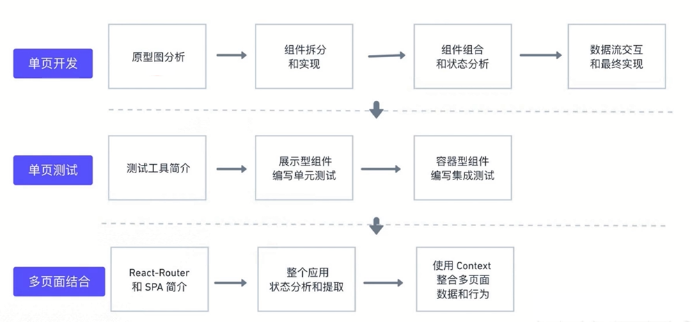

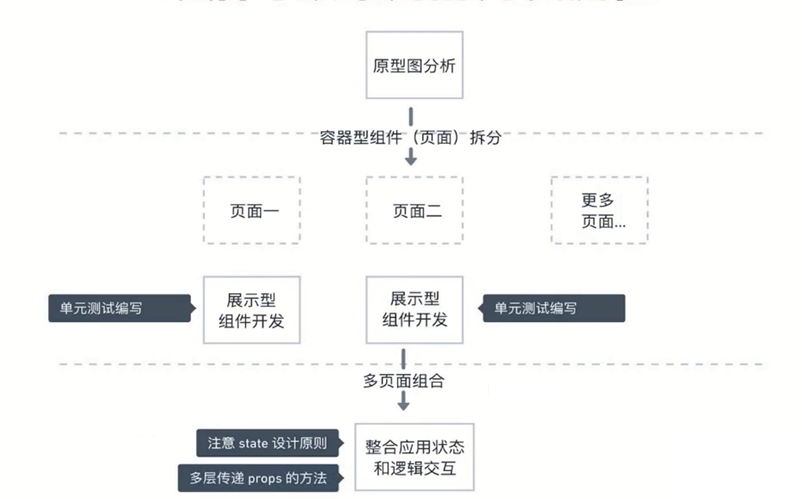

## 前后端分离开发和 mock server

前端开发的上古时代

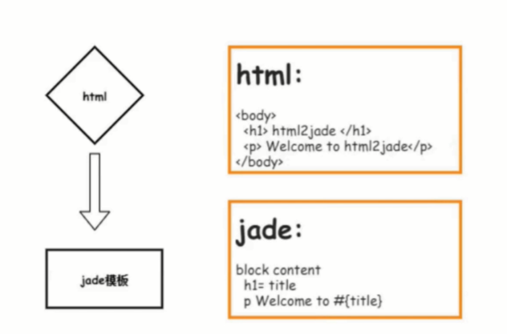

Nodejs 的诞生

- 前端工程化
- H5 和 JS 的进化
- RN、微信小程序、PWA 等

前后端分离之前的开发模式

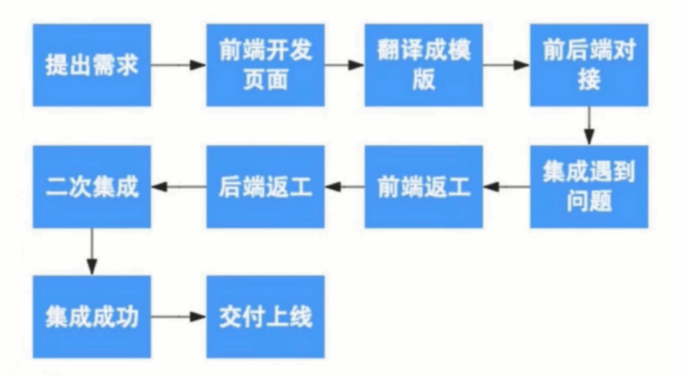

前后端分离后的数据交互方式

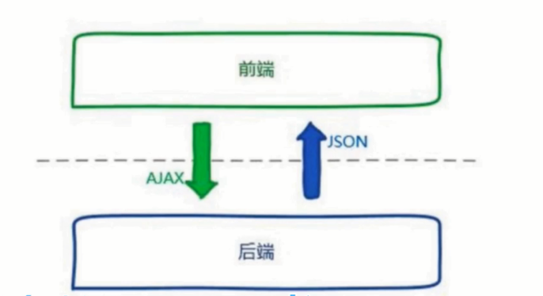

前后端分离之后的开发模式

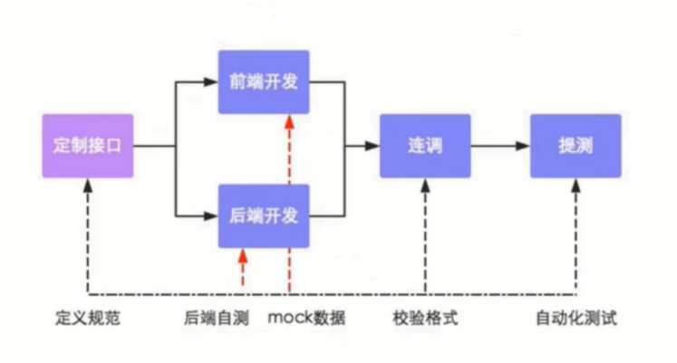

前后端分离开发的优点：

- 为优质产品打造精益团队
- 提升开发效率
- 完美应对复杂多变的前端需求
- 增强代码可维护性

### 使用 json-server 打造 mock server

优秀的 mock server 应该有的特性：

- 快速搭建
- 支持标准的 Restful 操作
- 支持标准的 Restful 路由规则
- 一些进阶扩展：自定义路由、中间件支持 等

```bash
npm install -g json-server
```

db.json

```json
{
  "posts": [{"id": 1, "title": "json-server", "author": "typicode"}],
  "comments": [{"id": 1, "body": "some comment", "postId": 1}],
  "profile": {"name": "typicode"}
}
```

```bash
json-server --watch db.json
```

使用 [postman](http://www.getpostman.com/) 进行 API 测试

Postman 的特点：

- 支持各种操作系统
- 有非常简洁易用的界面
- 可以支持 APi 测试的导出，很容易分享给其他同学

## 下一代 HTTP 库： Axios

原生 XHR 和 \$.ajax

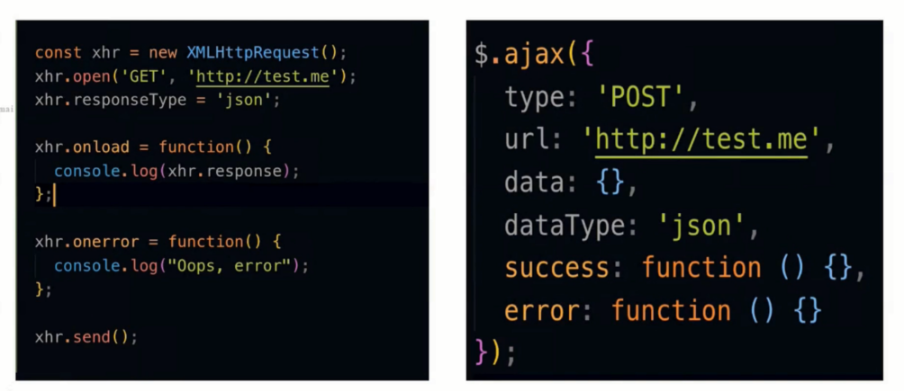

Fetch 看起来很美

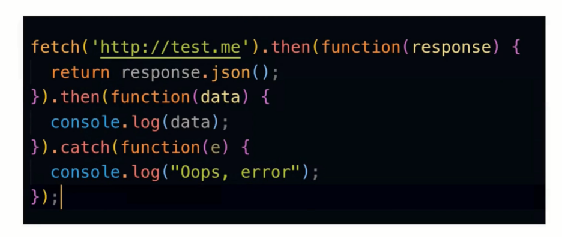

Fetch 的缺点

- 只对网络请求报错，对 400、500 都当做成功的请求
- 默认不会带 cookie
- 不支持 abort，不支持超时控制
- 没有办法原生检测请求的进度

[Axios](https://github.com/axios/axios)

- 浏览器和 node 环境都支持
- 完全支持标准的 Promise API
- 简单易用
- 取消请求，json 请求自动转换等

concurrently：多个命令一起执行

### Promise、async await

- Promise 使用
- async await

## 怎样选择一个好的开源库

- 从他的主页和 Github 项目页了解信息
- 使用 npm-stat 分析下载量
- 使用 npm-view 查看发布频率

## Recharts

https://github.com/recharts/recharts

## 生成环境和开发环境的异同

开发环境

- 有尽量丰富的信息帮助我们解决问题
- 使用本地的 mock 数据

生成环境

- 尽量消除程序错误和调试信息
- 使用线上的真实数据
- 访问速度是第一要务

不同应用对于两种环境的适配

- express 对两种环境的优化
- React 对两种环境的优化

webpack

## 服务器的不同类型

- Shared Host
- VPS
- Cloud hosts

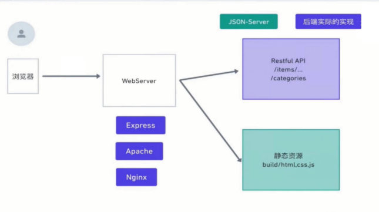
