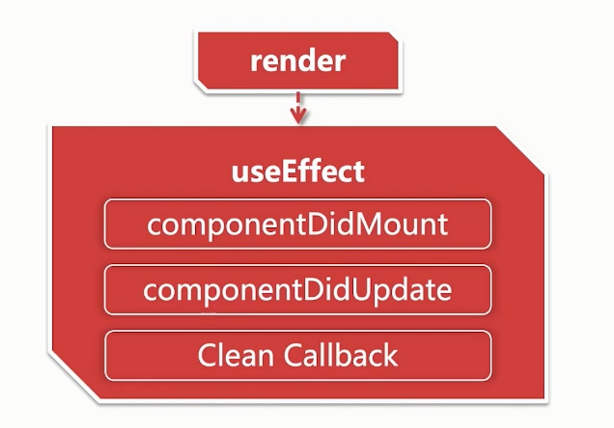

# React Notes（2）

## React

- Error Boundaries
- Fragment
- Async Rendering
- Context
- Hooks
- Concurrent Rendering

## 准备

- 工具类
  - node: 建立在 V8 之上；异步事件驱动；广泛应用于前端工具化
  - npm：js 模块化规范；模块托管在 `www.npmjs.com` 上；意外应用于浏览器端代码共享
  - webpack: 模块打包器
  - eslint：ES 代码风格校验；`--fix` 自动修复风格错误；已定义规则易扩展校验范围
  - prettier：增强的代码美化工具；武断的行为风格
- 语法类
  - ES 2015 +
  - JSX
  - Css flex
- 概念类
  - SPA、MPA：异步接口通信；纯前端渲染；解耦的前后端协作
  - PWA：渐进式网络应用；可控的静态缓存；离线访问能力；优化载入速度
- 效率类
  - iconfont：衍生于 webfont；自定义文字图形；仅限于单色图标
  - snippets：代码片段
- 原则类
  - 职责分离：两耳不闻窗外事；模块解耦；优化课维护性

## 使用 react-create-app 构建工具

```bash
npm react-create-app react-app
```

编译脚本：react-scripts 的作用与工作原理

```bash
npm run start
npm run build
npm run test
```

解构编译脚本：eject 的具体用法.

```bash
npm run eject
```

## React 新特性一览

- Context
- ContextType
- Lazy 与 Suspense
- Memo

### Context 实现跨层级的组件数据传递

Context 提供了一种方式，能够让数据在组件树中传递而不必一级一级的手动传递

结构：


API

- createContext(defaultValue?)

### 静态属性 ContextType 访问跨层级组件的数据

```js
static contextType = XXXContext;

const xxx = this.context;
```

### Lazy 与 Suspense 实现延迟加载

暂时没有使用的资源 --> 延迟加载

途径：

- webpack: Code Splitting
- `import`

```js
import React, {lazy, Suspense} from 'react';
const OtherComponent = lazy(() => import('./OtherComponent'));

// 如果需要重命名
// const OtherComponent = lazy(() => import(/* webpackChunkName: "OtherComponent" */'./OtherComponent'));

function MyComponent() {
  return (
    <Suspense fallback={<div>Loading...</div>}>
      <OtherComponent />
    </Suspense>
  );
}
```

注意：加载异常的错误处理

### Memo 实现指定组件进行渲染

- showComponentUpdate(nextProps, nextState)
- PureComponent: 注意传入的 callBack
- Memo

```js
const Foo = memo(function Foo(props){
    console.log('Foo render);
    return <div>{props.name}</div>
})
```

## Hooks

类组件不足：

- 状态逻辑复用难
  - 缺少复用机制
  - 渲染属性和高阶组件导致层级冗余
- 趋于复杂难以维护
  - 生命周期函数混杂不相干逻辑
  - 想干逻辑分散在不同的生命周期
- this 指向困扰
  - 内联函数过度创建句柄
  - 类成员函数不能保证 this

Hooks 优势：优化类组件三大问题

- 函数组件无 this 问题
- 自定义 Hook 方便复用状态逻辑
- 副作用的关注点分离

插件：eslint-plugin-react-hooks

```bash
eslint-plugin-react-hooks
```

### useState

```js
import React, {useState} from 'react';
function Counter() {
  const [number, setNumber] = useState(0);
  return (
    <>
      <p>{number}</p>
      <button onClick={() => setNumber(number + 1)}>改数字</button>
    </>
  );
}
```

### useEffect

副作用

- 绑定事件
- 网络请求
- 访问 DOM

副作用调用时机

- Mount 之后: componentDidMount
- Update 之后: componentDidUpdate
- Unmount 之前: componentWillUnmount

useEffect 覆盖上面所有情况。




### useContext


```js
function Count() {
  const count = useContext(CountContext);
  return <h1>{count}</h1>;
}
```

### useMemo & useCallback

```js
const double = useMemo(() => {
  return count * 2;
}, [count === 3]);

// const onClick = useMemo(() => {
//     return () => {
//         console.log('Click')
//     };
// }, []);

const onClick = useCallback(() => {
  console.log('Click');
}, []);

<Counter count={double} onClick={onClick} />;
```

useMemo(() => fn) 等价于 useCallback(fn)

### useRef

class 组件中：

- String ref
- CallBack ref
- CreateRef

useRef

- 获取子组件或者 DOM 节点的句柄
- 渲染周期之间共享数据的存储

```js
function Test() {
  const t = useRef(null);

  useEffect(() => {
    console.log(t.current); // div
  });

  return <div ref={t}> ... </div>;
}

function Test() {
  const t = useRef(null);
  function handleClick() {
    t.current = setTimeout(() => l(1), 2000);
  }
  function handleClear() {
    clearTimeout(t.current);
  }

  return (
    <>
      <button onClick={handleClick}>start</button>
      <button onClick={handleClear}>clear</button>
    </>
  );
}

function Test() {
  const t = useRef(null);
  const [name, setName] = useState('ajanuw');
  useEffect(() => {
    t.current = name;
  });
  const prevName = t.current;
  return (
    <div>
      <input value={name} onChange={(e) => setName(e.target.value)} />
      <h2>{name}</h2>
      <p>{prevName}</p>
    </div>
  );
}
```

### 自定义 Hooks

Custom Hooks

### Hooks 的使用法则

- 在顶层调用 hooks, 不要在 if、for 中调用
- 仅在函数组件和自定义 Hooks 组件中调用

### Hooks 的常见问题

对传统 React 编程的影响

- 生命周期函数如何映射到 Hooks?
- 类实例成员变量如何映射到 Hooks?
- Hooks 中如何获取历史 props 和 state ?
- 如何强制更新一个 Hooks 组件?

## React 新特性之 Redux

Redux: 状态容器与数据流管理

Redux 三大原则：

- 单一数据源
- 状态不可变
- 纯函数修改状态

https://github.com/facebookincubator/redux-react-hook

## 渐进式 Web App

## PWA

Progressive Web App

PWA 组成技术：

- Service Worker
- Promise
- fetch
- cache Api
- Notification Api

Service Worker

- 服务工作线程
  - 常驻内存运行
  - 代理网络请求
  - 依赖 HTTPS

Promise

- 承诺控制流
  - 优化回调地狱
  - async/await 语法同步化

fetch

- 比 XMLHttpRequest 更简洁
- Promise 风格
- 依旧存在不足

cache Api

- 缓存资源 css\js\img
- 依赖 Service Worker 代理网络请求
- 支持离线程序运行

Notification Api：推送消息

- 依赖用户授权
- 适合在 Service Worker 中推送

## 代码规范格式化

eslint + prettier

```bash
npm i prettier -D

npm i husky lint-staged -D
```

package.json

```json
"proxy": "http://0.0.0.0",
  "scripts": {
    "start": "node scripts/start.js",
    "build": "node scripts/build.js",
    "test": "node scripts/test.js",
    "format": "prettier src/**/*.{js,jsx,css,md} --write && eslint src/**/*.{jsx,js} --fix"
  },
  "eslintConfig": {
    "extends": [
      "eslint:recommended",
      "react-app"
    ],
    "rules": {
      "react/jsx-indent": [
        "error",
        4
      ]
    }
  },
  "husky": {
    "hooks": {
      "pre-commit": "lint-staged"
    }
  },
  "lint-staged": {
    "*.{js,jsx}": [
      "prettier --write",
      "eslint --fix",
      "git add"
    ],
    "*.{css,md}": [
      "prettier --write",
      "git add"
    ]
  },
```

prettier.config.js

```js
module.exports = {
  tabWidth: 4,
  singleQuote: true,
  trailingComma: 'es5',
};
```

## 性能与部署

```bash
npm i webpcak-bundle-analyzer -D
```

https://github.com/webpack-contrib/webpack-bundle-analyzer

```js
import {WebpackBundleSizeAnalyzerPlugin} from 'webpack-bundle-size-analyzer';

module.exports = {
  entry: {
    // ...
  },
  output: {
    //...
  },
  plugins: [
    new BundleAnalyzerPlugin({
      openAnalyzer: false, // 是否打开 8888 的server
      analyzerMode: static,
    }),
  ],
};
```

publicPath 及版本的管理
