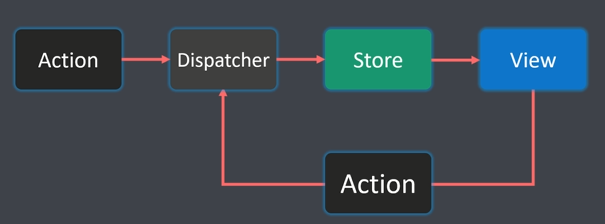
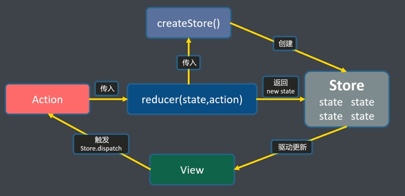

# React 数据流管理

- 为什么要掌握数据流管理
- React 数据流管理有哪些方案
- Redux 设计理念
- 数据方案对比

```ts
UI = render(data)

UI = f(data)
```

“组件级通信” 的背后是一套环环相扣的 React 数据流解决方案

组件级通信
- 父与子
- 子与父
- 同级兄弟
- 无直接关系

问题：

- 如何实现状态同步与状态共享？
- 如何让状态变得可预测，甚至可回溯？
- 如何处理异步数据流？

数据流管理有哪些？

Context API 是 React 官方提供的一种状态管理
- createContext
- Provider
- Con

Flux



Redux

Redux 是 JS 状态容器，提供可预测化的状态管理。




