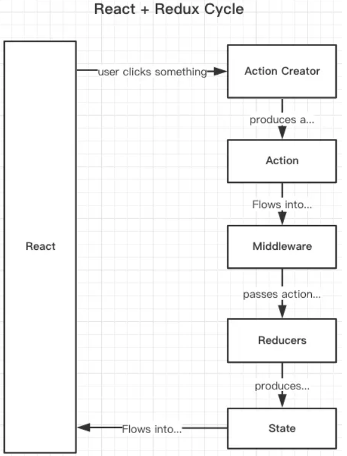

# Redux-saga

redux-saga 是一个用于管理 redux 应用异步操作的中间件，redux-saga 通过创建 sagas 将所有异步操作逻辑收集在一个地方集中处理，可以用来代替 redux-thunk 中间件。

## 表现形式

- reducer 负责处理 action 的 stage 更新
- sagas 负责协调那些复杂或者异步的操作

## 原理

1. sagas 是通过 generator 函数来创建的
2. sagas 监听发起的 action，然后决定基于这个 action 来做什么
   - 比如：是发起一个异步请求，还是发起其他的 action 到 store，还是调用其他的 sagas 等
3. 在 redux-saga 中，所有的任务都通过用 yield Effects 来完成
   Effects 都是简单的 javascript 对象，包含了要被 saga middleware 执行的信息
4. redux-saga 为各项任务提供了各种 Effects 创建器，让我们可以用同步的方式来写异步代码
5. 名词
   - put(action)
     - 发起一个 action 到 store
     - 创建一条 Effect 描述信息，指示 middleware 发起一个 action 到 Store
     - put 是异步的，不会立即发生
   - takeEvery(actionTypes, 方法)
     - 如果有对应 type 的 action 触发，就执行后面的方法
     - 然后由 ui 组件从 reducer 中获取数据，并显示

## 运行

ui 组件触发 action 创建函数 ---> action 创建函数返回一个 action ------> action 被传入 redux 中间件(被 saga 等中间件处理) ，产生新的 action，传入 reducer-------> reducer 把数据传给 ui 组件显示 -----> mapStateToProps ------> ui 组件显示



## 示例

yarn add redux-saga

```js
import {createStore, combineReducers, applyMiddleware} from 'redux';
import userNameReducer from '../username/reducer.js';
import createSagaMiddleware from 'redux-saga'; // 引入redux-saga中的createSagaMiddleware函数
import rootSaga from './saga.js'; // 引入saga.js

export const store = createStore(
  combineReducers({...reducerAll}), // 合并reducer
  window.devToolsExtension ? window.devToolsExtension() : undefined, // dev-tools
  applyMiddleware(sagaMiddleware) // 中间件，加载sagaMiddleware
);

sagaMiddleware.run(rootSaga); // 执行rootSaga
```
