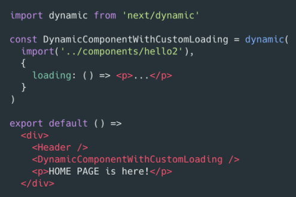

# 使用 Next.js 创建 React 同构应用

创建页面

1. 页面就是 pages 目录下的一个组件
2. static 目录映射静态文件
3. page 具有特殊静态方法 getInitialProps

在页面中使用其它 React 组件

1. 页面也是标准的 node 模块，可使用其它 React 组件
2. 页面会针对性打包，仅包含其引入的组件

使用 Link 实现同构路由

1. 使用 "next/link" 定义链接
2. 点击链接时页面不会刷新
3. 使用 prefetch 预加载目标资源
4. 使用 replace 属性替换 URL

动态加载页面

