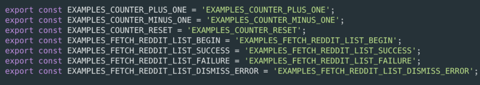

# 构建可维护可扩展的前端应用

前端项目的理想架构：

- 可维护
- 可扩展
- 可测试
- 易开发
- 易构建

易于开发

1. 开发工具是否完善
2. 生态圈是否繁荣
3. 社区是否活跃

易于扩展

1. 增加新功能是否容易
2. 新功能是否会显著增加系统复杂度

易于维护

1. 代码是否容易理解
2. 文档是否健全

易于测试

1. 功能的分层是否清晰
2. 副作用少
3. 尽量使用纯函数

易于构建

1. 使用通用技术和架构
2. 构建工具的选择

## 拆分复杂度

### 按领域模型（feature）组织代码，降低耦合度

### 如何组织 component, action 和 reducer

文件夹结构

- 按 feature 组织源文件
- 组件和样式文件同一级
- Redux 单独文件夹
- 单元测试保持同样目录结构放在 tests 文件夹

counterPlusOne.js

constants.js

reducer.js

actions.js

rootReducer.js

1. 按 feature 组织组件，action 和 reducer
2. 使用 root loader 加载 feature 下的各个资源
3. 做到高内聚松耦合

### 如何组织 React Router 的路由配置

1. 每个 feature 都有自己的专属路由配置
2. 顶层路由使用 JSON 配置更易维护和理解
3. 如何解析 JSON 配置到 React Router 语法

## 使用 Rekit

### 创建项目，代码生成和重构

Rekit：React 专属 IDE 和工具集

前端技术功能越来越强⼤ -> 大开发变得越来越复杂

背景

- 一个独立功能通常需要多个文件组成
- 代码模板很复杂
- 重构极为困难
- 项目复杂后很难理解和维护

Rekit: 更好的代码导航

1. 语义化的组织源代码文件
2. 使用子 Tab 来展示项目元素的各个部分
3. 直观的显示和导航某个功能的所有依赖

Rekit: 一键生成项目元素

1. 直观的 UI 用于生成组件，action，reducer 等
2. 模板代码遵循最佳实践
3. 支持命令行方式创建项目元素

Rekit: 重构非常容易

1. 右键菜单重命名或者删除某个项目元素
2. 所有相关代码都会一次性重构从而保证一致性
3. 详细的 log 信息显示重构的完整修改

Rekit: 可视化的项目架构

1. 项目总体架构的可视化图表
2. 项目依赖关系的图表

Rekit 是如何工作的？

1. 定义了基于 feature 的可扩展文件夹结构
2. 基于最佳实践生成代码和管理项目元素
3. 提供工具和 IDE 确保代码和文件夹结构遵循最佳实践

IDE -> Best Practices -> Project Structure

集成单元测试

单元测试覆盖率

### 遵循最佳实践，保持代码一致性

遵循最佳实践

1. 以 feature 方式组织代码
2. 拆分组件，action 和 reducer
3. 拆分路由配置

通过代码自动生成保持一致性

1. 文件夹结构一致性
2. 文件名一致性
3. 变量名一致性
4. 代码逻辑的一致性
