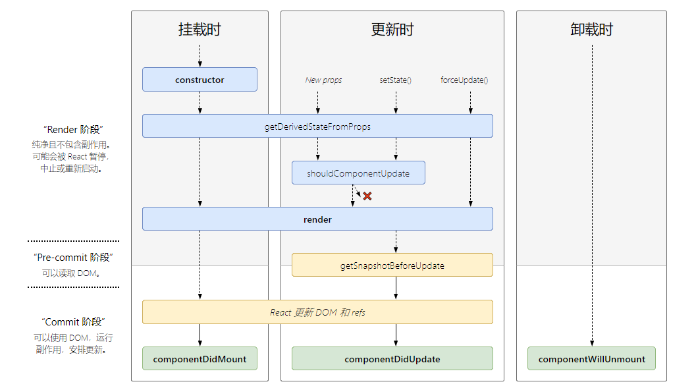
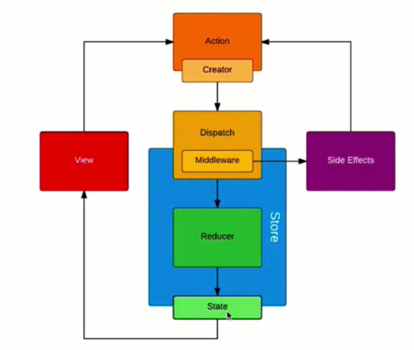

# React 使用

## React 基础使用

- React 和 Vue 一样重要，力求两者都会
- React 和 Vue 有很多相通之处，而且正在趋于一致
- React 比 Vue 成本高，尤其是初学者

React 使用
- 基本使用：常用，必须会
- 高级特性：不常用，体现深度
- Redux、React-router 使用

自己看文档不行吗？
- 行，但是一种最低效的方式
- 文档是一个备忘录，给会用的人查阅，并不是入门教程
- 文档全面成冗长且细节过多，不能突出重点

小问题：

1. React 组件如何通讯
1. JSX 的本质是什么
1. context 是什么，有什么用途？
1. shouldComponentUpdate (简称 SCU)的用途
1. 描述 Redux 单向数据流
1. setState 是同步还是异步

## JSX 基本知识

- 变量、表达式
- className、style
- 子元素和组件
- html

```jsx
<div dangerouslySetInnerHTML={{__html: 'html code'}}></div>
```

## JSX 如何判断条件和渲染列表

- if else
- 三元表达式
- 逻辑运算符 && ||

列表渲染

- map
- key

## React 事件为何 bind this

- bind this

事件中 this 默认是 undefined

```js
class EventDemo extends React.Component {
  constructor() {
    super();
    this.state = {
      num: 0,
    };
    this.clickHandl2 = this.clickHandl2.bind(this);
  }

  render() {
    return (
      <div>
        num: {this.state.num}
        <ul>
          <li onClick={this.clickHandl1}>clickHandl1</li>
          <li onClick={this.clickHandl2}>clickHandl2</li>
          <li onClick={this.clickHandl3.bind(this)}>clickHandl3</li>
          <li onClick={this.clickHandl4}>clickHandl4</li>
        </ul>
      </div>
    );
  }

  clickHandl1() {
    console.log('clickHandl1:', this);
  }

  clickHandl2() {
    console.log('clickHandl2:', this);
    this.setState({
      num: this.state.num + 1,
    });
  }

  clickHandl3() {
    console.log('clickHandl3:', this);
    this.setState({
      num: this.state.num + 1,
    });
  }

  clickHandl4 = () => {
    console.log('clickHandl4:', this);
    this.setState({
      num: this.state.num + 1,
    });
  };
}
```

- 关于 event 参数

```js
clickHandler = (event) => {
  // 阻止默认行为
  event.preventDefault();
  // 阻止冒泡
  event.stopPropagation();
  // 指向当前元素、即当前元素触发
  console.log('target:', event.target);
  // 指向当前元素，假象！！！
  console.log('currentTarget:', event.currentTarget);
  // event 其实是React封装的。可以看__proto__.constructor 是 SyntheticEvent； SyntheticEvent不是原生的 event，原生的是 MouseEvent
  console.log('event:', event);
  console.log('event.__proto__.constructor:', event.__proto__.constructor);

  // 原生对象
  console.log('nativeEvent:', event.nativeEvent);
  // 指向当前元素、即当前元素触发
  console.log('nativeEvent target:', event.nativeEvent.target);
  // 指向 document !!!
  console.log('nativeEvent currentTarget:', event.nativeEvent.currentTarget);

  // 总结：
  // event 是 SyntheticEvent，模拟出来 DOM 事件所有能力
  // event.nativeEvent 是原生对象
  // 所有的事件都被挂载到 document 上
  // 和 DOM 事件不一样，和 Vue 事件也不一样
};
```

- 传递自定义参数

```js
clickHandler1 (p, event){
    console.log('p:', p);
    console.log ('event:', event);
}

clickHandler2 = (p, event)=>{
    console.log('p:', p);
    console.log ('event:', event);
}

render () {
    return (
        <div>
            <div onClick={this.clickHandler1.bind(this, '这个传的参数1')}>带参数的事件1</div>
            <div onClick={(event)=>{this.clickHandler2('这个传的参数2', event)}}>带参数的事件2</div>
        </div>
    );
}
```

## React 事件和 DOM 事件的区别

1. event 是 SyntheticEvent，模拟出来 DOM 事件所有能力
1. event.natibeEvent 是原生对象
1. 所有的事件都被挂载到 document 上
1. 和 DOM 事件不一样，和 Vue 事件也不一样

React 17 事件绑定到 root
- React 16 绑定到 document
- React 17 事件绑定到 root 组件
- 有利于多个 React 版本共存，例如微前端


## React 表单

- 受控组件
- 非受控组件

- input\textarea\select 用 value
- checkbox\radio 用 checked

## React 父子组件通讯

- props 传递数据
- props 传递函数
- props 类型检查

propTypes

## setState 为何使用不可变值

- 不可变值
- 可能是异步更新
- 可能会被合并

函数式编程、纯函数

## setState 是同步还是异步

- 直接使用 setState 是异步的
- setTimeout 中的 setState 是同步的
- 自定义的 DOM 事件，setState 是同步的，在 componentDidMount 中

## setState 合适会合并 state

- setState 传入对象，会被合并（类似 Object.assign）
- setState 传入函数，不会被合并

## React 组件生命周期

- 单组件生命周期
- 父子组件生命周期

[react-lifecycle-methods-diagram](http://projects.wojtekmaj.pl/react-lifecycle-methods-diagram/)

React version：16.3


React version：^16.4



## React 函数组件和 class 组件有何区别

函数组件

- 纯函数：输入 props，输出 JSX
- 没有实例，没有生命周期、没有 state
- 不能扩展其他方法

## 什么是 React 非受控组件

- ref
- defaultValue\deaultChecked
- 手动操作 DOM 元素

非受控组件的使用场景

- 必须手动操作 DOM 元素，setState 实现不了
- 文件上传 `<input type='file'`
- 富文本编辑器，需要传入 DOM 元素

受控组件 vs 非受控组件

- 优先使用受控组件，符合 React 设计原则
- 必须操作 DOM 时，再使用非受控组件

## 什么场景需要用 React Portals

Portals

- 组件默认会按照既定的层级嵌套渲染
- 如何让组件渲染到父组件以外？

Portals 使用场景

- overflow: hidden;[BFC]
- 父组件 z-index 值太小
- fixed 需要放在 body 第一层级

v16 之前

- unstable_renderSubtreeIntoContainer
- unmountComponentAtNode

v16 之后

- createPortal

## 是否用过 React Context

Context

- 公共信息（语言、主题）如何传递给每个组件？
- 用 props 太繁琐
- 用 redux 小题大做

## React 如何异步加载组件

- import()
- React.lazy()
- React.Suspense

v16.6 之前：

- 懒加载 React 组件最流行的库可能是 react-loadable
- 服务端渲染上仍然建议使用可加载组件(Loadable Components)

## React 性能优化- SCU 的核心问题在哪里

SCU 基本用法

```js
shouldComponentUpdate(nextProps, nextState) {
  if (nextState.count !== this.state.count) {
    return true; // 可以渲染
  }
  return false; // 不重复渲染
}
```

## React 性能优化- SCU 默认返回什么

SCU 默认返回 `true`

React ，默认：父组件有更新，子组件则无条件也更新；

SUC 一定要每次都用吗？需要的时候才优化

## React 性能优化- SCU 一定要配合不可变值

SCU 一定要配合不可变值

_.isEqual 做对象或者数组的深度比较（一次性递归到底）

## React 性能优化 - PureComponent 和 memo

- PureComponent，实现了 SCU 的浅比较
- memo：函数组件中的 PureComponent
- 浅比较已适用大部分情况（尽量不要做深层比较）

```js
function MyComponent(props) {
  /* render using props */
}
function areEqual(prevProps, nextProps) {
  /*
  return true if passing nextProps to render would return
  the same result as passing prevProps to render,
  otherwise return false
  */
}
export default React.memo(MyComponent, areEqual);
```

## React 性能优化 - 了解 immutable.js

- 彻底拥抱"不可变值"
- 基于共享数据(不是深拷贝)，速度好
- 有学习成本和迁移成本，按需使用

## 什么是 React 高阶组件

组件公共逻辑的抽离

- mixin，已被废弃
- 高阶组件 HOC
- Render Props

Redux 中的 connect 是高阶组件

```js
connect([mapStateToProps], [mapDispatchToProps], [mergeProps], [options]);
```

## 什么是 React Render Props


- HOC:模式简单，但会增加组件层级
- Render Props：代码简洁，学习使用成本较高
- 按需使用

## 描述 Redux 单项数据流

- dispatch(action)
- reducer -> newState
- subscribe 触发通知

## react-redux

- Provider
- connect
- mapStateToProps
- mapDispatchToProps

## Redux action 如何处理异步

- redux-thunk
- redux-promise
- redux-saga


## Redux 中间件原理


```js
import {applyMiddleware, createStore} from 'redux';
import reduxLogger from 'redux-logger';
import reduxThunk from 'redux-thunk';

const logger = reduxLogger();

const store = createStore(
  reducer,
  applyMiddleware(reduxThunk, reduxLogger) // 按顺序执行
);
```

redux 中间件- logger 实现


redux 数据流程图



## react-router 知识点

- 路由模式(hash\history)
- 路由配置(动态路由、懒加载)
- history 需要 server 端支持，无特殊需求可使用前者


