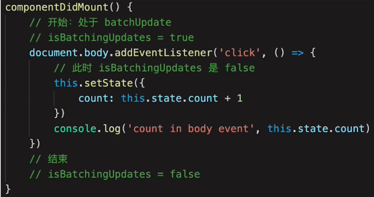

# React 原理

- 知其然知其所以然
- 了解原理，才能应用的更好
- 造轮子(业务定制、内部类库)

为何考察原理：

- 考察重点，28 原则
- 和使用相关联的原理，如：vdom、jsx、setState
- 整体流程是否全面，热门技术是否有深度

## 函数式编程

- 一种编程范式，概念比较多
- 纯函数
- 不可变值
- setState & SCU

## vdom 和 diff 是实现 React 的核心技术

- h 函数
- vnode 数据结构
- patch 函数

```js
{
    tag: 'div',
    props: {
        className: 'container',
        id: 'root',
    },
    children: [
        {
           tag: 'p',
           children: 'vdom'
        },
        {
            tag: 'ul',
            children: [
                {
                    tag: 'li',
                    children: 'a'
                }
                // ...
            ]
        }
    ]
}
```

diff

- 只比较同一级，不跨级比较
- tag 不相同，则直接删掉重建，不再深度比较
- tag 和 key 两者都相同，则认为是相同节点，不再深度比较

其他

- vue2.x、vue3.0、racet 三者实现 vdom 细节都不同
- 核心概念和实现思路都一样

## JSX 本质是什么

- JSX 等同于 Vue 模板
- Vue 模板不是 html
- JSX 也不是 JS

```js
import React from 'React';

const zElem = (
  <div id="title">
    <h1>this is title</h1>
    <p>this is p</p>
  </div>
);
```

```js
import React from 'React';
const zElem = React.createElement(
  'div',
  {
    id: 'title',
  },
  React.createElement('h1', null, 'this is title'),
  React.createElement('p', null, 'this is p')
);
```

JSX 本质

- React.createElemen 即 h 函数，返回 vnode
- 第一个参数，可能是组件，也可能是 html tag
- 组件名，首字母必须大写(React 规定)

## React 的合成事件机制

- 所有的事件都被挂载到 document 上
- event 不是原生的， 是 SyntheticEvent 合成事件对象
- 和 DOM 事件不一样，和 Vue 事件也不一样

```js
clickHandler = (event) => {
  // 阻止默认行为
  event.preventDefault();
  // 阻止冒泡
  event.stopPropagation();
  // 指向当前元素、即当前元素触发
  console.log('target:', event.target);
  // 指向当前元素，假象！！！
  console.log('currentTarget:', event.currentTarget);
  // event 其实是React封装的。可以看__proto__.constructor 是 SyntheticEvent； SyntheticEvent不是原生的 event，原生的是 MouseEvent
  console.log('event:', event);
  console.log('event.__proto__.constructor:', event.__proto__.constructor);

  // 原生对象
  console.log('nativeEvent:', event.nativeEvent);
  // 指向当前元素、即当前元素触发
  console.log('nativeEvent target:', event.nativeEvent.target);
  // 指向 document !!!
  console.log('nativeEvent currentTarget:', event.nativeEvent.currentTarget);

  // 总结：
  // event 是 SyntheticEvent，模拟出来 DOM 事件所有能力
  // event.nativeEvent 是原生对象
  // 所有的事件都被挂载到 document 上
  // 和 DOM 事件不一样，和 Vue 事件也不一样
};
```


为何要合成事件机制

- 更好的兼容性和跨平台
- 挂载 document，减少内存消耗，避免频繁解绑
- 方便事件的统一管理（如事务机制）

## setState 和 batchUpdate 机制

- 有时异步（普通使用），有时同步（setTimeout）
- 有何合并（对象形式），有时不合并（函数形式）
- 合并类似于 Object.assign

核心要点：

- setState 主流程
- batchUpdate 机制
- transaction 事务机制

setState 主流程




setState 同步还是异步？

- setState 无所谓异步还是同步
- 看是否能命中 batchUpdate 机制
- 判断 isBatchingUpdates

哪些能命中 batchUpdate 机制？

- 生命周期（和它调用的函数）
- React 中注册的事件（和它调用的函数）
- React 可以"管理"的入口

哪些不能命中 batchUpdate 机制？

- setTimeout、setInterval 等（和它调用的函数）
- 自定义的 DOM 事件（和它调用的函数）
- React "管不到"的入口

## React 事务机制

transaction 事务机制


## React 组件渲染和更新的过程

- JSX 如何渲染为页面
- setState 之后如何更新页面

JSX 本质和 vdom

- JSX 即 createElement 函数
- 执行生成 vdom
- patch(elem, vnode) 和 patch(vnode, newVnode)


- 组件渲染和更新过程
- 更新的两个阶段
- React fiber

组件渲染过程

- props state
- render() 生成 vnode
- patch(elem, vnode)

更新过程

- setState(newState) --> dirtyComponents (可能有子组件)
- render() 生成 newVnode
- patch(vnode, newVnode)

更新的两个阶段

- patch 被拆分为两个阶段
- reconciliation 阶段：执行 diff 算法，纯 JS 计算
- commit 阶段：将 diff 结果渲染 DOM

可能会有性能问题

- JS 是单线程，且和 DOM 渲染公用一个线程
- 当组件足够复杂，组件更新时计算和渲染都压力大
- 通识再有 DOM 操作需求(动画、鼠标拖拽等)，将卡顿

## React-fiber 如何优化性能

解决方案 fiber

- 将 reconciliation 阶段进行任务拆分(commit 无法拆分)
- DOM 需要渲染时暂停，空闲时恢复
- window.requestIdleCallback

关于 fiber

- React 内部运行机制
