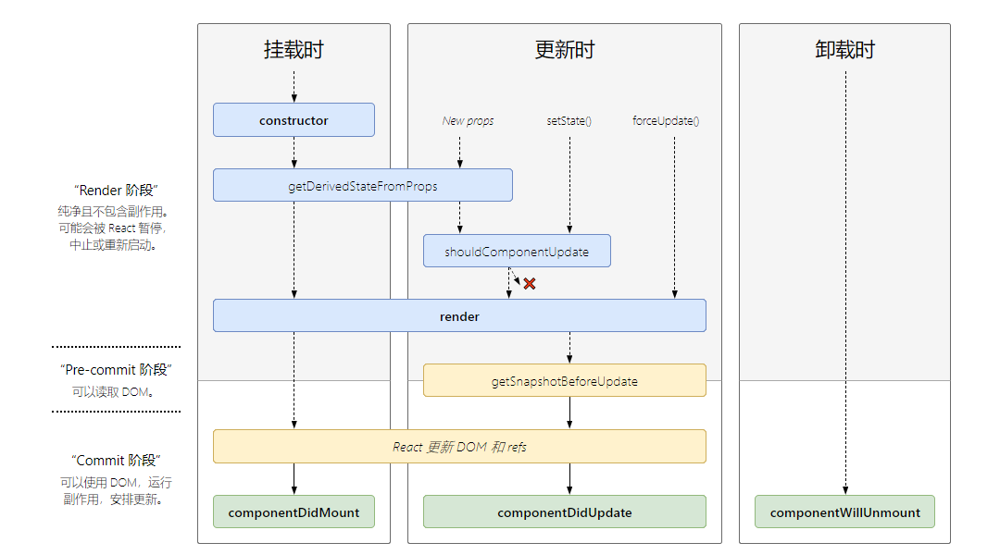
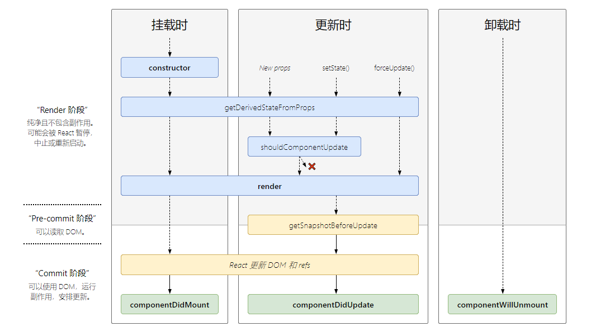
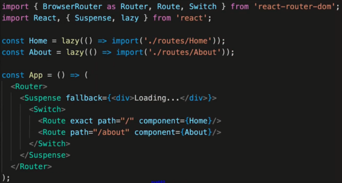

# React 真题

## 组件之间如何通信

- 父子组件 props
- 自定义事件
- Redux、Context

## JSX 的本质

- creactElement
- 执行返回 vnode

## Context 是什么，如何应用

- 父组件，向其下所有子孙组件传递信息
- 如简单的公共信息: 主题色，语言等
- 复杂的公共信息，请用 redux

## shouldComponentUpdate (简称 SCU)的用途

- 性能优化
- 配合"不可变值"一起使用，否则会出错

## redux 单向数据流

## setState 场景题

- 是否合并?
- 何时同步，何时异步?

要点

- 有时异步（普通使用），有时同步（setTimeout、自定义事件）
- 有何合并（对象形式），有时不合并（函数形式）
- 合并类似于 Object.assign

## 什么是纯函数

- 返回一个新值，没有副作用(不会"偷偷"修改其他值)
- 重点：不可变值
- 如：arr1 = arr.slice()

## 组件生命周期

- 单组件生命周期
- 父子组件生命周期
- 注意 SCU

[react-lifecycle-methods-diagram](http://projects.wojtekmaj.pl/react-lifecycle-methods-diagram/)

React version：16.3

React version：^16.4

## ajax 应该放在哪个生命周期

- 同 Vue
- componentDidMount

## 列表渲染 为何使用 key

- 必须用 key , 且不能是 index、random
- diff 算法中通过 tag 和 key 来判断，是否是 sameNode
- 减少渲染次数，提升渲染性能

## 函数组件和 class 组件的区别

- 函数组件的性能比类组件的性能要高
- 因为类组件使用的时候要实例化，而函数组件直接执行函数取返回结果即可。
- 函数组件：没有 this, 没有生命周期，没有状态 state，只有 props
- 类组件：有 this, 有生命周期，有状态 state。

## 什么是受控组件

- 表单的值，受 state 控制
- 需要自行监听 onChange , 更新 state
- 对比非受控组件

## 何时使用异步组件

- 加载大组价
- 路由懒加载

## 多个组件有公共逻辑，如何抽离

- 高阶组件 HOC
- Render Props
- mixin 已被 React 废弃

## redux 如何进行异步请求

- 使用异步 action
- 如 redux-thunk

## react-router 如何配置 懒加载

- React.lazy
- Suspense\fallback

## PureComponent 有何区别

- PureComponent，实现了 SCU 的浅比较
- 优化性能
- 结合不可变值使用

## React 事件 和 DOM 事件的区别

- 所有事件挂载到 document 上
- event 不是原生的，是 SynthecticEvent 合成事件对象
- dispatchEvent

## React 性能优化

- 渲染列表加 key
- 自定义事件、DOM 事件及时销毁
- 合理使用异步组件
- 减少函数 bind this 的次数
- 合理使用 SCU (PureComponent 和 memo)
- 合理使用 Immutable.js
- webpack 层面的优化
- 前端通用性能优化：如图片懒加载
- 使用 SSR

## React 和 Vue 的区别

- 都支持组件化
- 都是数据驱动视图
- 都使用 vdom 操作 DOM

- React 使用 JSX 拥抱 JS，Vue 使用模板，拥抱 html
- React 函数式编程，Vue 声明式编程
- React 更多需要自力更生，Vue 想要的都给你
