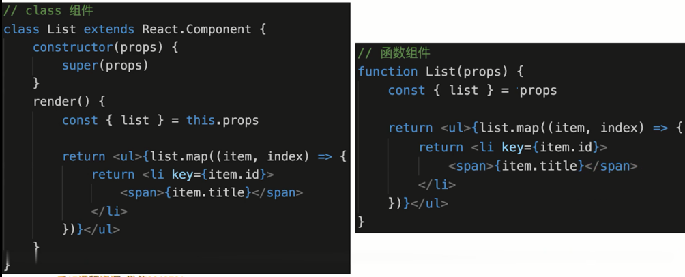

# React Hooks

## 关于 React Hooks

- 可选功能（class 组件 VS Hooks）
- 100% 向后兼容，没有破坏性改动
- 不会取代 class 组件，尚无计划要移除 class 组件

## 面试问到 React Hooks

- Hooks 作为 React 的一部分，在面试中也能占一部分时间
- 初学 class 组件为主，Hooks 是加分项
- 学好 Hooks 的前提，必须学好 class 组件

## 主要内容

- State Hook
- Effect Hook
- 其他 Hook
- 自定义 Hook
- 组件逻辑复用
- 规范和注意事项

## 题目

- 为什么会有 React Hooks，解决了那些问题？
- React Hooks 如何模拟组件生命周期？
- 如何自定义 Hook？
- React Hooks 性能优化
- 使用 React Hooks 遇到那些坑？
- Hooks 相比 HOC 和 Render Prop 有那些有点？

## class 组件存在哪些问题

- 回顾 React 函数组件
- State Hook
- Effect Hook



函数组件的特点：
- 没有组件实例
- 没有生命周期
- 没有 state 和 setState，只能接受 props

class 组件的问题：
- 大型组件很难拆分和重构，很难测试(即class 不易拆分)
- 相同业务逻辑，分拆到各个方法中，逻辑混乱
- 复用逻辑边的复杂。如 Mixins、HOC、Render Prop

React 组件更易用函数表达：
- React 提倡函数式编程，view = fn(props)
- 函数更灵活，更易拆分，更易测试
- 但是函数组件太简单，需要增强能力 --- Hooks

## 用 useState 实现 state 和 setState 功能

函数组件：
- 默认函数组件没有 state
- 函数组件是一个纯函数，执行完即销毁，无法存储 state
- 需要 State Hook，即把 state 功能 “钩” 到纯函数中

useState 总结：
- useState('xxx') 传入初始值。返回数组 `[state, setState]`
- 通过 state 获取值
- 通过 useState('xxx') 修改值

Hooks 命名规范：
- 规定所有的 Hooks 都是 use 开头，如 useXxx ...
- 自定义 Hook 也要以 use 开头
- 非 Hooks 的地方，尽量不要使用 useXxx 写法

ClickCounter:
```js
import React, { useState } from 'react'

function ClickCounter() {
    // 数组的解构
    // useState 就是一个 Hook “钩”，最基本的一个 Hook
    const [count, setCount] = useState(0) // 传入一个初始值

    const [name, setName] = useState('React Hooks')

    // const arr = useState(0)
    // const count = arr[0]
    // const setCount = arr[1]

    function clickHandler() {
        setCount(count + 1)
        setName(name + '2020')
    }

    return <div>
        <p>你点击了 {count} 次 {name}</p>
        <button onClick={clickHandler}>点击</button>
    </div>
}

export default ClickCounter
```

ClickCounterClass:
```js
import React from 'react'

class ClickCounter extends React.Component {
    constructor() {
        super()

        // 定义 state
        this.state = {
            count: 0,
            name: 'React Component Class'
        }

        this.clickHandler = this.clickHandler.bind(this)
    }
    render() {
        return <div>
            <p>你点击了 {this.state.count} 次 {this.state.name}</p>
            <button onClick={this.clickHandler}>点击</button>
        </div>
    }
    clickHandler() {
        // 修改 state
        this.setState({
            count: this.state.count + 1,
            name: this.state.name + '2020'
        })
    }
}

export default ClickCounter
```

## 用 useEffect 模拟组件生命周期

函数组件模拟生命周期：
- 默认函数组件没有生命周期
- 函数组件是一个纯函数，执行完即销毁，自己无法实现生命周期
- 需要 Effect Hook 把 生命周期 功能 “钩” 到纯函数中

useEffect 使用总结：
- 模拟 componentDidMount - useEffect 依赖 []
- 模拟 componentDidUpdate - useEffect 无依赖，或者依赖 [a,b]
- 模拟 componentWillUnMount - useEffect 中返回一个函数

**`useEffect 让纯函数有了副作用`**：
- 默认情况下，执行纯函数，输入参数，返回结果，无副作用
- 所谓副作用，就是对函数之外造成影响，如设置全局定时任务
- 而组件需要副作用，所以需要 useEffect “钩” 到纯函数中

```js
import React, { useState, useEffect } from 'react'

function LifeCycles() {
    const [count, setCount] = useState(0)
    const [name, setName] = useState('Name')

    // // 模拟 class 组件的 DidMount 和 DidUpdate
    // useEffect(() => {
    //     console.log('在此发送一个 ajax 请求')
    // })

    // // 模拟 class 组件的 DidMount
    // useEffect(() => {
    //     console.log('加载完了')
    // }, []) // 第二个参数是 [] （不依赖于任何 state）

    // // 模拟 class 组件的 DidUpdate
    // useEffect(() => {
    //     console.log('更新了')
    // }, [count, name]) // 第二个参数就是依赖的 state

    // 模拟 class 组件的 DidMount
    useEffect(() => {
        let timerId = window.setInterval(() => {
            console.log(Date.now())
        }, 1000)

        // 返回一个函数
        // 模拟 WillUnMount
        return () => {
            window.clearInterval(timerId)
        }
    }, [])

    function clickHandler() {
        setCount(count + 1)
        setName(name + '2020')
    }

    return <div>
        <p>你点击了 {count} 次 {name}</p>
        <button onClick={clickHandler}>点击</button>
    </div>
}

export default LifeCycles
```

## 用 useEffect 模拟 WillUnMount 时的注意事项

模拟 WillUnMount，但不完全相等

useEffect 中返回函数 fn：
- useEffect 依赖 [], 组件销毁是执行 fn，等于 WillUnMount
- useEffect 无依赖或依赖 [a,b], 组件更新时执行 fn，即：下一次执行 useEffect 之前，就会执行 fn，无论更新或卸载

```js
import React from 'react'

class FriendStatus extends React.Component {
    constructor(props) {
        super(props)
        this.state = {
            status: false // 默认当前不在线
        }
    }
    render() {
        return <div>
            好友 {this.props.friendId} 在线状态：{this.state.status}
        </div>
    }
    componentDidMount() {
        console.log(`开始监听 ${this.props.friendId} 的在线状态`)
    }
    componentWillUnMount() {
        console.log(`结束监听 ${this.props.friendId} 的在线状态`)
    }
    // friendId 更新
    componentDidUpdate(prevProps) {
        console.log(`结束监听 ${prevProps.friendId} 在线状态`)
        console.log(`开始监听 ${this.props.friendId} 在线状态`)
    }
}

export default FriendStatus
```

```js
import React, { useState, useEffect } from 'react'

function FriendStatus({ friendId }) {
    const [status, setStatus] = useState(false)

    // DidMount 和 DidUpdate
    useEffect(() => {
        console.log(`开始监听 ${friendId} 在线状态`)

        // 【特别注意】
        // 此处并不完全等同于 WillUnMount
        // props 发生变化，即更新，也会执行结束监听
        // 准确的说：返回的函数，会在下一次 effect 执行之前，被执行
        return () => {
            console.log(`结束监听 ${friendId} 在线状态`)
        }
    })

    return <div>
        好友 {friendId} 在线状态：{status.toString()}
    </div>
}

export default FriendStatus
```

## useRef 和 useContext

useRef:
```js
import React, { useRef, useEffect } from 'react'

function UseRef() {
    const btnRef = useRef(null) // 初始值

    // const numRef = useRef(0)
    // numRef.current

    useEffect(() => {
        console.log(btnRef.current) // DOM 节点
    }, [])

    return <div>
        <button ref={btnRef}>click</button>
    </div>
}

export default UseRef
```

useContext：
```js
import React, { useContext } from 'react'

// 主题颜色
const themes = {
    light: {
        foreground: '#000',
        background: '#eee'
    },
    dark: {
        foreground: '#fff',
        background: '#222'
    }
}

// 创建 Context
const ThemeContext = React.createContext(themes.light) // 初始值

function ThemeButton() {
    const theme = useContext(ThemeContext)

    return <button style={{ background: theme.background, color: theme.foreground }}>
        hello world
    </button>
}

function Toolbar() {
    return <div>
        <ThemeButton></ThemeButton>
    </div>
}

function App() {
    return <ThemeContext.Provider value={themes.dark}>
        <Toolbar></Toolbar>
    </ThemeContext.Provider>
}

export default App
```

## useReducer 能代替 redux 吗

- useReducer 是 useState 的替代方案，用于 state 复杂变化
- useReducer 是单组件状态管理，组件通讯还需要 props
- redux 是全局状态管理，多组件共享数据

```js
import React, { useReducer } from 'react'

const initialState = { count: 0 }

const reducer = (state, action) => {
    switch (action.type) {
        case 'increment':
            return { count: state.count + 1 }
        case 'decrement':
            return { count: state.count - 1 }
        default:
            return state
    }
}

function App() {
    // 很像 const [count, setCount] = useState(0)
    const [state, dispatch] = useReducer(reducer, initialState)

    return <div>
        count: {state.count}
        <button onClick={() => dispatch({ type: 'increment' })}>increment</button>
        <button onClick={() => dispatch({ type: 'decrement' })}>decrement</button>
    </div>
}

export default App
```

## 使用 useMemo 做性能优化

- React 默认会更新所有子组件
- class 组件使用 SCU 和 PureComponent 做优化
- Hooks 中使用 useMemo，但优化的原理是相同的

```js
import React, { useState, memo, useMemo } from 'react'

// 子组件
// function Child({ userInfo }) {
//     console.log('Child render...', userInfo)

//     return <div>
//         <p>This is Child {userInfo.name} {userInfo.age}</p>
//     </div>
// }
// 类似 class PureComponent ，对 props 进行浅层比较
const Child = memo(({ userInfo }) => {
    console.log('Child render...', userInfo)

    return <div>
        <p>This is Child {userInfo.name} {userInfo.age}</p>
    </div>
})

// 父组件
function App() {
    console.log('Parent render...')

    const [count, setCount] = useState(0)
    const [name, setName] = useState('React Hooks')

    // const userInfo = { name, age: 20 }
    // 用 useMemo 缓存数据，有依赖
    const userInfo = useMemo(() => {
        return { name, age: 21 }
    }, [name])

    return <div>
        <p>
            count is {count}
            <button onClick={() => setCount(count + 1)}>click</button>
        </p>
        <Child userInfo={userInfo}></Child>
    </div>
}

export default App
```

## 使用 useCallback 做性能优化

- 用 useMemo 缓存数据
- 用 useCallback 缓存函数

```js
import React, { useState, memo, useMemo, useCallback } from 'react'

// 子组件，memo 相当于 PureComponent
const Child = memo(({ userInfo, onChange }) => {
    console.log('Child render...', userInfo)

    return <div>
        <p>This is Child {userInfo.name} {userInfo.age}</p>
        <input onChange={onChange}></input>
    </div>
})

// 父组件
function App() {
    console.log('Parent render...')

    const [count, setCount] = useState(0)
    const [name, setName] = useState('双越老师')

    // 用 useMemo 缓存数据
    const userInfo = useMemo(() => {
        return { name, age: 21 }
    }, [name])

    // function onChange(e) {
    //     console.log(e.target.value)
    // }
    // 用 useCallback 缓存函数
    const onChange = useCallback(e => {
        console.log(e.target.value)
    }, [])

    return <div>
        <p>
            count is {count}
            <button onClick={() => setCount(count + 1)}>click</button>
        </p>
        <Child userInfo={userInfo} onChange={onChange}></Child>
    </div>
}

export default App
```

## 什么是自定义 Hook

- 封装通用的功能
- 开发和使用第三方 Hooks
- 自定义 Hook 带来了无限的扩展性，解耦代码

总结：
- 本质是一个函数，以 use 开头（重要）
- 内部正常使用 useState、useEffect 或者其他 Hooks
- 自定义返回结果，格式不限
’
第三方 Hook
- https://nikgraf.github.io/react-hooks/
- https://github.com/umijs/hooks

useAxios：
```js
import { useState, useEffect } from 'react'
import axios from 'axios'

// 封装 axios 发送网络请求的自定义 Hook
function useAxios(url) {
    const [loading, setLoading] = useState(false)
    const [data, setData] = useState()
    const [error, setError] = useState()

    useEffect(() => {
        // 利用 axios 发送网络请求
        setLoading(true)
        axios.get(url) // 发送一个 get 请求
            .then(res => setData(res))
            .catch(err => setError(err))
            .finally(() => setLoading(false))
    }, [url])

    return [loading, data, error]
}

export default useAxios
```

```js
import React from 'react'
import useAxios from '../customHooks/useAxios'

function App() {
    const url = 'http://localhost:3000/'
    // 数组解构
    const [loading, data, error] = useAxios(url)

    if (loading) return <div>loading...</div>

    return error
        ? <div>{JSON.stringify(error)}</div>
        : <div>{JSON.stringify(data)}</div>
}

export default App
```

## 使用 Hooks 的两条重要规则

- 再次强调命名规范 useXxx
- Hooks 使用规范，重要！
- 关于 Hooks 的调用顺序

### Hooks 使用规范

- 只能用于 React 函数组件和自定义 Hook 中，其他地方不可以
- 只能用于顶层代码，不能在循环、判断中使用 Hooks
- eslint 插件： eslint-pligin-react-hooks

## 为何 Hooks 要依赖于调用顺序？

Hooks 调用顺序必须保持一致
- 无论是 render 还是 re-render，Hooks 调用顺序必须一致
- 如果 Hooks 出现在循环、判断里，则无法保持顺序一致
- Hooks 严重依赖于调用顺序！重要！

```js
import React, { useState, useEffect } from 'react'

function Teach({ couseName }) {
    // 函数组件，纯函数，执行完即销毁
    // 所以，无论组件初始化（render）还是组件更新（re-render）
    // 都会重新执行一次这个函数，获取最新的组件
    // 这一点和 class 组件不一样

    // render: 初始化 state 的值 '张三'
    // re-render: 读取 state 的值 '张三'
    const [studentName, setStudentName] = useState('张三')

    // if (couseName) {
    //     const [studentName, setStudentName] = useState('张三')
    // }

    // render: 初始化 state 的值 '双越'
    // re-render: 读取 state 的值 '双越'
    const [teacherName, setTeacherName] = useState('双越')

    // if (couseName) {
    //     useEffect(() => {
    //         // 模拟学生签到
    //         localStorage.setItem('name', studentName)
    //     })
    // }

    // render: 添加 effect 函数
    // re-render: 替换 effect 函数（内部的函数也会重新定义）
    useEffect(() => {
        // 模拟学生签到
        localStorage.setItem('name', studentName)
    })

    // render: 添加 effect 函数
    // re-render: 替换 effect 函数（内部的函数也会重新定义）
    useEffect(() => {
        // 模拟开始上课
        console.log(`${teacherName} 开始上课，学生 ${studentName}`)
    })

    return <div>
        课程：{couseName}，
        讲师：{teacherName}，
        学生：{studentName}
    </div>
}

export default Teach
```

## class 组件逻辑复用有哪些问题

- 回顾 class 组件逻辑复用
- 使用 Hooks 做组件逻辑复用

class 组件逻辑复用
- Mixins 早已废弃
    - 变量作用域来源不清
    - 属性重名
    - Mixins 引入过多导致顺序冲突
- 高阶组件 HOC
    - 组件层级嵌套过多，不易渲染，不易调试
    - HOC 会劫持 props，必须严格规范，容易出现疏漏
- Render Prop
    - 学习成本高，不易理解
    - 只能传递纯函数，而默认情况下纯函数功能有限

## Hooks 组件逻辑复用有哪些好处

- 完全符合 Hooks原有规则，没有其他要求，易理解记忆
- 变量作用域明确
- 不会产生组件嵌套

useMousePosition：
```js
import { useState, useEffect } from 'react'

function useMousePosition() {
    const [x, setX] = useState(0)
    const [y, setY] = useState(0)

    useEffect(() => {
        function mouseMoveHandler(event) {
            setX(event.clientX)
            setY(event.clientY)
        }

        // 绑定事件
        document.body.addEventListener('mousemove', mouseMoveHandler)

        // 解绑事件
        return () => document.body.removeEventListener('mousemove', mouseMoveHandler)
    }, [])

    return [x, y]
}

export default useMousePosition
```

```js
import useMousePosition from '../customHooks/useMousePosition'

function App() {
    const [x, y] = useMousePosition()
    return <div style={{ height: '500px', backgroundColor: '#ccc' }}>
        <p>鼠标位置 {x} {y}</p>
    </div>
}
```

## React Hooks 注意事项

- useState 初始化值，只有第一次有效
- useEffect 内部不能修改 state
- useEffect 可能出现死循环

```js
import React, { useState } from 'react'

// 子组件
function Child({ userInfo }) {
    // render: 初始化 state
    // re-render: 只恢复初始化的 state 值，不会再重新设置新的值
    //            只能用 setName 修改
    const [ name, setName ] = useState(userInfo.name)

    return <div>
        <p>Child, props name: {userInfo.name}</p>
        <p>Child, state name: {name}</p>
    </div>
}


function App() {
    const [name, setName] = useState('name')
    const userInfo = { name }

    return <div>
        <div>
            Parent &nbsp;
            <button onClick={() => setName('new Name')}>setName</button>
        </div>
        <Child userInfo={userInfo}/>
    </div>
}

export default App
```

```js
import React, { useState, useRef, useEffect } from 'react'

function UseEffectChangeState() {
    const [count, setCount] = useState(0)

    // 模拟 DidMount
    const countRef = useRef(0)
    useEffect(() => {
        console.log('useEffect...', count)

        // 定时任务
        const timer = setInterval(() => {
            console.log('setInterval...', countRef.current)
            // setCount(count + 1)
            setCount(++countRef.current)
        }, 1000)

        // 清除定时任务
        return () => clearTimeout(timer)
    }, []) // 依赖为 []

    // 依赖为 [] 时： re-render 不会重新执行 effect 函数
    // 没有依赖：re-render 会重新执行 effect 函数

    return <div>count: {count}</div>
}

export default UseEffectChangeState
```

## Hooks 面试题解答

- State Hook
- Effect Hook
- 其他 Hook
- 自定义 Hook
- 组件逻辑复用
- 规范和注意事项

题目：

- 为什么会有 React Hooks，解决了那些问题？
    - 完善函数组件的能力，函数更适合 React 组件
    - 组件逻辑复用，Hooks 表现更好
    - class 复杂组件正在变得费解，不易拆解吗，不易测试，逻辑混乱
        - DidMount 和 DidMount 中获取数据
        - DidMount 绑定事件，WillUnMount 解绑事件
        - 使用 Hooks ，相同逻辑可分割到一个一个的 useEffect 中
- React Hooks 如何模拟组件生命周期？
    - 模拟 componentDidMount - useEffect 依赖 []
    - 模拟 componentDidUpdate - useEffect 无依赖，或者依赖 [a,b]
    - 模拟 componentWillUnMount - useEffect 中返回一个函数
    - useEffect 中返回函数 fn：
        - useEffect 依赖 [], 组件销毁是执行 fn，等于 WillUnMount
        - useEffect 无依赖或依赖 [a,b], 组件更新时执行 fn，即：下一次执行 useEffect 之前，就会执行 fn，无论更新或卸载
- 如何自定义 Hook？
- React Hooks 性能优化
    - useMemo 缓存数据
    - useCallback 缓存函数
    - 相当于 class 组件的 SCU 和 PureComponent
- 使用 React Hooks 遇到那些坑？
    - useState 初始化值，只有第一次有效
    - useEffect 内部不能修改 state
    - useEffect 可能出现死循环
- Hooks 相比 HOC 和 Render Prop 有那些有点？
    - 完全符合 Hooks原有规则，没有其他要求，易理解记忆
    - 变量作用域明确
    - 不会产生组件嵌套

