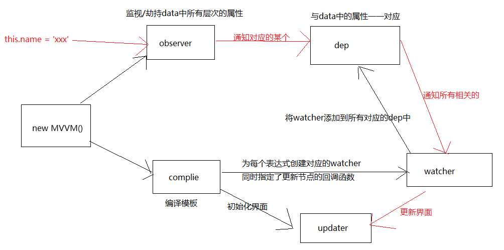

# React VS Vue

## 比较一下 React 与 Vue

相同点

1. 都有组件化开发和 Virtual DOM
2. 都支持 props 进行父子组件间数据通信
3. 都支持数据驱动视图, 不直接操作真实 DOM, 更新状态数据界面就自动更新
4. 都支持服务器端渲染
5. 都有支持 native 的方案,React 的 React Native,Vue 的 Weex

不同点

1. 数据绑定: vue 实现了数据的双向绑定，react 数据流动是单向的
2. 组件写法不一样, React 推荐的做法是 JSX , 也就是把 HTML 和 CSS 全都写进 JavaScript 了,即'all in js'；Vue 推荐的做法是 webpack+vue-loader 的单文件组件格式,即 html,css,js 写在同一个文件
3. state 对象在 react 应用中不可变的,需要使用 setState 方法更新状态;在 vue 中,state 对象不是必须的,数据由 data 属性在 vue 对象中管理
4. virtual DOM 不一样,vue 会跟踪每一个组件的依赖关系,不需要重新渲染整个组件树.而对于 React 而言,每当应用的状态被改变时,全部组件都会重新渲染,所以 react 中会需要 shouldComponentUpdate 这个生命周期函数方法来进行控制
5. React 严格上只针对 MVC 的 view 层,Vue 则是 MVVM 模式

## Redux 管理状态的机制

对 Redux 基本理解

1. redux 是一个独立专门用于做状态管理的 JS 库, 不是 react 插件库
2. 它可以用在 react, angular, vue 等项目中, 但基本与 react 配合使用
3. 作用: 集中式管理 react 应用中多个组件共享的状态和从后台获取的数据

Redux 的工作原理

Redux 使用扩展

1. 使用 react-redux 简化 redux 的编码
2. 使用 redux-thunk 实现 redux 的异步编程
3. 使用 Redux DevTools 实现 chrome 中 redux 的调试

## Vue 组件间通信方式

通信种类

1. 父组件向子组件通信
2. 子组件向父组件通信
3. 隔代组件间通信
4. 兄弟组件间通信

实现通信方式

1. props
2. vue 自定义事件
3. 消息订阅与发布
4. vuex
5. slot

方式 1: props

1. 通过一般属性实现父向子通信
2. 通过函数属性实现子向父通信
3. 缺点: 隔代组件和兄弟组件间通信比较麻烦

方式 2: vue 自定义事件

1. vue 内置实现, 可以代替函数类型的 props
   - a.绑定监听: `<MyComp @eventName="callback"`
   - b.触发(分发)事件: `this.$emit("eventName", data)`
2. 缺点: 只适合于子向父通信

方式 3: 消息订阅与发布

1. 需要引入消息订阅与发布的实现库, 如: pubsub-js
   - a.订阅消息: PubSub.subscribe('msg', (msg, data)=>{})
   - b.发布消息: PubSub.publish(‘msg’, data)
2. 优点: 此方式可用于任意关系组件间通信

方式 4: vuex

1. 是什么: vuex 是 vue 官方提供的集中式管理 vue 多组件共享状态数据的 vue 插件
2. 优点: 对组件间关系没有限制, 且相比于 pubsub 库管理更集中, 更方便

方式 5: slot

1. 是什么: 专门用来实现父向子传递带数据的标签
   - a.子组件
   - b.父组件
2. 注意: 通信的标签模板是在父组件中解析好后再传递给子组件的

## Vuex 管理状态的机制

对 Vuex 基本理解

1. 是什么: Vuex 是一个专为 Vue.js 应用程序开发的状态管理的 vue 插件
2. 作用: 集中式管理 vue 多个组件共享的状态和从后台获取的数据

## Vue 的 MVVM 实现原理

理解

1. Vue 作为 MVVM 模式的实现库的 2 种技术
   - a.模板解析
   - b.数据绑定
2. 模板解析: 实现初始化显示
   - a.解析大括号表达式
   - b.解析指令
3. 数据绑定: 实现更新显示
   - a.通过数据劫持实现

