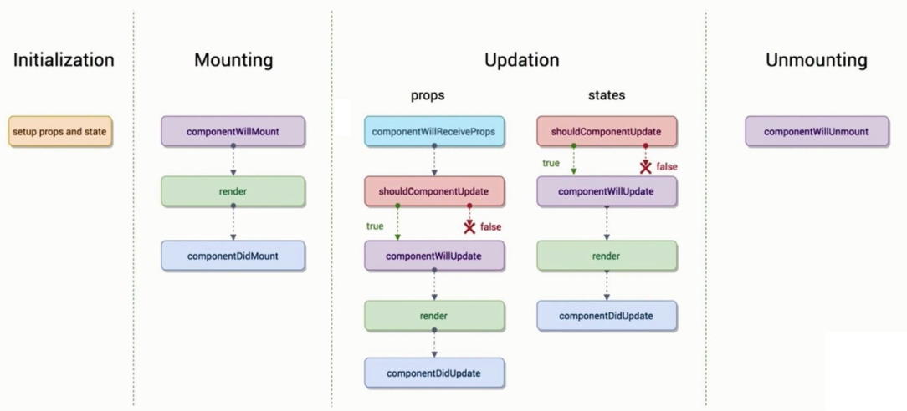
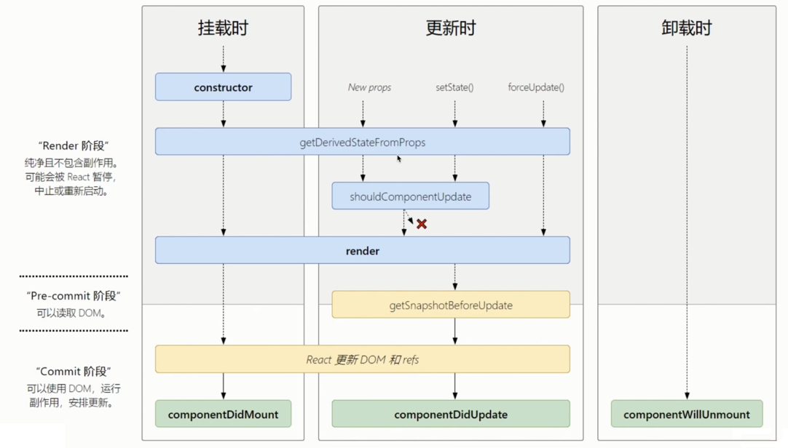

# React 核心内容梳理

## 前端开发环境搭建

- VSCode
- Nodejs
- yarn

## 前端开发环境搭建之 Window 下安装 nvm

- https://github.com/coreybutler/nvm-windows/releases

```bash
nvm list

nvm ls

nvm install 14.0.0

nvm uninstall 14.0.0

nvm use 14.0.0
```

## UmiJs 极速入门

可插拔的企业级 react 应用框架。

集成 react、react-router、ant design 等项目中常用的依赖包，可通过脚手架快速生成项目。

特点：

- 可扩展
- 开箱即用
- 企业级
- 大量自研
- 完备路由
- 最新技术

## react 组件生命周期

react 组件旧版生命周期



新版生命周期



## react 组件之间的通信方式

- 父子组件通信
- 兄弟组件通信
- 组件跨页面通信

## Dva 数据处理及数据 mock

```js
export default {
  namespace: 'search',
  state: {
    text: 'dva',
    lists: []
  },
  // 同步
  reducers: {
    getLists(state, action){

      return {
        ...state,
        // lists: Array(10).fill(action.payload)
        lists: action.payload
      }
    }
  },
  // 异步
  effects: {
    *getListsAsync({payload}, {call, put}){
      const res = yield call(getLists, payload);
      yield put({
        type: 'getLists',
        payload: res.lists
      })
    }
  }
}
```

```js
export default {
  'GET /api/getLists': {
    lists: ['a', 'b', 'c']
  },
  'GET /api/getListsAsync': (req, res)=>{
    console.log(req)
    setTimeout(() => {
      res.json({
        lists: Array(10).fill(req.query.value)
      })
    }, 1000);
  }
}
```

## 基于 react context api 实现数据流管理

```jsx
import React from 'react';

const SearchContext = React.createContext();

export default SearchContext;
```

```jsx
import Consumer from './consumer';

export default class Index extends Component {

  constructor(props) {
    super(props);
    this.state = {
      text: '',
      lists: []
    };
  }

  handleDispatch = async (action)=>{
    switch (action.type) {
      case 'TEXT':
        return this.setState({
          text: action.payload
        });
      case 'LISTS':
        const res = await getLists(action.payload);
        return this.setState({
          lists: res.lists
        });
      default:
        break;
    }
  }

  render() {
    const houses = {
      info: {}
    };
    return (
      <div>
        {houses?.info2?.id}
        <SearchContext.Provider value={{
          state: this.state,
          dispatch: this.handleDispatch
        }}>
          <Consumer />
        </SearchContext.Provider>
      </div>
    )
  }
}
```

```jsx
import React, { Component } from 'react';
import SearchContext from './searchContext';

export default class Consumer extends Component {

  constructor(props) {
    super(props);
    this.state = {

    };
  }

  render() {
    return (
      <div>
        <SearchContext.Consumer>
          {({state, dispatch})=>(
            <h1 onClick={()=>dispatch({
              type: 'TEXT',
              payload: 'consumer test'
            })}>consumer: {state.text}</h1>
          )}
        </SearchContext.Consumer>
      </div>
    )
  }
}
```

## LazyLoad 组件开发【基于 lazy 与 suspense 实现的懒加载组件】

```jsx
import React, { Component } from 'react';

export default class Demo extends Component {

  constructor(props) {
    super(props);
    this.state = {

    };
  }

  render() {
    return (
      <div>
        demo
      </div>
    )
  }
}
```

```jsx
import React, { Component, lazy, Suspense } from 'react';
const Demo = lazy(()=>import('./demo'));

export default class Index extends Component {

  constructor(props) {
    super(props);
    this.state = {
      flag: false
    };
  }

  componentDidMount() {
    setTimeout(() => {
      this.setState({
        flag: true
      })
    }, 2000);
  }

  render() {
    return (
      <div>
        {this.state.flag ? <Suspense fallback={<div>loading...</div>}>
          <Demo />
        </Suspense> : null}
      </div>
    )
  }
}
```

自定义封装：

LazyLoad：

```jsx
import React, { Component, lazy, Suspense } from 'react';

export default class Index extends Component {

  constructor(props) {
    super(props);
    this.state = {

    };
  }

  _renderLazy = ()=>{
    let Lazy;
    const { component, delay, ...other } = this.props;
    if(!component || component.constructor.name !== 'Promise'){
      Lazy = import('./error');
    }

    Lazy = lazy(()=>{
      return new Promise(resolve=>{
        setTimeout(() => {
          resolve(component);
        }, delay || 300);
      })
    })

    return <Lazy {...other}/>
  }

  render() {
    return (
      <div>
        <Suspense fallback={<div>loading...</div>}>
          {this._renderLazy()}
        </Suspense>
      </div>
    )
  }
}
```

```jsx
import React, { Component } from 'react';

export default class Error extends Component {
  render() {
    return (
      <div>
        组件引入错误！
      </div>
    )
  }
}
```

use：

```jsx
import LazyLoad from '@/components/LazyLoad'

<LazyLoad component={import('./lists')}/>
```

## ErrorBoundary 组件开发【基于 React 错误边界技术实现的组件】

ErrorBoundary

```jsx
import React, { Component } from 'react';

export default class ErrorBoundary extends Component {

  constructor(props) {
    super(props);
    this.state = {
      flag: false
    };
  }

  static getDerivedStateFromError(error) {
    console.log(error)
    return {
      flag: true
    }
  }

  /* error: 抛出的错误
   * info: 带有 componentStack key 的对象，其中包含有关组件引发错误的栈信息
  */
  componentDidCatch(error, info) {

  }

  render() {
    return (
      <div>
        {this.state.flag ? <h1>发生错误，请稍后再试！</h1> : this.props.children}
      </div>
    )
  }
}
```

## Modal 组件开发【基于 createPortal 创建自定义弹窗组件】

CreatePortal.jsx

```jsx
import React, { Component } from 'react';
import ReactDOM from 'react-dom';

export default class CreatePortal extends Component {

  constructor(props) {
    super(props);
    this.body = document.querySelector('body');
    this.el = document.createElement('div');
  }

  componentDidMount() {
    this.el.setAttribute('id', 'portal-root');
    this.body.appendChild(this.el);
  }

  componentWillUnmount() {
    this.body.removeChild(this.el);
  }

  render() {
    return ReactDOM.createPortal(this.props.children, this.el)
  }
}
```

use：

```jsx
import React, { Component } from 'react';
import CreatePortal from '../CreatePortal';
import { Icon } from 'antd-mobile';

const Styles = {
  modal: {
    position: 'relative',
    top: '0',
    left: '0',
    zIndex: '999'
  },
  body: {
    backgroundColor: '#fff',
    position: 'fixed',
    height: '100%',
    width: '100%',
    top: '0',
    left: '0',
    display: 'flex',
    alignItems: 'center',
    justifyContent: 'center',
  },
  close: {
    position: 'fixed',
    top: '10px',
    right: '10px'
  }
};

export default class Modal extends Component {

  constructor(props) {
    super(props);
    this.state = {

    };
  }

  handleClose = ()=>{
    const { onClose } = this.props;
    onClose && onClose();
  }

  render() {
    const { show } = this.props;
    return (
      <>
        {show ? <CreatePortal style={Styles.modal}>
          <div style={Styles.body}>
            {this.props.children}
            <Icon type='cross' size='lg' style={Styles.close} onClick={this.handleClose} />
          </div>
        </CreatePortal> : null}
      </>
    )
  }
}
```

## 使用 ref api 来操作 dom 和组件

```jsx
import React, { Component } from 'react';
import Demo from './demo';
import Input from './input';

export default class Refs extends Component {

  constructor(props) {
    super(props);
    this.state = {

    };
    this.divRef = React.createRef();
    this.inputRef = React.createRef();
    this.childRef = React.createRef();
    this.input2Ref = React.createRef();
  }

  componentDidMount(){
    // console.log(this.divRef.current);
    this.inputRef.current.focus();
    // console.log(this.childRef.current.changeText())
    this.input2Ref.current.value = 'input';

    setTimeout(()=>{
      console.log(this.input2Ref.current.value)
    },2000)
  }

  handleChange = ()=> {
    console.log(this.inputRef.current.value)
  }

  handleClick = ()=> {
    this.childRef.current.changeText()
  }

  render() {
    return (
      <div>
        <div ref={this.divRef}>div demo</div>
        <input ref={this.inputRef} onChange={()=>this.handleChange()}/>
        <Demo ref={this.childRef}/>
        <button onClick={()=>this.handleClick()}>修改demo组件</button>
        <br />
        <Input ref={this.input2Ref}/>
      </div>
    )
  }
}
```

```jsx
import React from 'react';

const Input = React.forwardRef((props, ref)=>{
  return (
    <>
    forwardRef: <input ref={ref}/>
    </>
  )
});

export default Input;
```

