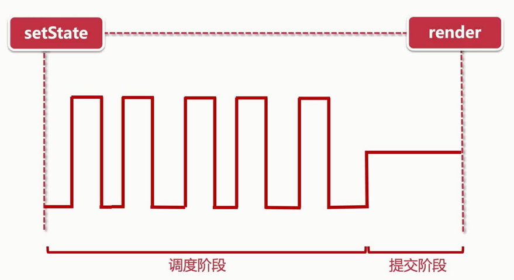
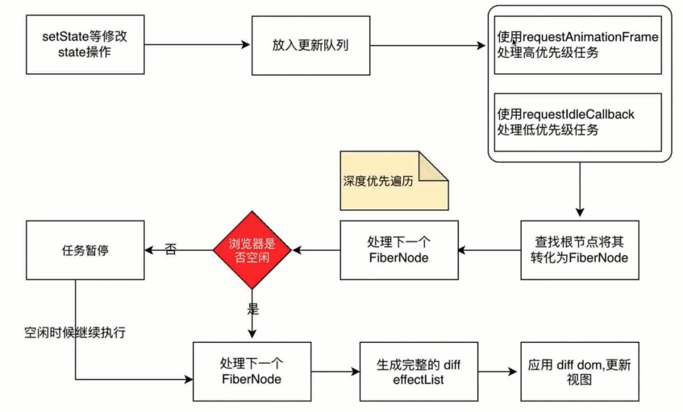
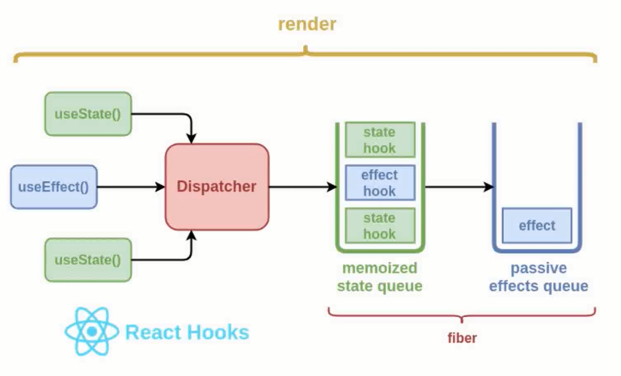
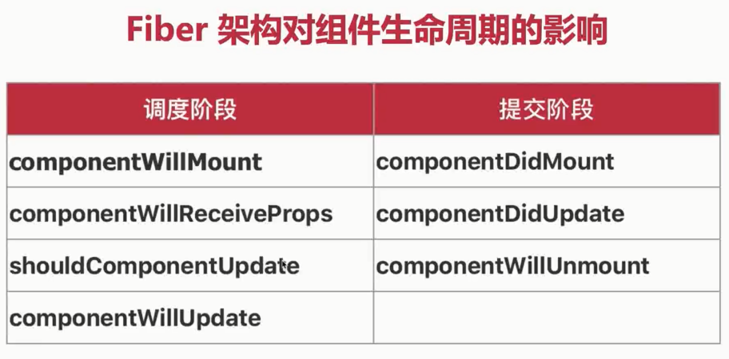

# React Hooks 及自定义hook开发

## react hook api-新的组件开发模式

```jsx
import React, { useState, useEffect, useLayoutEffect, useMemo, useCallback } from 'react';

export default function(props){
  const [count, setCount] = useState(0)
  const [text, setText] = useState('test-demo')
  // const [state, setState] = useState()

  async function demo(){
    console.log('demo')
  }

  useEffect(() => {
    console.log('useEffect')
    demo()

    // fetch('/api/getLists')
  }, [count])

  useEffect(()=>{
    console.log('useEffect 2')
  }, [])

  useLayoutEffect(()=>{
    console.log('useLayoutEffect')
  }, [])

  // const handleCount = ()=>{
  //   setCount(count + 1)
  // }

  const handleCount = useCallback(()=>{
    console.log('count changed')
    setCount(count + 1)
  }, [count])

  const noCacheText = ()=>{
    console.log('text changed')
    return text
  }

  const memoText = useMemo(()=>{
    console.log('text changed')
    return text
  }, [text])

  return (
    <div>
      <h1 onClick={handleCount}>count: {count}</h1>
      {/* <h1>text: {noCacheText()}</h1> */}
      <h1>text: {memoText}</h1>
    </div>
  )
}
```

## useContext和useReducer实现数据流管理

userContext.js

```jsx
import React, { useReducer } from 'react';

const initState = {
  isLogin: false,
  user: {
    id: '100',
    name: 'john'
  }
};

const UserContext = React.createContext();

const reducer = (state, action)=>{
  switch (action.type) {
    case 'LOGIN':
      return {
        ...state,
        isLogin: action.payload
      }
  
    default:
      break;
  }
};

const UserContextProvider = (props)=>{
  const [state, dispatch] = useReducer(reducer, initState);
  return (
    <UserContext.Provider value={{state, dispatch}}>
      {props.children}
    </UserContext.Provider>
  )
}

export {
  UserContext,
  UserContextProvider
}
```

```jsx
import React, { useState, useEffect, useContext } from 'react';
import User from './user';
import { UserContext } from './userContext';
import { Button } from 'antd-mobile';

export default function(props){
  // const [state, setState] = useState()
  const {state, dispatch} = useContext(UserContext);

  useEffect(() => {

  }, [])

  const handleLogin = ()=>{
    dispatch({
      type: 'LOGIN',
      payload:  true
    })
  }

  return (
    <div>
      {state.isLogin ? <User /> : <Button type='primary' onClick={handleLogin}>登陆</Button>}
    </div>
  )
}
```

## useTitleHook【根据url修改页面title的自定义hook】、useHttpHook【基于fetch api 封装具有监测功能的自定义hook】

jsconfig.json
```js
{
  "compilerOptions": {
    "baseUrl": "src",
    "paths": {
      "@/hooks": ["hooks/index"]
    }
  }
}
```

useTitleHook

```jsx
import { useLayoutEffect, useState } from 'react';

export default function useTitleHook(title) {
  const [state, setState] = useState()

  useLayoutEffect(()=>{
    document.title = title;
    setState(title);
  }, [title])

  return state;
}
```

useHttpHook：

```jsx
import { useState, useEffect } from 'react';
import { Toast } from 'antd-mobile';

export default function useHttpHook({
  url,
  method = 'post',
  headers,
  body = {},
  watch = []
}){
  const [result, setResult] = useState();
  const [loading, setLoading] = useState(true);

  async function Http(){
    setLoading(true);

    const defaultHeader = {
      'Content-type': 'application/json'
    };

    let params;
    if(method.toUpperCase() === 'GET'){
      params = undefined;
    }else {
      params = {
        headers: {
          ...defaultHeader,
          headers
        },
        method,
        body: JSON.stringify(body)
      }
    }

    return new Promise((resolve, reject)=>{
      fetch('/api' + url, params)
        .then(res => res.json())
        .then(res => {
          if(res.status === 200){
            resolve(res.data);
            setResult(res.data);
          }else {
            Toast.fail(res.errMsg);
            reject(res.errMsg);
          }
        })
        .catch(err => {
          Toast.fail(err);
          reject(err);
        })
        .finally(() => {
          setLoading(false);
        })
    });
  }

  useEffect(()=>{
    Http();
  }, watch);

  return [result, loading];
}
```

```jsx
import React, { useState, useEffect } from 'react';
import { useTitleHook, useHttpHook } from '@/hooks'

export default function(props){
  const [state, setState] = useState('customize')
  const title = useTitleHook(state);
  useEffect(() => {

  }, [])

  const [listResult, loading] = useHttpHook({
    url: '/getListsAsync',
    method: 'get',
    watch: [state]
  });
  console.log(listResult, loading)

  const handleClick = ()=>{
    setState('customize changed!')
  }

  return (
    <div>
      <h1 onClick={handleClick}>{title}</h1>
    </div>
  )
}
```

## 使用think-react-store实现数据处理【基于React context 和 hook的数据流解决方案】

- think-react-store：https://github.com/cpagejs/think-react-store

## Fiber 架构解析

- 为什么需要 Fiber 架构
- Fiber 的执行流程
- Fiber 对 React 生命周期 API 的影响









