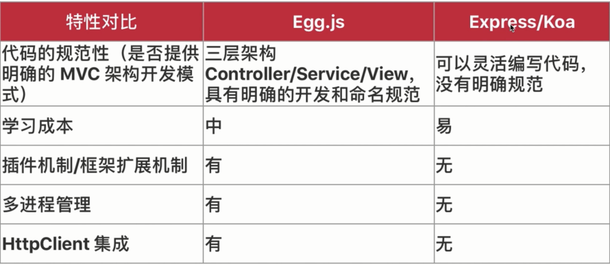

# Egg.js 介绍

- 文档：https://eggjs.org

## Egg.js 企业级开发的利器概述

为企业级框架和应用而生

企业级应用的特点：

- 功能完善
- 规范性高
- 便于扩展、升级

Egg.js 的特点：

- 提供基于  Egg.js 定制上层框架的能力
- 高度可扩展的插件机制
- 内置多进程管理
- 基于 koa 开发，性能优异
- 框架稳定，测试覆盖率高
- 渐进式开发

## Egg.js 初体验

```js
'use strict';

const Controller = require('egg').Controller;
const info = require('../utils/info');

class HomeController extends Controller {
  async index() {
    const { ctx } = this;
    // console.log(info(), ctx.request.url)
    console.log(ctx.info)
    ctx.body = 'hi, egg first app';
  }

  async demo() {
    const { ctx } = this;
    console.log(ctx.info)
    ctx.body = 'demo page';
  }
}

module.exports = HomeController;
```

```js
'use strict';

/**
 * @param {Egg.Application} app - egg application
 */
module.exports = app => {
  const { router, controller } = app;
  router.get('/', controller.home.index);
  router.get('/demo', controller.home.demo);
};
```

## Node.js 中的进程

- child-process 模块
- cluster 模块
- master 进程与 cluster 进程的通信

child_process.js

```js
const {exec, spawn} = require('child_process');

// exec('cat a.js', (error, stdout, stderr) => {
//     // console.log(error);
//     if (error) {
//         console.log('出错了');
//         return;
//     }

//     console.log(`stderr: ${stderr}`);
//     console.log(`stdout: ${stdout}`);
// })

const ls = spawn('ls', ['-a'], {encoding: 'utf-8'});

ls.stdout.on('data', (data) => {
  console.log(`stdout: ${data}`);
});

ls.stderr.on('data', (data) => {
  console.log(`stderr: ${data}`);
});

ls.on('close', (code) => {
  console.log(`code: ${code}`);
});
```

cluster.js

```js
const cluster = require('cluster');
const http = require('http');
const os = require('os');

const cpus = os.cpus().length;

// console.log(spus);

if (cluster.isMaster) {
  console.log(`主进程：${process.pid} 正常进行`);

  // 衍生工作进程
  for (let index = 0; index < cpus; index++) {
    cluster.fork();
  }
} else {
  // 工作进程可以共享任何 tcp 链接
  // 这里我们可以共享的一个 http 链接

  http
    .createServer((req, res) => {
      res.writeHead, (200, {'Content-type': 'text/html; charset=utf-8'});
      res.write('你好');
      res.end();
    })
    .listen(8000);

  console.log(`工作进程 ${process.pid} 已经启动`);
}
```

通信：

child.js

```js
console.log(`子进程 ${process.pid}`);

process.on('message', (msg) => {
  console.log(`来自 master：${msg}`);
});
process.send('这是子进程');
```

master.js

```js
const {fork} = require('child_process');

const child = fork('./child.js');

child.on('message', (msg) => {
  console.log(`来自子进程：${msg}`);
});
child.send('这是 master');
```

## 聊聊 Node.js 中的多线程和shell操作

## Egg.js 中多进程模式

## 超越 Express/Koa2，Egg.js 中的渐进式开发模式


