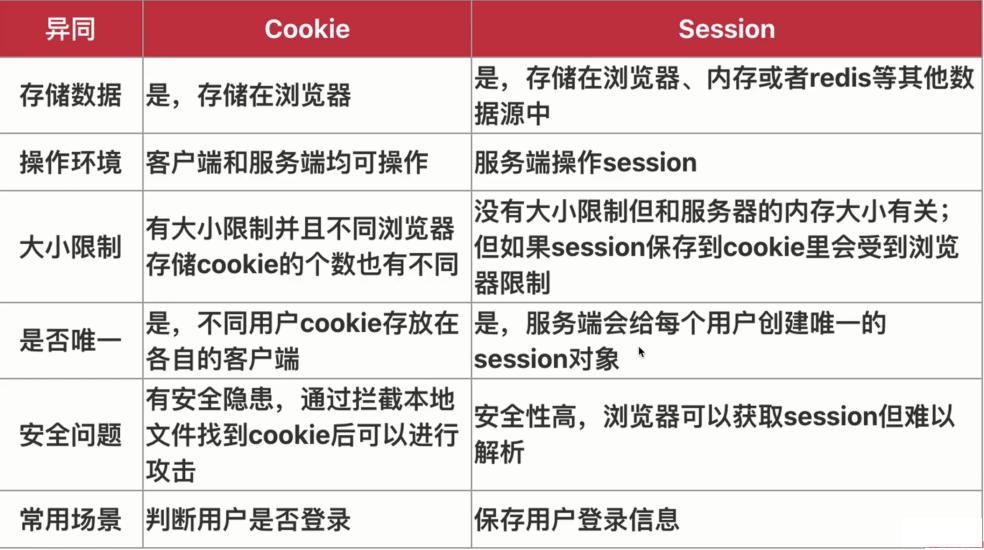

# Egg.js 基础--路由、控制器、服务、模板引擎

## Egg.js 中 Controller 的使用和单元测试

- Controller：https://eggjs.org/zh-cn/basics/controller.html

```js
'use strict';

const Controller = require('egg').Controller;

class UserController extends Controller {  async index() {

  async this.index() {
    const { ctx } = this;
    ctx.body = 'user index';
  }

  async lists() {
    const { ctx } = this;

    await new Promise(resolve => {
      setTimeout(() => {
        resolve();
      }, 1500);
    });

    ctx.body = [{ id: 123 }];
  }
}

module.exports = UserController;
```

```js
'use strict';

const { app } = require('egg-mock/bootstrap');

describe('user test', () => {
  it('user index', () => {
    return app.httpRequest()
      .get('/user')
      .expect(200)
      .expect('user index');
  });

  it('user lists', async () => {
    await app.httpRequest()
      .get('/user/lists')
      .expect(200)
      .expect('[{"id":123}]');
  });
    //   ...
```

## Egg.js 路由中 get 请求的处理方式

```js
// user.js
  async detail() {
    const { ctx } = this;
    console.log(ctx.query);
    // ...
  }

// user.test.js
  it('user detail', async () => {
    await app.httpRequest()
      .get('/user/detail?id=123')
      .expect(200)
      .expect('123');
  });
```

```js
// user.js
  async detail2() {
    const { ctx } = this;
    console.log(ctx.params);
    ctx.body = ctx.params.id;
  }

// user.test.js
  it('user detail2', async () => {
    await app.httpRequest()
      .get('/user/detail2/100')
      .expect(200)
      .expect('100');
  });
```

##  Egg.js 路由中 post/put/delete 等请求的处理及参数校验

post

config/plugin.js

```js
'use strict';

exports.validate = {
  enable: true,
  package: 'egg-validate',
};
```

```js
// user.js
  async add() {
    const { ctx } = this;
    console.log(ctx.request.body);

    const rule = {
      name: { type: 'string' },
      age: { type: 'number' },
    };
    ctx.validate(rule);
    ctx.body = {
      status: 200,
      data: ctx.request.body,
    };
  }

// user.test.js
    it('user add post', async () => {
    await app.httpRequest()
      .post('/user/add')
      .send({
        name: 'john',
        age: 18,
      })
      .expect(200)
      .expect({
        status: 200,
        data: {
          name: 'john',
          age: 18,
        },
      });
  });
});
```

put、delete：

```js
  async edit() {
    const { ctx } = this;

    ctx.body = ctx.request.body;
  }

  async del() {
    const { ctx } = this;

    ctx.body = ctx.request.body.id;
  }
```

```js
'use strict';

/**
 * @param {Egg.Application} app - egg application
 */
module.exports = app => {
  const { router, controller } = app;
  router.get('/user', controller.user.index);
  router.get('/user/lists', controller.user.lists);
  router.get('/user/detail', controller.user.detail);
  router.get('/user/detail2/:id', controller.user.detail2);
  router.post('/user/add', controller.user.add);
  router.put('/user/edit', controller.user.edit);
  router.del('/user/del', controller.user.del);
};
```

## Egg.js 中 Service 服务和单元测试

- Service：https://eggjs.org/zh-cn/basics/service.html

service/user.js

```js
'use strict';

const Service = require('egg').Service;

class UserService extends Service {
  async detail(id) {
    return {
      id,
      name: 'john',
      age: 18,
    };
  }
}

module.exports = UserService;
```

controller/user.js

```js

  async detail() {
    const { ctx } = this;
    // console.log(ctx.query);
    const res = await ctx.service.user.detail(10);
    console.log(res);
    ctx.body = ctx.query.id;
  }
```

service/user.test.js

```js
'use strict';

const { app, assert } = require('egg-mock/bootstrap');

describe('service user test', () => {
  it.only('test detail', async () => {
    const ctx = app.mockContext();
    const user = await ctx.service.user.detail(10);
    assert(user);
    assert(user.id === 10);
  });
});
```

## Egg.js 中使用 Ejs 模版引擎

- 后端渲染由来已久，渲染性能得到业界认可
- 利于SEO 优化，对纯展示类网站体验较好
- 对前后端分离模式的补充（单点登录的登录页面）

Ejs：https://github.com/tj/ejs

config/plugin.js

```js
'use strict';

exports.ejs = {
  enable: true,
  package: 'egg-view-ejs'
};
```

config/config.default.js

```js
  config.view = {
    mapping: {
      ".html": "ejs"
    },
    root: [
      path.join(appInfo.baseDir, "app/html"),
      path.join(appInfo.baseDir, "app/view")
    ].join(",")
  };

  config.ejs = {
    delimiter: "%"
  };
```

```js
  async index() {
    const { ctx } = this;

    await ctx.render('user.html', {
      id: 100,
      name: 'admin',
      lists: [
        'java',
        "php",
        "ts"
      ],
    }, {
      delimiter: '%'
    });
  }
```

## Ejs 模版引擎中静态资源的使用和配置

- assets：https://eggjs.org/zh-cn/tutorials/assets.html

config/config.default.js

```js
  config.static = {
    prefix: "/assets/",
    dir: path.join(appInfo.baseDir, "app/assets")
  };
```

## Egg.js 中 Cookie、Session 的配置和使用以及如何设置中文cookie

- cookie：https://eggjs.org/zh-cn/core/cookie-and-session.html#cookie
- session：https://eggjs.org/zh-cn/core/cookie-and-session.html#session

```js
  async login(){
    const { ctx } = this;
    const body = ctx.request.body;
    ctx.cookies.set("user", JSON.stringify(body), {
      maxAge: 1000 * 60 * 10,
      httpOnly: false,
    });

    // 保存session
    ctx.session.user = body;
    ctx.session.zh = "中文测试";
    ctx.session.test = "test";

    ctx.body = {
      status: 200,
      data: body
    };
  }

  async logout(){
    const { ctx } = this;
    ctx.cookies.set("user", null);

    //清除session
    ctx.session.user = null;

    ctx.body = {
      status: 200
    };
  }
```

```js
function login(){
  fetch("/login", {
    method: "post",
    headers: {
      "Content-type": "application/json"
    },
    body: JSON.stringify({
      name: "admin",
      pwd: "admin"
    })
  })
  .then(res=>{
    location.reload()
  });
}

function logout(){
  fetch("/logout", {
    method: "post",
    headers: {
      "Content-type": "application/json"
    },
    body: JSON.stringify({
    })
  })
  .then(res=>{
    location.reload()
  });
}
```

中文 cookies：

方式一：

```js
    ctx.cookies.set("zh", "测试", {
      encrypt: true
    });
    const zh = ctx.cookies.get("zh", {
      encrypt: true
    });
```

方式二：

```js

  encode(str = ''){
    return new Buffer(str).toString("base64");
  }
  decode(str = ''){
    return new Buffer(str, "base64").toString();
  }

    ctx.cookies.set("base64", this.encode("中文base64"));
    const base64 = this.decode(ctx.cookies.get("base64"));
```



session 配置项：

```js
  config.session = {
    key: "TEST_SESS",
    httpOnly: true,
    maxAge: 1000 * 50,
    renew: true
  };
```

扩展 session：

```js
module.exports = app => {

  const store = {};
  app.sessionStore = {
    async get(key){
      console.log("--store--", store)
      return store[key];
    },
    async set(key, value, maxAge){
      store[key] = value;
    },
    async destroy(key){
      store[key] = null;
    }
  };
}
```

## Egg.js 中使用 HttpClient 请求其他接口

```js
const Controller = require('egg').Controller;

class CurlController extends Controller {
  async curlGet() {
    const { ctx, app } = this;
    const res = await ctx.curl("http://localhost:7001/", {
      dataType: "json"
    });
    console.log(res);
    ctx.body = {
      status: 200,
      data: res.data
    };
  }

  async curlPost(){
    const { ctx } = this;
    const res = await ctx.curl("http://localhost:7001/login", {
      method: "post",
      contentType: "json",
      data: ctx.request.body,
      dataType: "json"
    });
    console.log(res);
    ctx.body = res.data;
  }
}

module.exports = CurlController;
```
