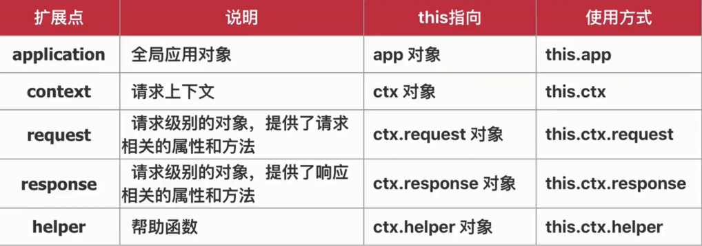

# Egg.js 高阶--插件、中间件、扩展

## 中间件，绕不开的洋葱圈模型【实现日志中间件httpLog】


```js
module.exports = options => {
  return async (ctx, next) => {
    console.log('m1 start');
    await next();
    console.log('m1 end');
  }
}
```

```js
  config.middleware = ['m1', 'm2'];
```

httpLog.js

```js
const dayjs = require('dayjs');
const fs = require('fs');

module.exports = options => {
  return async (ctx, next) => {
    // console.log(ctx)
    console.log(options)
    const sTime = Date.now();
    const startTime = dayjs(Date.now()).format("YYYY-MM-DD HH:mm:ss");
    const req = ctx.request;
    await next();
    const log = {
      method: req.method,
      url: req.url,
      data: req.body,
      startTime,
      endTime: dayjs(Date.now()).format("YYYY-MM-DD HH:mm:ss"),
      timeLength: Date.now() - sTime
    };
    // console.log(log)
    // console.log(ctx.app.baseDir)
    const data = dayjs(Date.now()).format("YYYY-MM-DD HH:mm:ss") + " [httpLog] " + JSON.stringify(log) + '\r\n';
    fs.appendFileSync(ctx.app.baseDir + '/htttpLog.log', data);
  }
}
```

config.default.js

```js
  config.httpLog = {
    type: 'all'
  };
```

## 丰富的扩展方式，项目开发得心应手【提取公共逻辑，提升开发效率】



extend/application.js

```js
const path = require('path');

module.exports = {
  // 方法扩展
  package(key){
    const pack = getPack();
    return key ? pack[key] : pack;
  },

  // 属性扩展
  get allPackage(){
    return getPack();
  }
};

function getPack(){
  const filePath = path.join(process.cwd(), "package.json");
  const pack = require(filePath);
  return pack;
}
```

context.js

```js
module.exports = {
  params(key){
    const method = this.request.method;
    if (method === 'GET') {
      return key ? this.query[key] : this.query;
    }else {
      return key ? this.request.body[key] : this.request.body;
    }
  }
};
```

request.js
```js
module.exports = {
  get token(){
    console.log('header', this.header);
    return this.get('token');
  }
};
```

response.js
```js
module.exports = {
  set token(token){
    console.log('token', this)
    this.set('token', token);
  }
};
```

helper.js
```js
module.exports = {
  base64Encode(str = ''){
    return new Buffer(str).toString('base64');
  }
};
```

controller/home.js

```js
'use strict';

const Controller = require('egg').Controller;

class HomeController extends Controller {

  async newApplication(){
    const { ctx, app } = this;
    const packageInfo = app.package('scripts');
    // console.log(packageInfo)
    const allPack = app.allPackage;
    console.log(allPack)
    ctx.body = 'newApplication';
  }

  async newContext(){
    const { ctx } = this;
    const params = ctx.params('id');
    console.log(params)
    ctx.body = 'newContext';
  }

  async newRequest(){
    const { ctx } = this;
    const token =  ctx.request.token;

    ctx.body = token;
  }

  async newResponse(){
    const { ctx } = this;
    ctx.response.token = 'abc123abc';
    const base64Parse = ctx.helper.base64Encode('newResponse');
    ctx.body = base64Parse;
  }
}

module.exports = HomeController;
```

## 插件机制， Egg.js 灵活应用【实现用户登录验证插件egg-auth】

- 中间件更适合处理请求，插件可以处理业务逻辑
- Eggjs 中的插件相当于一个微型应用
- 插件不包括 routerjs 和 controller 控制器

**egg-auth**：

/lib/plugin/egg-auth/app/middleware/auth.js

```js
module.exports = options => {
  console.log('options', options)
  return async (ctx, next) => {
    const url = ctx.request.url;
    console.log('url', url);
    const user = ctx.session.user;

    if (!user && !options.exclude.includes(ctx.request.url.split('?')[0])) {
      ctx.body = {
        status: 1001,
        errMsg: '用户未登录'
      };
    } else {
      await next();
    }
  }
}
```

/lib/plugin/egg-auth/app/package.json

```json
{
  "name": "egg-auth",
  "eggPlugin": {
    "name": "auth"
  }
}
```

/lib/plugin/egg-info/app/extend/context.js

```js
const os = require('os');

module.exports = {
  get info(){
    const data = {
      memory: os.totalmem() / 1024 / 1024 / 1024 + 'G',
      platform: os.platform(),
      cpus: os.cpus().length,
      url: this.request.url
    };
    return data;
  }
};
```

plugin.js

```js
exports.auth = {
  enable: true,
  path: path.join(__dirname, '../lib/plugin/egg-auth')
};

exports.info = {
  enable: true,
  path: path.join(__dirname, '../lib/plugin/egg-info')
};
```

config.default.js

```js
  config.auth = {
    exclude: ['/home', '/user', '/login', '/logout']
  };
```

## Egg.js 中的定时任务

- 定时上报应用状态，便于系统监控
- 定时从远程接口更新数据
- 定时处理文件（清除过期日志文件）

/app/schedule/get_info.js

```js
const Subscription = require('egg').Subscription;

class getInfo extends Subscription {
  static get schedule(){
    return {
      // interval: 3000,
      cron: '*/3 * * * * *',
      type: 'worker'
    }
  }

  async subscribe(){
    const info = this.ctx.info;
    console.log(Date.now(), info)
  }
}

module.exports = getInfo;
```
