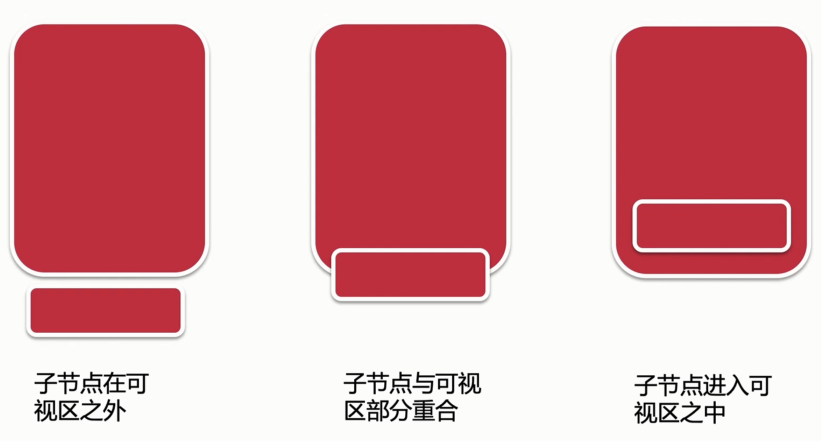

# 前端界面及自定义 hook

核心 api

- useState
- useEffect
- IntersectionObserver -> useObserverHook

工具库

- think-react-store
- project-libs
- rc-form

公共组件

- MenuBar
- ShowLoading
- Modal

自定义 hook

- useHttpHook
- useObserverHook
- useImgHook

## 为首页添加数据mock（使用useHttpHook请求数据）

```js
import { useState, useEffect } from 'react';
import { Http } from '@/utils';

export default function useHttpHook({
  url,
  method = 'post',
  headers,
  body = {},
  watch = []
}) {
  const [result, setResult] = useState();
  const [loading, setLoading] = useState(true);

  useEffect(() => {
    Http({
      url,
      method,
      headers,
      body,
      setResult,
      setLoading
    });
  }, watch);

  return [result, loading];
}
```

## 初识 IntersectionObserver ，实现 useObserverHook

- IntersectionObserver：https://developer.mozilla.org/zh-CN/docs/Web/API/IntersectionObserver



```js
import React, { useState, useEffect } from 'react';
import { history } from 'umi';

let observer;
export default function(){

  const handleClick = () => {
    history.push('/');
  };

  useEffect(() => {
    console.log('进入页面')
    observer = new IntersectionObserver(entries => {
      console.log(entries)
    });
    observer.observe(document.querySelector('#loading'));

    return () => {
      console.log('离开页面')
      if(observer){
        // 解绑元素
        observer.unobserve(document.querySelector('#loading'));

        // 停止监听
        observer.disconnect();
      }
    }
  }, [])

  return (
    <div>
      observer
      <button onClick={handleClick}>首页</button>
      <div id='loading' style={{width:'100px',height:'100px',background:'#f60', marginTop:'1000px'}}>
        loading
      </div>
    </div>
  )
}
```

useObserverHook

```js
import { useEffect } from 'react';

let observer;
export default function useObserverHook(ele, callback, watch = []) {
  useEffect(() => {
    const node = document.querySelector(ele);
    if (node) {
      observer = new IntersectionObserver(entries => {
        callback && callback(entries);
      });
      observer.observe(node);
    }

    return () => {
      if (observer && node) {
        // 解绑元素
        observer.unobserve(node);

        // 停止监听
        observer.disconnect();
      }
    }
  }, watch);
}
```

## 使用 useObserverHook 实现滚动加载

```js
  /**
   * 1，监听loading是否展示出来；
   * 2，修改分页数据；
   * 3，监听分页数据的修改，发送接口，请求下一页的数据；
   * 4，监听loading变化，拼装数据
   */
  useObserverHook('#' + CommonEnum.LOADING_ID, (entries) => {
    // console.log(entries)
    if (!loading && entries[0].isIntersecting) {
      setPage({
        ...page,
        pageNum: page.pageNum + 1
      });
    }

  }, null);
```

## 使用 useImgHook 实现图片懒加载

useImgHook

```js
import { useEffect } from 'react';
import { isEmpty } from 'project-libs';

/**
 * 1，监听图片是否进入可视区域；
 * 2，将src属性的值替换为真实的图片地址，data-src
 * 3，停止监听当前的节点
 * @param {*} ele 
 * @param {*} callback 
 * @param {*} watch 
 */
let observer;
export default function useImgHook(ele, callback, watch = []){
  useEffect(()=>{
    const nodes = document.querySelectorAll(ele);
    if(!isEmpty(nodes)){
      observer = new IntersectionObserver((entries)=>{
        callback && callback(entries);
        entries.forEach(item => {
          // console.log(item)
          if(item.isIntersecting){
            const dataSrc = item.target.getAttribute('data-src');
            item.target.setAttribute('src', dataSrc);
            observer.unobserve(item.target);
          }
        });
      });
      nodes.forEach(item => {
        observer.observe(item);
      });
    }

    return () => {
      if(!isEmpty(nodes) && observer){
        observer.disconnect();
      }
    }
  }, watch)
}
```


## 优化-使用 React.memo 减少渲染次数

```js
function Search(props) {
  // ...
}

function areEqual(prevProps, nextProps){
  // console.log(prevProps, nextProps)
  if(prevProps.citys === nextProps.citys && prevProps.citysLoading === nextProps.citysLoading){
    return true;
  }else {
    return false;
  }
}

export default memo(Search, areEqual);
```

