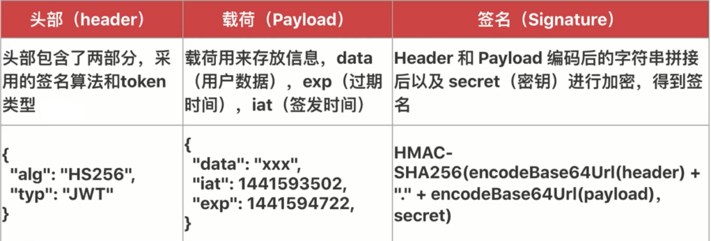
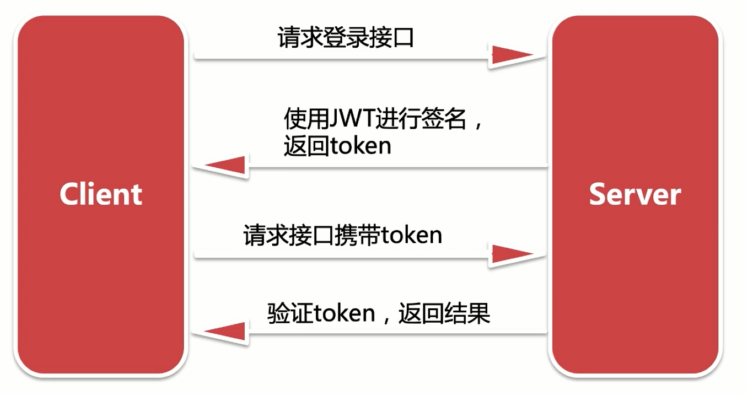

# 服务端用户模块实现及优化

核心技术

- Sequelize
- JWT
- Redis

框架扩展

- 扩展 Eggjs
- 优化  egg-auth
- userExist 中间件

## 创用户表，建基于 Sequelize 编写用户模型

```sql
create database egg_house;

use egg_house;

--- 用户表
create table `user`(
  `id` int not null auto_increment,
  `username` varchar(20) default null comment '用户名',
  `password` varchar(64) default null comment '密码',
  `avatar` text comment '头像',
  `phone` varchar(20) default null comment '电话',
  `sign` varchar(300) default null comment '用户签名',
  `createTime` timestamp default null comment '创建时间',
  `updateTime` timestamp default null comment '更新时间',
  primary key(`id`)
)engine=InnoDB auto_increment=1 default charset=utf8 comment='用户表';
```

model/user.js

```js
module.exports = app => {
  const { STRING, INTEGER, TEXT, DATE } = app.Sequelize;

  const User = app.model.define('user', {
    id: { type: INTEGER, primaryKey: true, autoIncrement: true },
    username: STRING(20),
    password: STRING(64),
    avatar: TEXT('long'),
    phone: STRING(20),
    sign: STRING(300),
    createTime: DATE,
    updateTime: DATE
  });

  return User;
}
```

## 什么是 JWT 技术？

JWT 是 JSON Web Tokens ，是一种规范化的 token，它里面包含用户信息，具有验证用户身份、防止 CSRF 攻击等优点。

- jwt.io

JWT  结构：



JWT 使用：




## 使用 JWT 改造注册和登陆接口，并联调登录注册接口

```bash
npm i egg-jwt --save
```

plugin.js

```js
exports.jwt = {
  enable: true,
  package: 'egg-jwt'
};
```

config.default.js

```js
  config.jwt = {
    secret: 'test-secret'
  };
```

```js
class UserController extends BaseController {
  async jwtSign({ id, username }) {
    const { ctx, app } = this;
    // const username = ctx.request.body.username;
    const username = ctx.params('username');
    const token = app.jwt.sign({
      id,
      username
    }, app.config.jwt.secret);
    // ctx.session[username] = 1;
    await app.redis.set(username, token, 'EX', app.config.redisExpire);
    return token;
  }
  parseResult(ctx, result) {
    return {
      ...ctx.helper.unPick(result.dataValues, ['password']),
      createTime: ctx.helper.timestamp(result.createTime),
    }
  }
  async register() {
    const { ctx, app } = this;
    const parmas = ctx.params();
    const user = await ctx.service.user.getUser(parmas.username);

    if (user) {
      this.error('用户已经存在');
      return;
    }

    const result = await ctx.service.user.add({
      ...parmas,
      password: md5(parmas.password + app.config.salt),
      createTime: ctx.helper.time()
    });
    // console.log(result)
    if (result) {
      const token = await this.jwtSign({
        id: result.id,
        username: result.username
      });
      this.success({
        ...this.parseResult(ctx, result),
        token
      });
    } else {
      this.error('注册使用失败');
    }
  }

  async login() {
    const { ctx, app } = this;
    const { username, password } = ctx.params();
    const user = await ctx.service.user.getUser(username, password);

    if (user) {
      const token = await this.jwtSign({
        id: user.id,
        username: user.username
      });

      this.success({
        ...this.parseResult(ctx, user),
        token
      });
    } else {
      this.error('该用户不存在');
    }
  }
  // ...
}
```


```js
  async detail() {
    const { ctx } = this;
    const user = await ctx.service.user.getUser(ctx.username);

    if (user) {
      this.success({
        ...this.parseResult(ctx, user)
      });
    } else {
      this.error('该用户不存在');
    }
  }
  async logout() {
    const { ctx, app } = this;
    try {
      await app.redis.del(ctx.username);
      this.success('ok');
    } catch (error) {
      this.error('退出登录失败');
    }
  }
```

## redis 的简单使用,将用户基础信息存储在 redis 中

redis 缓存：

redis 是一个基于内存的高性能 key-value 数据库。具有存储速度快、支持丰富的数据类型、过期过后自动删除缓存等特点。被广泛的应用于企业级项目。

- redis.io

```bash
brew install redis

brew services start redis

redis-cli

set id 1

get id

get id2

expire id 3

del id

exit
```

```bash
cd /user/local/stc/

ls

open redis.config

# 修改 requirepass
requirepass abc123456

brew services restart redis

redis-cli -a  abc123456

```

```bash
yarn  i egg-redis
```

plugin.js
```js
exports.redis = {
  enable: true,
  package: 'egg-redis'
};
```

config.default.js

```js
  config.redis = {
    client: {
      port: 6379,
      host: '127.0.0.1',
      password: 'abc123456',
      db: 0
    }
  };
```

```js
  async jwtSign({ id, username }) {
    //  ...
    await app.redis.set(username, token, 'EX', app.config.redisExpire);
    //  ...
  }
```

## 将公共逻辑写在 BaseController 和 BaseService 里面，并开发新的中间件

middleware/userExist.js

```js
module.exports = options => {
  return async (ctx, next) => {
    const user = await ctx.service.user.getUser(ctx.username);
    if(!user){
      ctx.body = {
        status: 500,
        errMsg: '用户不存在'
      };
      return;
    }else {
      await next();
    }
  }
}
```

