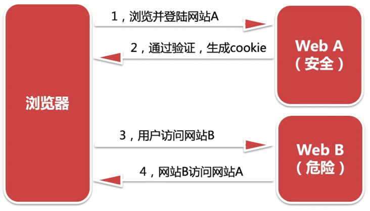

# 项目安全

安全风险

- XSS 跨站脚本攻击：在 Web 页面注入脚本，使用 JavaScript 窃取用户信息
- SQL 注入攻击：将用户传入的数据作为参数，使用字符串拼接的方式插入到 SQL 查询中
- CSRF 跨站请求伪造：伪造用户请求向网站发起恶意请求
- 海量接口请求：通过短时间内向服务器发起海量的请求，耗尽服务器资源，使服务器奔溃。

## XSS 常见攻击方式与解决思路

XSS 攻击手段：

- DOM-based 型攻击：利用 dom 本身的缺陷，进行攻击
- 存储型：表单提交的数据存在恶意代码，被保存到目标网站的服务器中
- 反射型：恶意代码并没有保存在目标网站，通过引诱用户点击一个连接到目标网站的恶意链接来实施攻击的

XSS 防御手段：

- 过滤：对用户的输入进行过滤，移除用户输入的 Style 节点、Script 节点、Iframe 等节点‘
- 编码：Html Entity 编码
- cookie：将重要的 cookie 设置成 http only 这样就不能通过 js 获取到该 cookie 了

## SQL 注入防御手段

- 验证输入类型：比如根据 id 查询数据，那么变量必须是整型
- 转义特殊字符：比如引号、分号和横线等，在执行 CURD 前后需要进行转义

## CSRF 常见攻击方式与解决思路(开发egg-allowHosts插件)

CSRF 攻击手段



CSRF 防御手段：

- 使用 token：服务器给客户端一个 token，客户端请求接口带上该 token，服务器验证 token 是否有效，有效允许访问，否则拒绝访问
- Referer 验证：Referer 指的是页面请求来源，意思是，只接受本站的请求，服务器才做响应；如果不是，就拦截。

lib/plugin/egg-allowHosts/app/middleware/allowHosts.js

```js
module.exports = options => {
  return async (ctx, next) => {
    const { referer } = ctx.request.header;
    // console.log(referer)
    if(referer){
      const url = new URL(referer);
      if(options.includes(url.host)){
        await next();
      }else {
        ctx.body = {
          status: 403,
          errMsg: `host ${url.host} 被禁止`
        };
      }
    }else {
      await next();
    }
  }
}
```

package.json

```js
{
  "name": "egg-allowHosts",
  "eggPlugin": {
    "name": "allowHosts"
  }
}
```

plugin.js

```js
exports.allowHosts = {
  enable: true,
  path: path.join(__dirname, '../lib/plugin/egg-allowHosts')
};
```

config.default.js

```js
  config.allowHosts = ['localhost:8000', '127.0.0.1:8000'];
```

## 如何对接口限流，避免无限制请求(开发egg-interfaceLimit插件)

- 服务限流：服务器在一定时间段内只接受一定量的请求，超出限制则拒绝执行
- 接口缓存：将常用的接口数据进行缓存，减少对数据库查询次数

```js
/**3秒内最多允许3个接口请求
 * 1，设置计数器，每次请求加1；保存起始时间
 * 2，超过3秒，计数器大于3，则提示请求频繁；计数器清零，起始时间修改为当前时间
 * 3，超过3秒，计数器小于3，计数器清零，起始时间修改为当前时间
 */
module.exports = options => {
  let count = 0;
  let firstTime = new Date().getTime();

  return async (ctx, next) => {
    if(new Date().getTime() - firstTime >= options.time ){
      if(count >= options.maxCount){
        count = 0;
        firstTime = new Date().getTime();
        ctx.body = {
          status: 500,
          errMsg: '请求太频繁'
        };
        return;
      }else {
        count = 0;
        firstTime = new Date().getTime();
        await next();
      }
    }else {
      count++;
      await next();
    }
  }
}
```

```js
{
  "name": "egg-interfaceLimit",
  "eggPlugin": {
    "name": "interfaceLimit"
  }
}
```

```js
exports.interfaceLimit = {
  enable: true,
  path: path.join(__dirname, '../lib/plugin/egg-interfaceLimit')
};
```

```js
  config.interfaceLimit = {
    maxCount: 3, // 最多请求个数
    time: 3 * 1000, // 间隔时间
  };
```

## 接口缓存问题处理(开发egg-interfaceCache插件)

```js
/**缓存接口
 * 1，接口地址作为redis中的key
 * 2，查询redis，有缓存，返回返回接口
 * 3，没有缓存，将接口返回结果保存到redis中
 */
module.exports = options => {
  return async (ctx, next) => {
    const { url } = ctx.request;
    const cahce = await ctx.app.redis.get(url);

    if(options.include.includes(url)){
      if(cahce){
        ctx.body = JSON.parse(cahce);
        return;
      }else {
        await next();
        await ctx.app.redis.set(url, JSON.stringify(ctx.response.body), 'EX', 8);
      }
    }else {
      await next();
    }
  }
}
```

```js
{
  "name": "egg-interfaceCache",
  "eggPlugin": {
    "name": "interfaceCache"
  }
}
```

```js
exports.interfaceCache = {
  enable: true,
  path: path.join(__dirname, '../lib/plugin/egg-interfaceCache')
};
```

```js
  config.interfaceCache = {
    expire: 10,
    include: ['/api/user/detail']
  };
```
