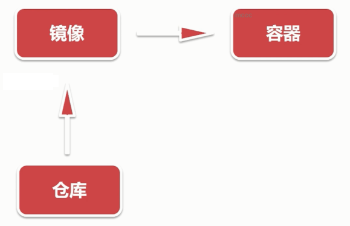
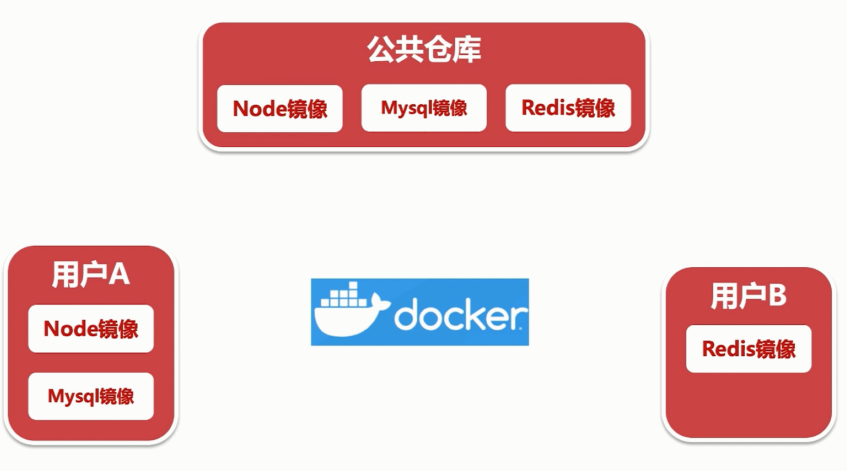

# 项目部署

## Docker 简介

为什么需要 Docker ？

- 开发环境不一致：开发系统不一样、本地开发环境和线上环境不一样
- 软件安装麻烦：安装不同软件的复杂程度不同，不仅耗时久还容易出错
- 运维成本过高：软件维护和升级都比较费时费力，如果新增机器，所有软件都需要重新安装





```bash
docker -v

docker -h
```

## Docker 基础入门

Docker 操作：

- 镜像操作：拉取、查看、删除等
- 容器操作：运行、查看、进入、删除等

- 国内镜像：https://hub.daocloud.io

```bash
docker pull daocloud.io/library/node:12.18

docker images

docker tag  镜像id  node   # 重命名镜像

mkdir docker-test
cd docker-test

docker save -o node.image  镜像id  # 导出镜像

docker rmi # 删除镜像
docker rmi -f

docker load -i node.image  # 导入镜像


docker pull daocloud.io/library/mysql:8.0.20 # 拉取 mysql 镜像

docker run -d -p 3307:3306 --name mysql -e MYSQL_ROOT_PASSWORD=abc123456  镜像 id # 启动镜像

docker ps # 查看启动的镜像
docker ps -a
docker ps -aq

docker stop  镜像id  # 停止镜像运行

docker rm 镜像id # 删除镜像


docker exec -it 镜像id sh # 进入 mysql 容器

    mysql -uroot -p
    show databases
    exit # 退出mysql
exit # 退出mysql 容器

docker logs -f  容器id  # 查看日志

docker restart 容器id  # 重启容器

```

## 阿里云后台介绍

```bash
ssh root@ip号

pwd

yum install yum-utils device-mapper-persistent-data lvm2

yum-config-manager --add-repo http://mirrors.aliyun.com/docker-ce/linux/centos/docker-ce.repo

yum install docker-ce docker-ce-cli containerd.io

docker -v

vi   /etc/docker/daemon.json

{
  "registry-mirrors": ["https://xxxxx.mirror.aliyuncs.com "]
}

systemctl daemon-reload
systemctl restart docker

docker pull daocloud.io/library/redis:6.0.5

docker run -d -p 6379:6379 --name redis  镜像id  --requirepass  abc1234456

docker exec -it redis镜像id  sh

    redis-cli -a abc23456
    set a 10
    get a
    exit # 退出redis
exit # 退出 redis 容器


scp -rp nginx root@id号:/root  # 上传文件

```

```bash
# 使用node镜像
FROM daocloud.io/library/node:12.18
# 在容器中新建目录文件夹 egg
RUN mkdir -p /egg
# 将 /egg 设置为默认工作目录
WORKDIR /egg
# 将 package.json 复制默认工作目录
COPY package.json /egg/package.json
# 安装依赖
RUN yarn config set register https://registry.npm.taobao.org
RUN yarn --production
# 再copy代码至容器
COPY ./ /egg
#7001端口
EXPOSE 7001
#等容器启动之后执行脚本
CMD yarn prod
```

## 链接

- https://zhuanlan.zhihu.com/p/265714594
