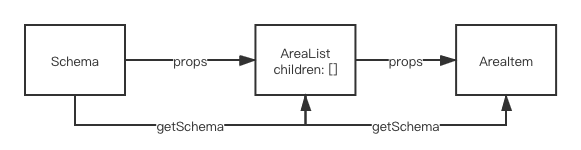

# 配置化协议的编码实现

如何通过 Ref 逐级分解 Schema，并最终拼装协议的代码实现。通过巧妙的设计，快速便捷的实现三级协议的灵活生成及存取。同时讲解了数据重置功能的实现思路。通过协议中子节点拖拽排序的功能，衍生出对基于 Ref 设计存在不足的思考，从而讲解 Redux 在项目中使用的必要性。

## 最外层 Schema 的存取逻辑

## 围绕 Schema 结构合理设计组件层次

## 二层 Schema 的存储逻辑开发

## 多层次 Schema 的标准逻辑设计

## Schema 重置的逻辑实现

## 设计优化解决系统 BUG

## 拖拽排序功能的实现以及数据设计思考

VS code 插件

- Code Spell Checker

react-sortablejs
- https://github.com/SortableJS/react-sortablejs

