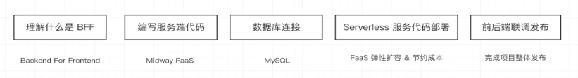
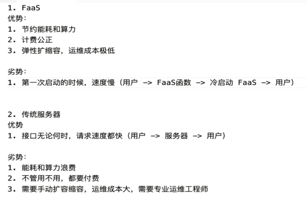

# 基于 Midway FaaS 的 Serverless 服务端代码开发

使用 Midway FaaS 框架，搭建数据库环境、使用 TypeORM 进行数据库映射操作，开发服务端接口，通过接口存取协议的内容。过程中，实现了标准化的异常处理中间件、参数校验逻辑和接口数据结构。开发完成后，本章借助阿里云的 Function Computing，完成了对框架代码的函数式部署，并绑定域名可以线上执行。


## 服务端脉络 



## Midway Faas 框架代码介绍

函数

## 使用 TypeORM 连接管理数据库

安装 mysql

Sequel Pro / Navicat for Mysql

- http://www.midwayjs.org/docs/2.0.0/intro
- https://www.yuque.com/midwayjs/midway_v2/orm


## 参数校验、异常处理、标准化接口 

error.middleware.ts
```ts
import { IMiddleware } from '@midwayjs/core';
import { Middleware } from '@midwayjs/decorator';
import { NextFunction, Context } from '@midwayjs/koa';
import { getStandardResponse } from '../util/common';

@Middleware()
export class ErrortMiddleware implements IMiddleware<Context, NextFunction> {

  resolve() {
    return async (ctx: Context, next: NextFunction) => {
      try {
          await next();
      } catch (error) {
          ctx.body = getStandardResponse(false, null, error.message);
      }
    };
  }
}
```

## Serverless FaaS 线上部署及域名绑定 

阿里云 FC



- 【拓展】Serverless 的优势和劣势全面整理
- 【思考】云原生的概念是什么？使用云上服务有什么优势？


