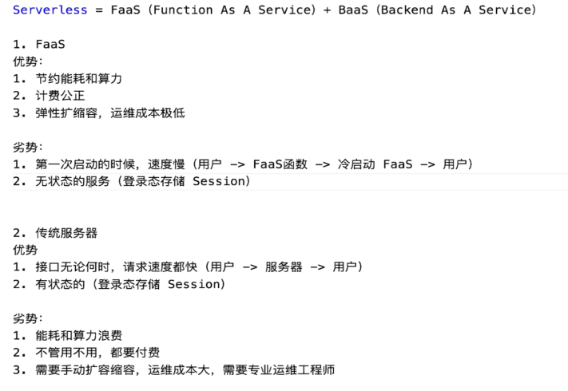

# 使用 BaaS 能力丰富 Serverless 项目功能

使用 Authing 提供的第三方 BaaS 鉴权能力，为项目增加了登录退出和存储管控的功能。通过实践讲解了为什么 Serverless = FaaS + BaaS，以及 BaaS 能力集成的典型流程。在此基础上，对工程中前后端代码中的请求类、自定义 Hook，通用函数进行了封装拆分，并最终发布完整版本的项目至线上环境。

- BaaS 简介 & 使用 Authing 实现前端登录功能
- 【思考】Serverless = FaaS + BaaS
- Server 端根据用户进行权限管控
- 自定义Hook的拆分和鉴权请求的封装
- 登录退出代码完善及项目上线
- 【思考】关于鉴权，你有多少理解呢？

