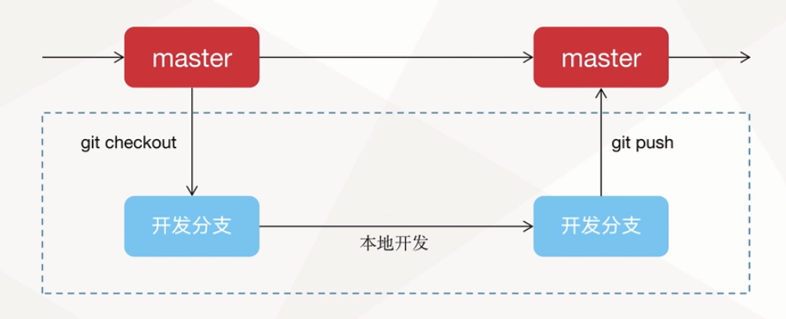
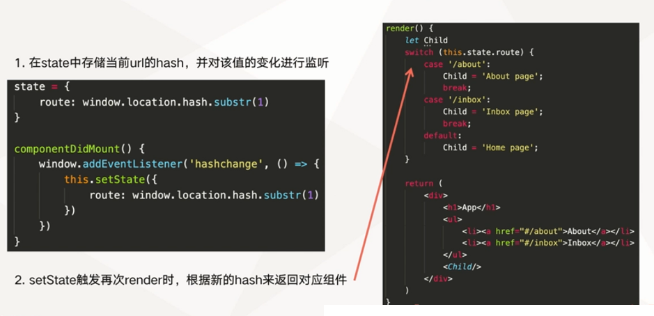
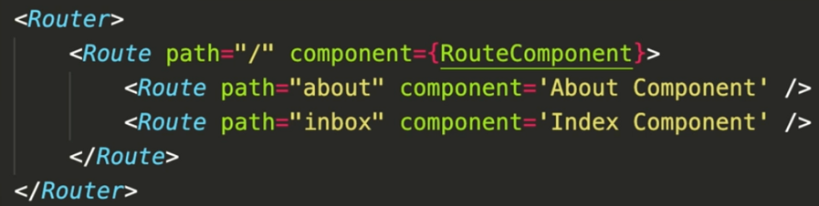

# 从零到一完成前端工程架构之基础篇

介绍如何从零到一完成一个前端工程，包括使用webpack初始化一个前端工程，eslint配置，typescript配置，react-router配置，基础组件库antd配置等。

## 初始化一个React前端工程

webpack5 + react 完成开发与生产环境配置

babel7 相关、webpack5 相关、loader相关、React相关

babel7 相关
- @babel/core
- @babel/plugin-transform-runtime
- @babel/preset-env
- @babel/preset-react

webpack5 相关
- webpack5
- webpack-cli
- webpack-dev-server
- clean-webpack-plugin
- html-webpack-plugin
- open-browser-webpack4-plugin

loader相关
- bebel-loader
- node-sass
- css-loader
- sass-loader
- style-loader

React相关
- react
- react-dom


## git提交规范



## eslint相关配置

安装 Eslint 相关 npm 包

```
"eslint": "^7.30.0",
"eslint-config-airbnb": "^18.2.1",
"eslint-import-resolver-alias": "^1.1.2",
"eslint-plugin-import": "^2.23.4",
"eslint-plugin-jsx-a11y": "^6.4.1",
"eslint-plugin-react": "^7.24.0",
"eslint-plugin-react-hooks": "^4.2.0",
```

配置 .eslintrc.json 文件
```json
{
    "env": {
        "browser": true
    },
    "extends": [
        "airbnb"
    ],
    "parser": "@typescript-eslint/parser",
    "plugins": [
        "react",
        "@typescript-eslint"
    ],
    "rules": {
        "indent": ["error", 4],
        "react/jsx-indent": ["error", 4],
        "react/prefer-stateless-function": "off",
        "react/jsx-filename-extension": ["error", { "extensions": [".js", ".jsx", ".ts", ".tsx"] }],
        "no-unused-vars": "warn",
        "no-use-before-define": "off",
        "import/no-unresolved": ["error", { "ignore": [".png$", ".webp$", ".jpg$"] }],
        "import/extensions": ["error", "never", { "svg": "always" }],
        "import/no-extraneous-dependencies": "off",
        "no-plusplus": "off",
        "react/state-in-constructor": "off",
        "max-len": "off",
        "react/jsx-indent-props": ["error", 4],
        "jsx-a11y/no-static-element-interactions": "off",
        "jsx-a11y/click-events-have-key-events": "off",
        "jsx-a11y/mouse-events-have-key-events": "off",
        "react/jsx-props-no-spreading": "off",
        "arrow-body-style": "off",
        "react/no-deprecated": "off"
    },
    "settings": {
        "import/resolver": {
            "alias": {
                "map": [
                    ["pages", "./src/pages"],
                    ["common", "./src/common"],
                    ["@utils", "./src/utils"],
                    ["@components", "./src/components"],
                    ["context", "./src/context"],
                    ["api", "./src/api"],
                    ["store", "./src/store"]
                ],
                "extensions": [".ts", ".tsx", ".js", ".jsx", ".json", ".d.ts"]
            }
        }
    }
}
```

## Typescript相关配置


安装依赖：

```
"typescript": "^4.3.5"
"@types/react": "^17.0.14",
"@types/react-dom": "^17.0.9",
```

配置 tsconfig.json 文件

```json
{
  "compilerOptions": {
    /* Basic Options */
    // "incremental": true,                   /* Enable incremental compilation */
    "target": "es5",                          /* Specify ECMAScript target version: 'ES3' (default), 'ES5', 'ES2015', 'ES2016', 'ES2017', 'ES2018', 'ES2019' or 'ESNEXT'. */
    "module": "es2015",                     /* Specify module code generation: 'none', 'commonjs', 'amd', 'system', 'umd', 'es2015', or 'ESNext'. */
    // "lib": [],                             /* Specify library files to be included in the compilation. */
    "allowJs": true,                       /* Allow javascript files to be compiled. */
    // "checkJs": true,                       /* Report errors in .js files. */
    "jsx": "react",                     /* Specify JSX code generation: 'preserve', 'react-native', or 'react'. */
    // "declaration": true,                   /* Generates corresponding '.d.ts' file. */
    // "declarationMap": true,                /* Generates a sourcemap for each corresponding '.d.ts' file. */
    // "sourceMap": true,                     /* Generates corresponding '.map' file. */
    // "outFile": "./",                       /* Concatenate and emit output to single file. */
    "outDir": "./",                        /* Redirect output structure to the directory. */
    "rootDir": "./",                       /* Specify the root directory of input files. Use to control the output directory structure with --outDir. */
    // "composite": true,                     /* Enable project compilation */
    // "tsBuildInfoFile": "./",               /* Specify file to store incremental compilation information */
    // "removeComments": true,                /* Do not emit comments to output. */
    // "noEmit": true,                        /* Do not emit outputs. */
    // "importHelpers": true,                 /* Import emit helpers from 'tslib'. */
    // "downlevelIteration": true,            /* Provide full support for iterables in 'for-of', spread, and destructuring when targeting 'ES5' or 'ES3'. */
    // "isolatedModules": true,               /* Transpile each file as a separate module (similar to 'ts.transpileModule'). */

    /* Strict Type-Checking Options */
    "strict": true,                           /* Enable all strict type-checking options. */
    "noImplicitAny": true,                 /* Raise error on expressions and declarations with an implied 'any' type. */
    // "strictNullChecks": true,              /* Enable strict null checks. */
    // "strictFunctionTypes": true,           /* Enable strict checking of function types. */
    // "strictBindCallApply": true,           /* Enable strict 'bind', 'call', and 'apply' methods on functions. */
    // "strictPropertyInitialization": true,  /* Enable strict checking of property initialization in classes. */
    // "noImplicitThis": true,                /* Raise error on 'this' expressions with an implied 'any' type. */
    // "alwaysStrict": true,                  /* Parse in strict mode and emit "use strict" for each source file. */

    /* Additional Checks */
    // "noUnusedLocals": true,                /* Report errors on unused locals. */
    // "noUnusedParameters": true,            /* Report errors on unused parameters. */
    // "noImplicitReturns": true,             /* Report error when not all code paths in function return a value. */
    // "noFallthroughCasesInSwitch": true,    /* Report errors for fallthrough cases in switch statement. */

    /* Module Resolution Options */
    "moduleResolution": "node",            /* Specify module resolution strategy: 'node' (Node.js) or 'classic' (TypeScript pre-1.6). */
    "baseUrl": "./",                       /* Base directory to resolve non-absolute module names. */
    "paths": {
      "pages/*": [
        "src/pages/*"
      ],
      "common/*": [
        "src/common/*"
      ],
      "@utils/*": [
        "src/utils/*"
      ],
      "@components/*": [
        "src/components/*"
      ],
      "context/*": [
        "src/context/*"
      ],
      "api/*": [
        "src/api/*"
      ],
      "store/*": [
        "src/store/*"
      ],
    },                           /* A series of entries which re-map imports to lookup locations relative to the 'baseUrl'. */
    // "rootDirs": [],                        /* List of root folders whose combined content represents the structure of the project at runtime. */
    // "typeRoots": [],                       /* List of folders to include type definitions from. */
    // "types": [],                           /* Type declaration files to be included in compilation. */
    // "allowSyntheticDefaultImports": true,  /* Allow default imports from modules with no default export. This does not affect code emit, just typechecking. */
    "esModuleInterop": true                   /* Enables emit interoperability between CommonJS and ES Modules via creation of namespace objects for all imports. Implies 'allowSyntheticDefaultImports'. */
    // "preserveSymlinks": true,              /* Do not resolve the real path of symlinks. */
    // "allowUmdGlobalAccess": true,          /* Allow accessing UMD globals from modules. */

    /* Source Map Options */
    // "sourceRoot": "",                      /* Specify the location where debugger should locate TypeScript files instead of source locations. */
    // "mapRoot": "",                         /* Specify the location where debugger should locate map files instead of generated locations. */
    // "inlineSourceMap": true,               /* Emit a single file with source maps instead of having a separate file. */
    // "inlineSources": true,                 /* Emit the source alongside the sourcemaps within a single file; requires '--inlineSourceMap' or '--sourceMap' to be set. */

    /* Experimental Options */
    // "experimentalDecorators": true,        /* Enables experimental support for ES7 decorators. */
    // "emitDecoratorMetadata": true,         /* Enables experimental support for emitting type metadata for decorators. */
  },
  "include": [
    "./src/**/*"
  ],
  "exclude": [
    "node_modules",
    "config",
    "dist"
  ]
}
```

## 前端路由 React Router 相关配置

React Router 是一个面向于 React 开发的强大路由库，它可以让我们向应用中快速的添加视图和数据流，同事保持页面与 URL 间同步。

不使用 React Router 的情况




使用 React Router 的情况



安装依赖：

```
"react-router": "^5.2.0",
"react-router-config": "^5.1.1",
"react-router-dom": "^5.2.0",
"@types/react-router-config": "^5.0.3",
```

完成路由配置文件


## 基础组件库 antd 相关配置

antd 是 Ant Design 设计体系的 React UI 组件库，主要用于研发企业级中后台产品。 

1、 安装

2、使用

