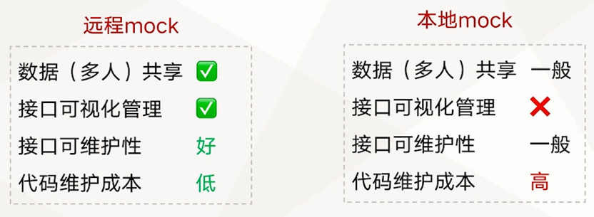

# 从零到一完成前端工程架构之进阶篇

一个好的前端工程可以大大提升开发效率，同时提升代码稳定性和规范性。本章将会介绍如何做前端工程架构的优化，包括打包性能优化，打包文件拆分，mock配置等。

## js 与 css 文件打包分离 

为什么
- 减少单个文件的体积，进而提升浏览加载速度
- 相互独立修改，互不影响
- css 文件放在 index.html 顶部，让浏览器优先解析 css

```ts
const MiniCssExtractPlugin = require('mini-css-extract-plugin');

{
    test: /\.(sc|c)ss/,
    use: [
        devMode ? 'style-loader' : MiniCssExtractPlugin.loader,
        'css-loader',
        'sass-loader',
    ],
},

new MiniCssExtractPlugin({
    filename: '[name].[fullhase:4].css',
}),
```

## 本地mock配置


面向 webpack 的本地 mock 方案
1. webpack-api-mocker
2. webpack-mock-server
3. `手写一个 mock 插件/中间件`

mock 方案核心流程原理


mock 中间件核心原理：


```ts
const fs = require('fs');
const path = require('path');

function response(res, content, type = 'json') {
    res.type(type);
    res.write(content);
    res.end();
}

function mock(res, file) {
    fs.readFile(file, 'utf8', (error, content) => {
        if (error) {
            response(res, error.message, 'html');
        }
        response(res, content, 'json');
    });
}

const mockMiddleware = (config) => (req, res, next) => {
    const { projectDir, mockDir } = config;

    if (['.html', '.css', '.js', '.png', '.jpg'].indexOf(path.extname(req.path)) > -1) {
        return next();
    }

    const filePath = path.resolve(projectDir, `./${mockDir + req.path}.json`);
    console.log('filePath', filePath);

    return fs.stat(filePath, (error) => {
        if (error) {
            next();
        } else {
            mock(res, filePath);
        }
    });
};

module.exports = mockMiddleware;
```

```ts
    devServer: {
        contentBase: path.join(__dirname, '../src'),
        historyApiFallback: false,
        hot: false,
        host: '0.0.0.0',
        port: PORT,
        before(app) {
            const projectDir = path.resolve();
            const mockDir = './mock';
            app.use(mockMiddleware({ projectDir, mockDir }));
        },
    },
```


## 远程 mock 配置

就是将 mock 数据放在服务端，通过接口请求的方式获取，这也是最最近与真实场景的一种 mock 方式。远程 mock 方案的实现就是搭建接口管理服务。

远程 mock VS 本地 mock




远程 mock 适用场景：


本地安装 Yapi


## 前端工程性能优

为什么做前端工程性能优


如何做前端工程的性能优化


```ts
const SpeedMeasurePlugin = require('speed-measure-webpack-plugin');

const smp = new SpeedMeasurePlugin();

module.exports = smp.wrap(merge(webpackConfigBase, webpackConfigDev));
```

ts transpileOnly:
```ts
            {
                test: /\.tsx?$/,
                use: {
                    loader: 'ts-loader',
                    options: {
                        transpileOnly: true,
                    },
                },
            },
```

```ts
const ForkTsCheckerWebpackPlugin = require('fork-ts-checker-webpack-plugin');

new ForkTsCheckerWebpackPlugin(),
```

## 前端工程开发代码工具库配置

开发者喜欢什么样的前端工程

- 打包速度快
- 上手成本低
- 功能实现便捷
- ...

需要有：丰富的代码工具库


一些常用的代码工具：

- 时间处理：Day.js （时间格式转换、日期格式化等）
- JS 实用工具： Lodash （具有深拷贝等丰富的工具函数）
- 本地维护的 utils：解析url参数、解析 cookie 参数等
