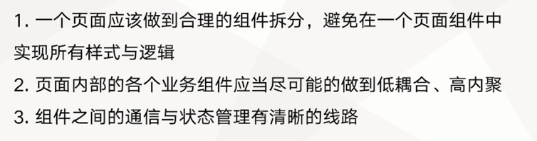
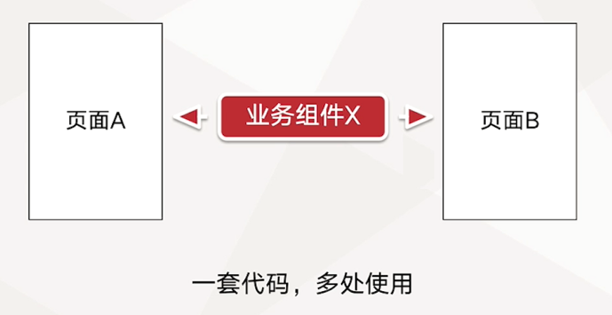
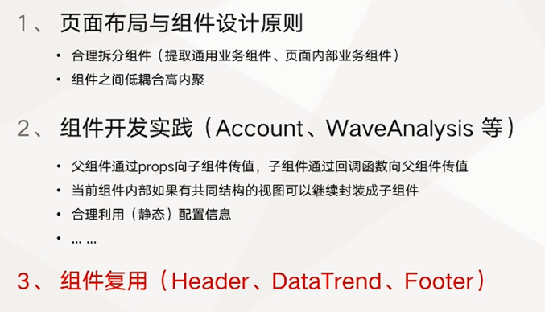

# 营销平台搜索推广页面开发

介绍如何做页面中组件及代码的复用，如何做到代码开发的高效与可维护。

## 页面布局与组件的设计原则

组件应做到尽可能的复用

组件复用

## 页面组件开发

- 搜索推广页面布局与组件设计
- Header 及 DataTrend 组件复用
- 搜索推广页 Account 组件开发
- WaveAnalysis 组件开发
- UserPortrait 组件开发及 Footer 组件复用

## 主要内容

