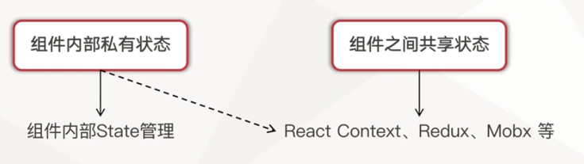
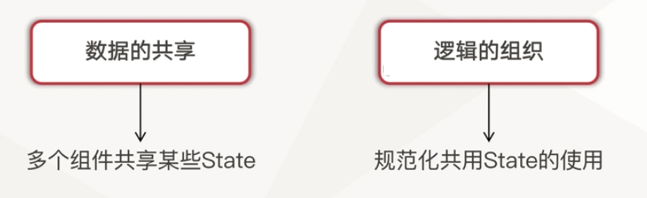
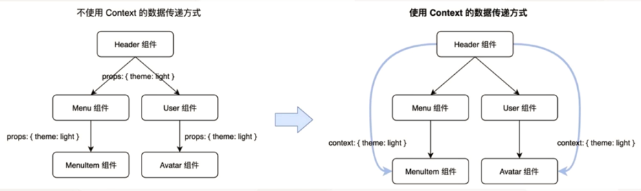

# 使用 React Context 实现应用状态管理

介绍React官方为我们提供的公共状态管理工具 React Context，并且使用React Context来完成应用中全局状态的管理

## React 中的状态管理

1. React 应用程序中状态分为那些种类

    - 组件内部私有状态
    - 组件之间共享状态

2. React 状态如何管理？



3. React 应用程序中状态管理的本质是什么？




## 认识 React Context

- https://react.docschina.org/docs/context.html


React Context 数据流




作用：
1. 缩短多层组件之间数据传递链路
2. 实现多个子组件对父组件中数据的共享


## 使用 React Context 实现公共状态管理

theme.ts
```ts
import React from 'react';

export interface ThemeType {
    buttonType: string
}

const themeContextDefaultValue: ThemeType = {
    buttonType: 'default',
};

export const ThemeContext = React.createContext(themeContextDefaultValue);
```

pages/index.tsx
```ts
import { ThemeContext, ThemeType } from 'context/theme';

const { theme } = this.state;

<ThemeContext.Provider value={theme}>
    // ...
</ThemeContext.Provider>
```


```ts
import { ThemeContext, ThemeType } from 'context/theme';

const { Consumer } = ThemeContext;

<Consumer>
   {
        (value) => {
            return ...
        }
   }
</Consumer>
```


## 前端工程性能优化

背景：打包编译速度慢，影响开发效率

怎么找？怎么解决？

官方文档 + 社区方案

- 优化 babel-loader 配置项
- 优化 ts-loader 配置项

```ts
{
    test: /\.jsx?$/,
    use: 'babel-loader',
    exclude: /node_modules/,
},
{
    test: /\.tsx?$/,
    use: {
        loader: 'ts-loader',
        options: {
            transpileOnly: true,
        },
    },
},

new ForkTsCheckerWebpackPlugin(),
```


