# 使用 Redux 实现应用状态管理

介绍React生态中常用的第三方状态管理方案Redux的核心思想、使用方式以及其高级工具如redux-thunk和redux-saga中间件的使用等。

## 认识 Redux

- Redux 是什么
- 我们的应用程序是否需要使用 Redux？
- Redux 的核心思想是什么
- 如何快速学习 Redux

https://cn.redux.js.org/

### 我们的应用程序是否需要使用 Redux？Redux 是什么

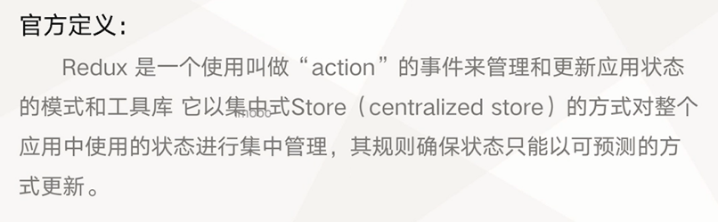

总结：Redux 是一个公共状态管理工具

### 我们的应用程序是否需要使用 Redux？

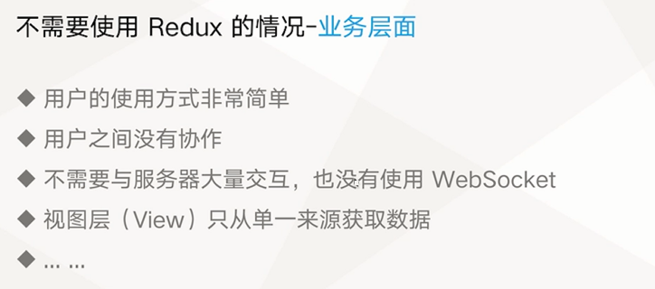

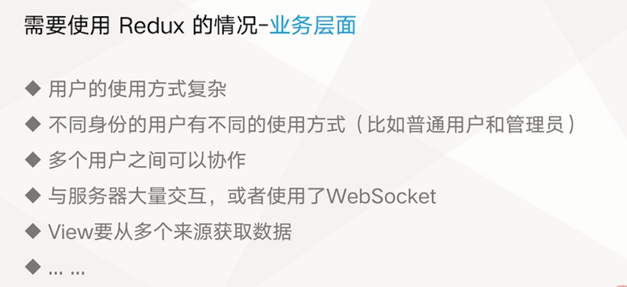

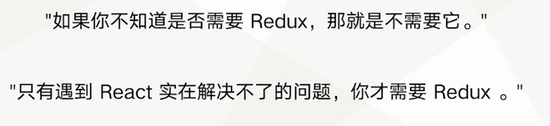


### Redux 的核心思想 - 数据流

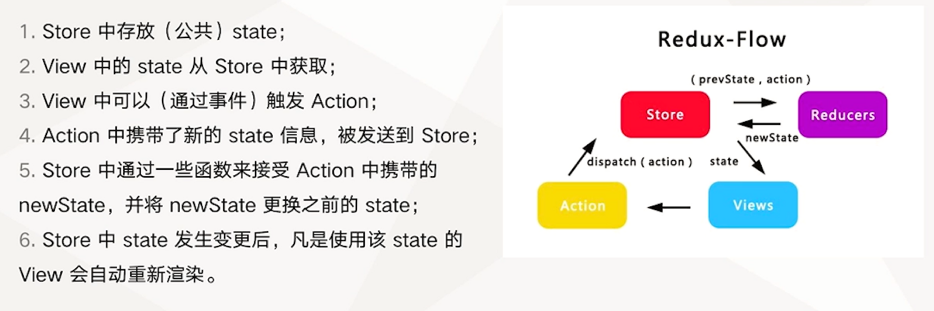

###  如何快速学习 Redux

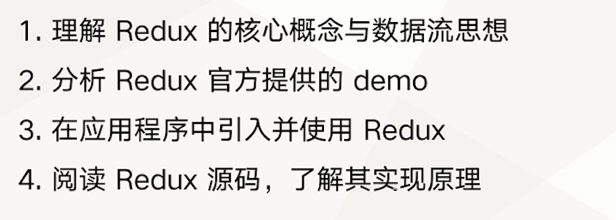


## 跟着官方文档学习 Redux

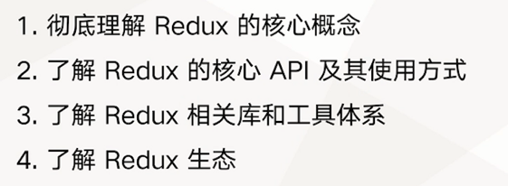


Redux 的核心概念：

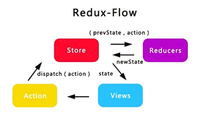


Redux 的核心 API 及其使用方式：

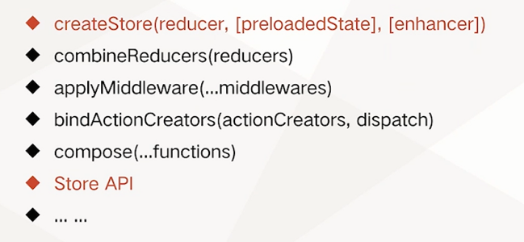


Redux 相关库和工具体系：

- React-Redux
- Redux Toolkit
- Redux DevTools


Redux 生态：

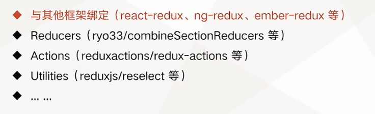


## 通过官方 demo 学习 Redux

https://github.com/reduxjs/redux/blob/master/examples/counter/src/index.js

问题：

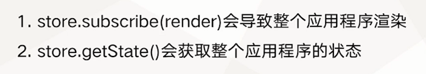


## 使用 React-Redux 优化计数器应用程序

- https://react-redux.js.org/
- https://www.redux.org.cn/

## 通过 redux-thunk 了解 Redux 中间件

关于 redux 中间件

基础数据流：
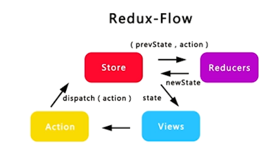

新增：
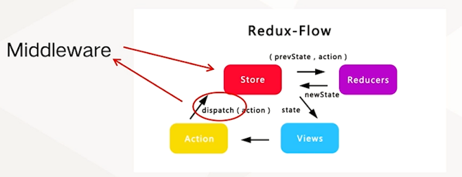

**它提供的是位于 action 被发起之后，到达 reducer 之前的扩展点。**


关于  redux-thunk：

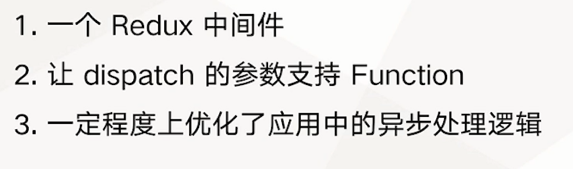

redux-thunk 支持 dispatch function，以此让 action creator 控制反转。被 dispatch 的 function 会接收 dispatch 作为参数，并且可以异步调用它。这类的 function 就称为 thunk


## 了解Redux 中的异步解决方案与 redux-saga 使用方式

- https://github.com/redux-saga/redux-saga
- https://zhuanlan.zhihu.com/p/114409848
- https://zhuanlan.zhihu.com/p/371045258


## 使用 Redux + redux-saga 实现营销平台的状态管理

具体实现参考代码

## 使用 require.context 优化 React + Redux 工程架构

```ts
let allReducers: any = {};
const allSagas: any = [];

function importAll(r: any, moudleType: string) {
    r.keys().forEach((item: any) => {
        if (moudleType === 'reducer') {
            const name = item.split('/')[1];
            const reducerItem = { [name]: r(item).default };
            allReducers = { ...allReducers, ...reducerItem };
        } else if (moudleType === 'saga') {
            allSagas.push(...r(item).default);
        } else {
            //
        }
    });
}
// @ts-ignore
importAll(require.context('./', true, /reducer\.ts$/), 'reducer');
// @ts-ignore
importAll(require.context('./', true, /saga\.ts$/), 'saga');

const rootReducer = combineReducers(allReducers);

const rootSaga = function* () {
    yield all(allSagas);
};
```
