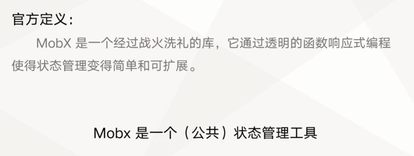
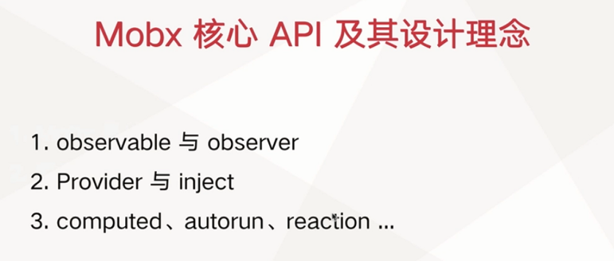

# 使用 Mobx 实现应用状态管理

介绍 React 生态中常用的第三方状态管理方案 Mobx 的核心思想、配套工具及使用方式。

- https://github.com/mobxjs
- https://mobx.js.org
- https://zh.mobx.js.org
- https://cn.mobx.js.org/
- https://mobx-react.js.org/

- https://zhuanlan.zhihu.com/p/157555656


## 认识 Mobx

- Mobx 是什么
- 我们的应用程序是否需要使用 Mobx
- Mobx 的核心思想是什么
- 如何快速学习 Mobx

Mobx 是什么




我们的应用程序是否需要使用 Mobx
- 对于大型项目建议使用


Mobx 的核心思想


如何快速学习 Mobx


## 学习 Mobx 核心 API 及其设计理念

1. 理解 Mobx 的核心概念与设计理念
2. 了解 Mobx 的核心 API 及其使用方法
3. 了解 Mobx 生态

核心概念

- Action
- State
- Reaction 


生态：
- mobx-react 
- mobx-react-lite 


安装

```bash
npm install mobx --save
# React 绑定库
npm install mobx-react --save
```

## 使用 Hooks 实现搜索推广页弹窗组件

- 使用 Hooks 实现逻辑


## 总结




