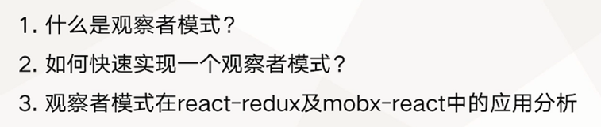
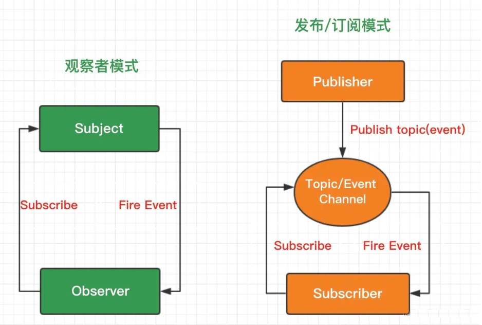
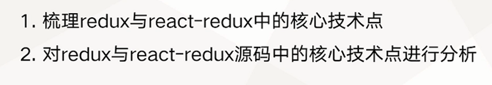
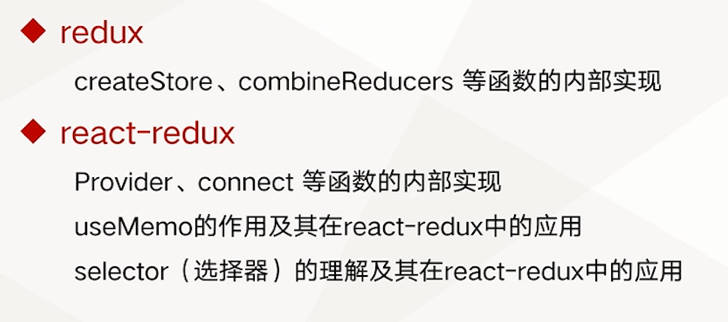

# Redux 原理解析

核心内容包括
- a. Redux 和Mobx 内部如何维护state并监听state的变化
- b. state发生变化后，Redux 和Mobx 如何让view 层进行更新渲染
- c. react-redux和mobx-react中Provider组件的实现原理

## 观察者模式及其应用分析

- https://juejin.cn/post/6844903603107266567

**观察者模式**：一个对象（称为subject）维持一系列依赖于它的对象（称为observer），将有关状态的任何变更自动通知给它们（观察者）。

**发布/订阅模式**：基于一个主题/事件通道，希望接收通知的对象（称为subscriber）通过自定义事件订阅主题，被激活事件的对象（称为publisher）通过发布主题事件的方式被通知。

- Observer模式要求观察者必须订阅内容改变的事件，定义了一个一对多的依赖关系；
- Publish/Subscribe模式使用了一个主题/事件通道，这个通道介于订阅着与发布者之间；
- 观察者模式里面观察者「被迫」执行内容改变事件（subject内容事件）；发布/订阅模式中，订阅着可以自定义事件处理程序；
- 观察者模式两个对象之间有很强的依赖关系；发布/订阅模式两个对象之间的耦合读底。

## redux 与 react-redux 源码中的核心技术点分析

redux 与 react-redux 中的核心技术点

源码：

redux
- https://github.com/reduxjs/redux/blob/master/src/index.ts

react-redux
- https://github.com/reduxjs/react-redux/blob/master/src/index.ts

使用React.memo()来优化函数组件的性能： https://segmentfault.com/a/1190000018563418

- React.PureComponent是银
- React.memo(...)是金
- React.PureComponent是给ES6的类组件使用的
- React.memo(...)是给函数组件使用的
- React.PureComponent减少ES6的类组件的无用渲染
- React.memo(...)减少函数组件的无用渲染
- 为函数组件提供优化是一个巨大的进步

