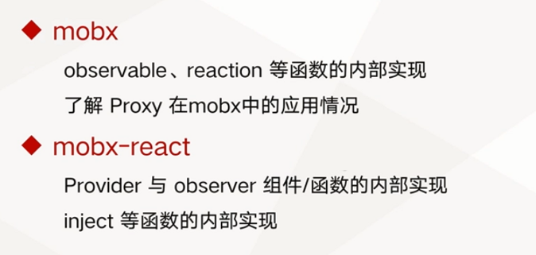

# Mobx 原理解析

## mobx 与 mobx-react 源码中的核心技术点分析


mobx 与 mobx-react 中核心技术点



源码：

mobx：
https://github.com/mobxjs/mobx/blob/main/packages/mobx/src/mobx.ts

## 理解 Proxy 工作原理

new Proxy(target, handler)

- target: 需要监听的对象，将对象的内置方法全部挂载在target上面。因此调用Proxy就会触发target的内置方法
- handler: 重写被挂载的target上的内置方法，方法如下

```ts
// 在读取代理对象的原型时触发该操作，比如在执行 Object.getPrototypeOf(proxy) 时。
handler.getPrototypeOf()

// 在设置代理对象的原型时触发该操作，比如在执行 Object.setPrototypeOf(proxy, null) 时。
handler.setPrototypeOf()

// 在判断一个代理对象是否是可扩展时触发该操作，比如在执行 Object.isExtensible(proxy) 时。
handler.isExtensible()

// 在让一个代理对象不可扩展时触发该操作，比如在执行 Object.preventExtensions(proxy) 时。
handler.preventExtensions()

// 在获取代理对象某个属性的属性描述时触发该操作，比如在执行 Object.getOwnPropertyDescriptor(proxy, "foo") 时。
handler.getOwnPropertyDescriptor()

// 在定义代理对象某个属性时的属性描述时触发该操作，比如在执行 Object.defineProperty(proxy, "foo", {}) 时。
andler.defineProperty()
 
// 在判断代理对象是否拥有某个属性时触发该操作，比如在执行 "foo" in proxy 时。
handler.has()

// 在读取代理对象的某个属性时触发该操作，比如在执行 proxy.foo 时。
handler.get()

// 在给代理对象的某个属性赋值时触发该操作，比如在执行 proxy.foo = 1 时。
handler.set()

// 在删除代理对象的某个属性时触发该操作，比如在执行 delete proxy.foo 时。
handler.deleteProperty()

// 在获取代理对象的所有属性键时触发该操作，比如在执行 Object.getOwnPropertyNames(proxy) 时。
handler.ownKeys()

// 在调用一个目标对象为函数的代理对象时触发该操作，比如在执行 proxy() 时。
handler.apply()

// 在给一个目标对象为构造函数的代理对象构造实例时触发该操作，比如在执行new proxy() 时。
handler.construct()
```


## mobx-react

源码：

https://github.com/mobxjs/mobx/blob/main/packages/mobx-react/src/index.ts


## 如何阅读源码

1. 找准入口
2. 先看参数，再看返回值
3. 以参数为主线找到核心代码行

建议：多看源码
