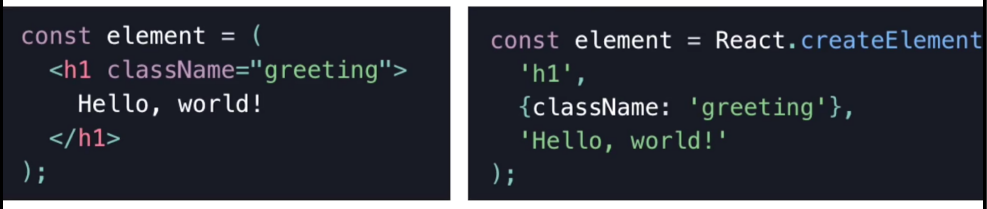
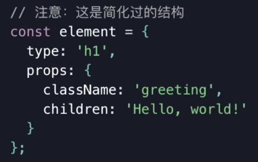
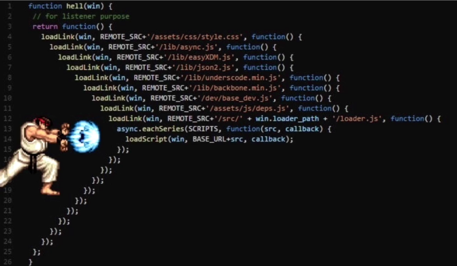
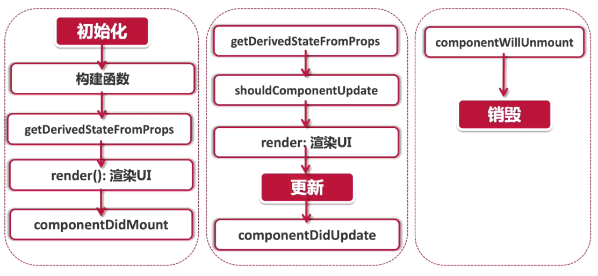

# React 与 TypeScript

- React 基础知识
- TS + React
- Create React APP

问题

- 为什么会出现 react 这个框架
- react 的出现解决了什么问题
- 为什么越来越多的人加入了 React 的行列

## 【概念理解】React 的前世今生

- React 编程思想
- React 的历史
- React 的成功原因
- 组件化编程的思想

### 历史

Ajax 的出现

jQuery：

1. 需求越来越多样化
2. 代码太复杂
3. 维护成本越来越高

AngularJS 与 MVC：

- Model - View - Controller
- 双向数据绑定
- 网站运行速度缓慢
- MVC 架构：页面状态管理混乱

组件化：

- 把网页拆成若干个独立的模块
- 可以轻易的复制和管理
- Angular(V2 +)、React、Vue
- Flex、Redux、Mobx、Immutable、Observable（Rxjs）

**以史为鉴**

- 前端技术突飞猛进
- 设计思想不断迭代
- 居安思危、把握时代风向、善于学习、追赶时代潮流

### React 设计理念

- 单向数据流
  - 数据与界面绑定
  - 单向渲染
  - 就好像一个函数，同样的输入，有同样的输出
- 虚拟 DOM
  - 类似 Docker 或 VMware 的 Snapshot 快照技术
- 组件化
  - 保持交互一致性
  - 保持视觉风格的统一
  - 便于程序员互相之间的协作

## 【组件化】初识 React 函数式组件

```jsx
import React from 'react';

interface AppProps {
  id: number;
  name: string;
  email: string;
}

const App: React.FC<AppProps> = ({id, name, email}) => {
  return (
    <li>
      <h2>{name}</h2>
      <p>{email}</p>
    </li>
  );
};

export default App;
```

## 【概念理解】JSX 编程思维

```jsx
const element = <h1>Hello Word! </h1>;
```

React 自创语言：JSX

文件后缀改用 `.js` 还是 `.jsx` ？

- JSX 并不是标准的 js 语法
- 鼓励在 .js 文件使用标砖的 JS 语法；而 React 语法用在 .jsx 文件中
- 结论：使用 .jsx 或 .js 都可以

为什么使用 jSX ？

- React 并不强制使用 JSX，也可以使用原生 JavaScript
- React 认为视图的本质就是渲染逻辑与 UI 视图表现的内在统一
- React 把 HTML 与渲染逻辑进行了耦合，形成了 JSX

JSX 的特点：

- 常规的 HTML 代码都可以与 JSX 兼容
- 可以在 JSX 中嵌入表达式
- 使用 JSX 指定子元素
- JSX 的命名约定
  - 使用 camelCase （小驼峰）方式定义属性
  - class 变为 className、tabindex 变为 tabIndex
  - 自定义属性使用 data- 开头
- JSX 表示对象
  - JSX 会被编译成为 React.createElement()
    
    

TSX

- 文件扩展名 .tsx
- 在配置文件中启用 jsx 选项

## 【组件化】配置 React 的 CSS 模组

如何架构项目中的文件样式

- 文件位置：css 文件与 component 文件放在同一个目录下
- 命名规范：xxx.module.css

CSS module （模组化）

- 每个 jsx 或者 tsx 文件就被视为一个独立存在的原件
- 所有所包含的所有内容页同样都应该是独立存在的

TS 的 定义声明：

- x.d.ts
- 只包含类型声明，不包含逻辑
- 不会被编辑、也不会被 webpack 打包

custom.d.ts

```js
declare module "*.css" {
  const css: { [key: string]: string };
  export default css;
}
```

小结：

- 直接引入整个文件

  ```jsx
  import './index.css
  <div className="xxx"></div>
  ```

- JSS 模块化引入组件
  ```jsx
  import style from './index.css
  <div className={style.xxx}></div>
  ```

CSS 的 TS 类型：

1. npm install -D typescript-plugin-css-modules
2. 配置文件 tsconfig.json：

    ```json
    {
    "compilerOptions": {
        // ...
        // 增加下面的配置
        "plugins": [
        {
            "name": "typescript-plugin-css-modules"
        }
        ]
    },
    }
    ```

3. .vscode/settings.json

    ```json
    {
        "typescript.tsdk": "node_modules/typescript/lib",
        "typescript.enablePromptUseWorkspaceTsdk": true
    }
    ```

## CSS in JS (JSS)

- https://github.com/cssinjs/jss
- https://cssinjs.org/

## 【资源配置】加载媒体与字体文件

```css
@font-face {
  font-family: 'Slidefu';
  src: local('Slidefu'), url(./assets/fonts/Slidefu-Regular-2.ttf) format('truetype');
}
```

## 【组件化】创建 class 类组件

```jsx
import React from "react";
import styles from "./ShoppingCart.module.css";

interface Props {}

interface State {
  isOpen: boolean;
}

class ShoppingCart extends React.Component<Props, State> {
  constructor(props: Props) {
    super(props);
    this.state = {
      isOpen: false,
    };
  }

  render() {
    return (
      <div className={styles.cartContainer}>
      </div>
    );
  }
}
```

## 【概念理解】State vs Props

- props 是组件对外的接口，而 state 是组件对内的接口
- props 用于组件间数据传递，而 state 用于组件内部的数据传递

state 的正确打开方式：

- state 是私有的，可以认为 state 组件的“私有属性”
- 用 setState() 修改 state
- 直接修改 state ，组件不会触发 render 函数，页面不会渲染
- 初始化：构建函数 constructor 是唯一可以初始化 state 的地方
- State 的更新时异步的
    - 调用 setState 后，state 不会立刻改变，是异步操作
    - 不要依赖当前的 state，计算下个 state

props：Properties 缩写

- 本质上，props 就是传入函数的参数，是从传入组件内部的数据。更准确的说，是从父组件传递给子组件的数据。

Immutable

- 中文：不变的
- 对象一旦创建就是不可改变的，只能通过销毁、重建来改变数据
- 通过判断内存地址是否一致，来确认对象是否有经过修改
- ImmutableJS、Redux、Observable(Rxjs)
- props 是只读属性
- 函数式编程

## 【事件驱动】React Event 事件处理

- e.target  描述的是事件发生的元素
- e.currentTarget 描述的是事件处理绑定
- e.nativeTarget

```jsx
handleClick = (e:React.MouseEvent<HTMLButtonElement, MouseEvent>) => {
    console.log("e.target ", e.target) // 描述的是事件发生的元素
    console.log("e.currentTarget ", e.currentTarget)  // 描述的是事件处理绑定的元素
    console.log("e.nativeTarget ", e.nativeTarget)
    if((e.target as HTMLElement).nodeName === "SPAN"){
        // ...
    }
}
```

```jsx
this.handleClick = this.handleClick.bind(this)

handleClick = (e:React.MouseEvent<HTMLButtonElement, MouseEvent>) {
    // ...
}
```

icon：react-icons

## 【异步处理】获取网络 API 数据

- Ajax 阿贾克斯
- callback 回调函数
- 程序栈 stack，先进先出

Callback Hell：



Promise：

- jsonplaceholder ：http://jsonplaceholder.typicode.com/
- http://jsonplaceholder.typicode.com/users

对于 any ：

- 资源来源于网络请求，返回的数据类型不受控制
- 前端强行定义  API 数据类型，违反了前后端分离的原则
- 不能为了使用 tpye 而放弃 JavaScript 的灵活性

```jsx
  componentDidMount() {
    fetch("https://jsonplaceholder.typicode.com/users")
      .then((response) => response.json())
      .then((data) => this.setState({ robotGallery: data }));
  }
```

## 【异步处理】setState 的异步开发

`setState 是异步的还是同步的？`

异步更新，同步执行

setState() 本身并非异步，但是对于 state 的处理机制给人一种异步的假象。

state 处理一般发生在生命周期变化的时候。

```jsx
// 1
this.setState({
    count: this.state.count + 1
})
console.log("count ", this.state.count);

// 2
this.setState({
    count: this.state.count + 1
}, () => {
    console.log("count ", this.state.count);
})

// 3
this.setState({
    count: this.state.count + 1
}, () => {
    console.log("count ", this.state.count);
})
this.setState({
    count: this.state.count + 1
}, () => {
    console.log("count ", this.state.count);
})


// 4
this.setState((preState, preProps) => {
    return { count: preState.count + 1 }
}, () =>{
    console.log("count ", this.state.count);
});
this.setState((preState, preProps) => {
    return { count: preState.count + 1 }
}, () =>{
    console.log("count ", this.state.count);
});
```

## 【死与新生】探索 React 组件的生命周期

- Mounting：创建虚拟 DOM，渲染 UI
- Updating：更新虚拟 DOM，重新渲染 UI
- Unmounting：删除虚拟 DOM，移除 UI

```jsx
class App extends React.Component<Props, State> {

  // * 生命周期第一阶段： 初始化
  // 初始化组件 state
  constructor(props) {
    super(props);
    this.state = {
      count: 0,
    };
  }

  // 在组件创建好dom元素以后、挂载进页面的时候调用
  componentDidMount() {

  }

  // * 生命周期第二阶段： 更新
  // 在组件接收到一个新的 prop (更新后)时被调用。
  // componentWillReceiveProps
  // state getDerivedStateFromProps(nextProps, prevState){}
  // shouldComponentUpdate(nextProps, nextState){
  //   return nextState.some !== this.state.some
  // }
  // 组件更新后调用
  componentDidUpdate(){}

  // * 生命周期第三阶段： 销毁
  // 组件销毁后调用，
  // 可以当作析构函数 destructor 来使用
  componentWillUnmount(){

  }

  render() {
    return (
      <div className={styles.app}>
        // ...
      </div>
    );
  }
}

export default App;
```

React 组件生命周期：



## 【概念理解】React 17 版本变化

- No New Features：没有新特性

React 17

- 虽然没有新功能，但具有战略意义
- 替换了底层的代码，向下兼容、同时甩掉了历史包袱
- 没有代码断层，为未来留下了足够的升级空间

逐步升级

- 逐步升级的方案，允许多个 React 版本共存
- 先升级路由系统、再升级弹窗，平滑过渡到最新版本

Breaking Changes

- 事件委托机制改变
- 向原生浏览器靠拢
    - onScroll、onFocus、onBlur ...
- 删除事件池
- useEffect 清理操作改为异步操作
- JSX 不可返回 undefined
- 删除部分私有 API

React 展望未来

- React 17 并不是过渡版本，而是承上启下的战略版本
- 未来将会更新强调函数式组件
- 支持微前端架构
